# A novel attention-enhanced LLM approach for accurate power demand and generation forecasting

Zehuan Hu a, Yuan Gao b ,∗, Luning Sun a, Masayuki Mae a

a Department of Architecture, Graduate School of Engineering, The University of Tokyo, Tokyo, Japan   
b International Institute for Carbon-Neutral Energy Research (WPI-I2CNER), Kyushu University, 744 Motooka, Nishi-ku, Fukuoka-shi, Fukuoka, 819-0395, Japan

# A R T I C L E I N F O

Keywords:

Large language model

Multi-attention mechanism

Electricity demand and generation forecasting

Zero-shot learning

# A B S T R A C T

Accurate forecasting of electricity demand and generation is crucial for efficient grid management and sustainable energy planning. While large language models (LLM) have shown promise in various fields, their application to time series forecasting presents challenges, including limited cross-channel information capture and the complexity of prompt design. In this study, we propose a novel framework that combines multiple attention mechanisms with LLM, enabling effective feature extraction from both target and non-target variables without the need for prompt engineering. We conducted extensive experiments using real-world electricity demand and generation data from multiple regions in Japan to evaluate the proposed model. The results demonstrate that our model outperforms state-of-the-art LLM-based and other time-series forecasting models in terms of electricity demand and generation forecast task, achieving better performance than the latest LLMbased models without using prompts or increasing model size. Compared with the Long short-term memory network (LSTM), the mean absolute error (MAE) is reduced by $2 0 . 8 \%$ . Compared with the previous time-series LLM, the proposed model reduces memory usage by $4 9 . 3 \%$ and shortens training time by $3 5 . 7 \%$ . Additionally, the proposed model exhibits superior generalization ability, maintaining high performance even in zero-shot learning scenarios. Compared with the LSTM, MAE on the four test datasets is reduced by $1 6 . 6 \%$ .

# 1. Introduction

# 1.1. Background

In recent years, global electricity consumption has surged due to rapid urbanization, industrialization, and the proliferation of digital technologies [1]. This increasing demand for power places immense pressure on energy providers to meet consumption needs while adhering to sustainability goals [2]. With the looming threat of climate change, governments and organizations worldwide are focusing on reducing carbon emissions and transitioning toward cleaner energy sources [3,4]. Achieving these ambitious targets requires not only the development of renewable energy infrastructures but also the implementation of smart energy management systems that can efficiently balance consumption with production [5,6].

Accurate forecasting of electricity demand and generation is crucial to ensuring a stable and efficient power grid [7]. Mismatches between power supply and demand can lead to significant operational challenges, including grid instability, power outages, and economic losses [8]. Traditional forecasting methods, while effective to some extent, struggle to capture the complexity of modern power

systems, which are influenced by numerous factors such as fluctuating renewable energy outputs, weather conditions, and dynamic market demands [9]. As a result, there is an increasing need for advanced predictive models that can enhance the accuracy and reliability of electricity forecasting, enabling more proactive energy management and decision-making [10].

# 1.2. Electricity demand and generation forecasting

Currently, a variety of methods are employed for electricity demand and generation forecasting, ranging from traditional statistical approaches to more advanced machine learning techniques [11]. Classical methods, such as autoregressive integrated moving average (ARIMA) and exponential smoothing, have been widely used due to their simplicity and effectiveness in modeling time series data methods often assume linear relationships and may struggle to capture the nonlinear complexities of modern energy systems [12]. On the other hand, machine learning methods, such as support vector machines (SVM) and random forests, have been introduced to address these limitations by modeling non-linear relationships more effectively [13]. Despite their

Table 1 Literature review for electricity demand & generation forecasting.   

<table><tr><td>Ref.</td><td>Methods</td><td>Datasets</td></tr><tr><td>[20]</td><td>ANN</td><td>Electricity demand data of Turkey</td></tr><tr><td>[21]</td><td>Autoregressive</td><td>Electricity demand data from the Nordic electricity market</td></tr><tr><td>[22]</td><td>LSTM; SVM</td><td>Electrical load data; weather factor data of school building</td></tr><tr><td>[23]</td><td>Classical statistical; autoregressive models</td><td>Electrical demand data of Ukraine</td></tr><tr><td>[24]</td><td>K-nearest neighbor (KNN), linear regression, random forest (RF); SVM</td><td>Demand and renewable power generation data from South African electricity public utility company</td></tr><tr><td>[25]</td><td>Transformer-based model</td><td>Electricity demand data of one city in China</td></tr><tr><td>[26]</td><td>Elman neural network</td><td>Power consumption statistics of Serbia</td></tr><tr><td>[27]</td><td>Hybrid deep learning</td><td>Four buildings data from Mendeley and Kaggle</td></tr><tr><td>[28]</td><td>ANN</td><td>Meteorological, operational, and economic data from Mexico</td></tr><tr><td>[29]</td><td>Deep-Autoformer</td><td>Microgrid system data of 24 families</td></tr><tr><td>[30]</td><td>CNN-LSTM</td><td>Load data from individual household</td></tr><tr><td>[31]</td><td>KNN; SVM; RF; ANN</td><td>Electricity demand data of ow-energy house</td></tr></table>

statistical methods, these approaches still require extensive feature engineering and may not always generalize well to unseen data [14].

In recent years, deep learning models, particularly artificial neural networks (ANN) and their variants, have gained significant attention in electricity forecasting due to their ability to learn complex patterns directly from raw data [15]. Recurrent neural networks (RNN), especially long short-term memory (LSTM) networks, have shown great promise in time series forecasting as they can capture temporal dependencies in the data [16,17]. Additionally, hybrid models that combine LSTM or other techniques, such as attention mechanisms are becoming increasingly popular due to their enhanced prediction performance and adaptability to complex energy systems [18,19]. A summary and review of relevant research on different machine learning methods of electricity demand forecasting is shown in Table 1.

# 1.3. Large language models for time-series forecasting

Large language models (LLM), such as GPT (Generative Pretrained Transformer) and BERT (Bidirectional Encoder Representations from Transformers), have revolutionized numerous fields, including natural language processing (NLP), machine translation, and text generation [32]. These models, characterized by their vast number of parameters and ability to process massive datasets, have shown remarkable capabilities in understanding and generating human-like text [33]. Beyond traditional NLP tasks, LLMs have been increasingly adopted in domains like healthcare, law, and finance, where complex, contextdependent decision-making is required [34]. The rapid advancements in transformer architectures, which LLMs are based on, have made it possible to capture intricate patterns in sequential data, offering potential applications in areas that extend beyond text [35].

Recent studies have started exploring the application of LLMs for time series forecasting, leveraging their ability to model sequential dependencies and long-range correlations effectively [36]. Traditional time series models, such as ARIMA or LSTM, are often limited in their ability to capture the full context of long sequences [37]. LLMs address these limitations by allowing parallel processing of sequential data and better handling of long-term dependencies [38] Research has demonstrated that LLM-based approaches, such as Time-series Transformers, can outperform classical methods in various forecasting tasks.

At present, approaches to employing LLMs in time series forecasting can be broadly classified into two categories. The first relies on prompt-based reprogramming of pretrained LLMs, whereby carefully crafted instructions are prepended to raw time series to steer the model’s predictions [39,40]. Inspired by their remarkable conversational capabilities, these methods leverage the LLM’s inherent pattern-recognition power to interpret temporal dynamics without any weight updates [41]. The second paradigm involves fine-tuning the

LLM itself on time series data [42,43]. Chang et al. [44] subsequently proposed a two-stage fine-tuning pipeline—first aligning the backbone network to time series representations, then training a lightweight prediction head. Sun et al. [45] introduced contrastive learning objectives to sharpen the model’s temporal embeddings. A summary and review of relevant research on LLM for time-series forecasting is shown in Table 2.

# 1.4. Research contribution

Despite some initial applications of LLMs in the field of time series forecasting, significant challenges and limitations remain:

(1) Pretrained LLMs have already undergone extensive training and validation, so naive fine-tuning often yields only marginal gains and can even degrade performance due to overfitting; moreover, the multiple modules within modern LLM architectures make identifying which components to fine-tune a nontrivial challenge.   
(2) While prompt design has been widely used in other LLMs applications to enhance model performance, designing effective prompts for time series forecasting is particularly challenging. Due to the diverse nature of datasets and the complexity involved in describing historical feature relationships and interdependencies, creating a simple and generalized prompt for time series prediction tasks remains elusive.   
(3) LLM applications in electricity demand and generation forecasting are still largely unexplored. Given the multivariate nature of electricity data, which typically involves numerous features, developing an LLM-based model that can efficiently handle and predict these dynamics is a significant challenge.   
(4) Japan spans a vast distance from north to south, and there are significant regional differences in power generation, electricity demand, and climate. These variations place high demands on the generalization ability of models. However, there is limited research focused on Japan’s electricity data.

To address these challenges and fill the research gaps, this study proposes a novel LLM-based model for forecasting electricity demand and generation. The key contributions of this research are as follows:

(1) To enhance the model’s ability to understand the relationships between different features, we design a specialized framework that allows the LLM to extract meaningful interdependencies between the target variables and other features in a simple yet effective manner.

Table 2 Literature review for time-series forecasting by LLM.   

<table><tr><td>Ref.</td><td>Target</td><td>Approaches to employing LLMs</td></tr><tr><td>[46]</td><td>Energy load</td><td>Directly use with predefined template prompt</td></tr><tr><td>[47]</td><td>Wind speed</td><td>Directly use with spatial prompts and temporal prompts</td></tr><tr><td>[48]</td><td>CNY-USD exchange rate</td><td>Directly use with prompt adjusted by reinforcement learning with human feedback</td></tr><tr><td>[49]</td><td>Wind power</td><td>Fine-tuning</td></tr><tr><td>[50]</td><td>NASDAQ-100 stock price</td><td>Directly use with predefined template prompt $ fine-tuning</td></tr><tr><td>[51]</td><td>Energy load</td><td>Fine-tuning</td></tr><tr><td>[52]</td><td>Climate</td><td>Directly use with predefined template prompt</td></tr><tr><td>[53]</td><td>Wind power</td><td>Directly use with proposed soft and hard prompts</td></tr><tr><td>[54]</td><td>Methanol price</td><td>Fine-tuning</td></tr><tr><td>[55]</td><td>Stock return</td><td>Fine-tuning</td></tr></table>

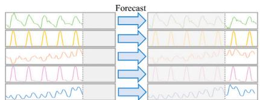  
(a) Channel Independent (CI) strategy

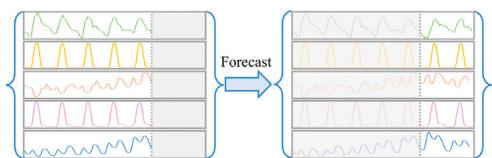  
(b) Channel Dependent (CD) strategy

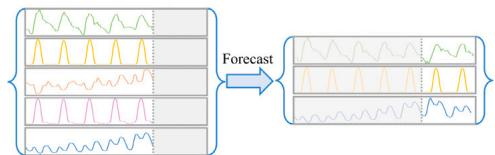  
(c)Prediction task requirements   
Fig. 1. Training strategies and prediction requirement.

(2) We introduce a preprocessing method based on cross-attention that eliminates the need for prompt engineering, enabling multiple time series of target features to be transformed and input into the LLM simultaneously. This approach simplifies the application of LLMs to multivariate time series forecasting.   
(3) To validate the effectiveness and generalizability of the proposed framework, we conduct extensive experiments using historical electricity demand, generation, and weather data from four different regions in Japan.

# 2. Methodology

# 2.1. Related works and challenges

In the field of time series forecasting, there are currently two mainstream training strategies: Channel Independent (CI) (Fig. 1(a)) and Channel Dependent (CD) (Fig. 1(b)) approaches [56]. Each of these strategies has its strengths and limitations. The CD strategy theoretically offers higher modeling capacity because it allows the model to learn complex relationships between different variables. In contrast, the CI strategy is more robust, as it focuses on the self-correlation characteristics within each channel, making it less sensitive to noise and more generalizable [57].

Meanwhile, in practical engineering applications, forecasting tasks often require using multiple input variables to predict a subset of target variables, such as predicting future power generation and electricity demand using historical power and weather data (Fig. 1(c)). Unlike tasks that require predictions for all variables or single-variable forecasting, these tasks benefit from the model’s ability to consider the relationships between variables without needing to predict every variable. However, considering the large scale of modern LLMs and their substantial computational costs, most existing applications of LLMs to time-series forecasting adopt a channel-independent training strategy [36,43]. This approach computes a loss for every variable – even when only a subset of variables requires prediction – resulting

in wasted training resources. Conversely, restricting the input to only the target variables prevents the model from leveraging information in other channels, which can lead to reduced forecasting accuracy.

Furthermore, prompt engineering plays a crucial role in optimizing the performance of LLMs, expanding their application range, and improving interaction efficiency. For example, Cao et al. [41] introduced a Semi-Soft Prompt strategy, where prompts are divided into explicit text-based prompts (hard prompts) and vector-based prompts (soft prompts). The authors propose a semi-soft prompting strategy that generates distinct prompts corresponding to key time series components: trend, seasonality, and residuals. Jin et al. [36] attached prompts as prefixes to the input time series, providing background information, task instructions, and data statistics. However, in practical applications, different forecasting tasks and time series often have unique characteristics, making it challenging to design effective prompts tailored for each scenario. This greatly increases the complexity of utilizing LLMs in time series forecasting.

# 2.2. Multi-attention large language model (MultiAttLLM)

To address these challenges, we propose a novel model that combines the advantages of CI and CD strategies while eliminating the need for prompt design, which called Multi-attention large language model (MultiAttLLM), as shown in Fig. 2. In this model, the LLM focuses on the self-correlations of target variables during the initial modeling phase, while cross-channel relationships are considered in a subsequent stage after the LLM output. This approach not only reduces the computational resources required for training but also enhances the model’s ability to capture complex interactions between variables, resulting in improved forecasting performance. The architecture is composed of six main components:

$\textcircled{1}$ Word Projection: The first component of the model is the word projection layer, which addresses the issue of vocabulary redundancy in large language models when applied to time series

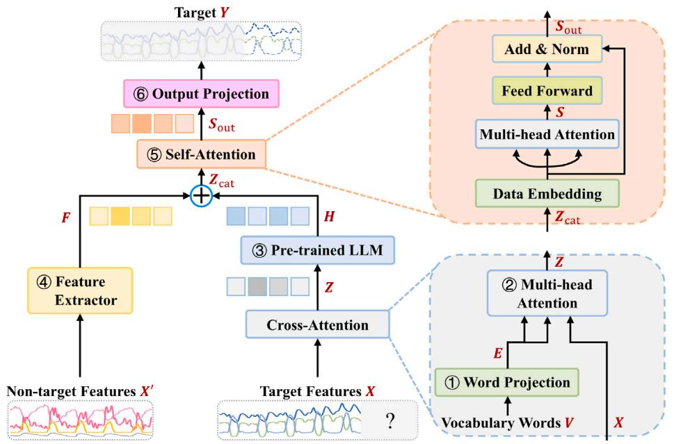  
Fig. 2. Topological general structure of the proposed LLM framework.

forecasting. Since the original vocabulary of LLM contains a significant amount of words unrelated to the context of time series data, the word projection layer maps the original vocabulary to a smaller, domain-specific word vector set. This allows the model to focus on the words and representations most relevant to describing time series, improving its efficiency and accuracy in forecasting tasks.

In this layer, we map the original LLM vocabulary embeddings $V ~ \in ~ \mathbb { R } ^ { | V | \times d _ { \mathrm { o r i g } } }$ into a smaller, domain-specific space of dimension $d _ { \mathrm { w p r o j } }$ , and the output $E$ of word projection layer can be calculated as follow:

$$
\boldsymbol {E} = \boldsymbol {V} \boldsymbol {W} _ {\mathrm {w p r o j}} + \boldsymbol {b} _ {\mathrm {w p r o j}}, \quad \boldsymbol {W} _ {\mathrm {w p r o j}} \in \mathbb {R} ^ {d _ {\mathrm {o r i g}} \times d _ {\mathrm {w p r o j}}}, \quad \boldsymbol {b} _ {\mathrm {w p r o j}} \in \mathbb {R} ^ {d _ {\mathrm {w p r o j}}} \tag {1}
$$

where $d _ { \mathrm { o r i g } }$ is the dimension of original LLM vocabulary; $d _ { \mathrm { w p r o j } }$ is the dimension of vocabulary after word projection, which is 2000 in this study.

$\textcircled{2}$ Cross-Attention: To enable the large language model to capture the relationships between different features and convert the time series data into a format that can be understood by the LLM, we employed a cross-attention module (Fig. 3). This module integrates the features by using a query-key–value (QKV) structure, where each feature can attend to all other features. This allows the model to capture complex interdependencies between the target features and other input variables, effectively bridging the gap between time series data and natural language processing. In this study, the target feature is used as $Q$ , and the word vectors are used as $K$ and $V$ . Given an input feature matrix $X \in \mathbb { R } ^ { T \times f }$ (where $T$ is sequence length, $f$ is number of features), we compute:

$$
Q = X W _ {q}, K = X W _ {k}, V = X W _ {v} \tag {2}
$$

where $Q , \kappa$ , and $V$ represent the query, key, and value matrices respectively; ${ W _ { q } } , { W _ { k } } , { W _ { v } } \in \mathbb { R } ^ { f \times d }$ , represent the learnable weights. The attention map and output are

$$
A (\boldsymbol {Q}, \boldsymbol {K}, \boldsymbol {V}) = \operatorname {s o f t m a x} \left(\boldsymbol {Q} \boldsymbol {K} ^ {T} / \sqrt {d _ {k}}\right) \boldsymbol {V} \tag {3}
$$

$$
\boldsymbol {Z} = A (\boldsymbol {Q}, \boldsymbol {K}, \boldsymbol {V}) \boldsymbol {W} _ {o}, \quad \boldsymbol {W} _ {o} \in \mathbb {R} ^ {d \times d}, \quad \boldsymbol {Z} \in \mathbb {R} ^ {T \times d} \tag {4}
$$

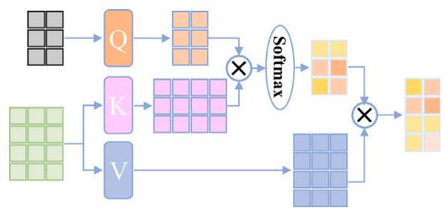  
Fig. 3. Topological general structure of attention mechanism.

where the attention mechanism is applied to each time step in the input sequence; $d _ { k }$ is the dimension of queries, keys and values, which used to reduce the impact of the input data dimension on the results.

$\textcircled{3}$ Frozen pre-trained LLM: After cross-attention block is a pretrained large language model. By keeping the LLM intact, we maintain the rich language understanding capabilities of the pretrained model while focusing on effective reprogramming of the input to align with its strengths.

In this layer, we feed the cross-attention outputs $Z$ (after adding positional encodings) into a pre-trained LLM of $L$ layers:

$$
\boldsymbol {H} = \operatorname {L L M} _ {\text {f r o z e n}} (\boldsymbol {Z} + \mathrm {P E}), \quad \boldsymbol {H} \in \mathbb {R} ^ {T \times d} \tag {5}
$$

where no weights inside the LLM are updated; we merely reprogram its input to our time-series format.

$\textcircled{4}$ Feature Extractor: The feature extractor module is responsible for capturing the relationships between non-target features, providing auxiliary information that helps improve the overall forecasting performance. This module can use various techniques, such as RNN or self-attention layers, to extract these relationships. In this study, we opt for a simple linear layer to validate the effectiveness of the proposed algorithm without introducing unnecessary complexity. This feature extraction helps the model understand the dynamics of auxiliary variables, which can influence the target features.

To model non-target feature interactions, we apply a simple linear extractor:

$$
\boldsymbol {F} = \boldsymbol {X} ^ {\prime} \boldsymbol {W} _ {f} + \boldsymbol {b} _ {f}, \quad \boldsymbol {W} _ {f} \in \mathbb {R} ^ {f \times d}, \quad \boldsymbol {b} _ {f} \in \mathbb {R} ^ {d}, \quad \boldsymbol {F} \in \mathbb {R} ^ {T \times d} \tag {6}
$$

This provides auxiliary embeddings capturing global feature dynamics.

$\textcircled{5}$ Self-Attention: The self-attention module is designed to enhance the understanding of the relationships between the target feature and the other input features. By applying self-attention, the model can learn the importance of each feature in relation to the target, thus improving its predictive accuracy. The self-attention mechanism assigns weights to each feature, allowing the model to focus more on the features that have a significant impact on the target. The calculation for the self-attention layer is the same as the crossattention layer. The difference here is that we merge the outputs of the Feature Extractor layer and pre-trained LLM layer along the feature dimension, and then use them as the query, key, and value inputs to compute self-attention. In addition, this layer also includes a feedforward component. In the feedforward layer, a feedforward neural network processes the output embeddings $Z$ from the self-attention mechanism to generate the final output of the transformer model.

In this layer, we concatenate $\pmb { H }$ and $\pmb { F }$ along the feature dimension to form $Z _ { \mathrm { c a t } } \in \mathbb { R } ^ { T \times 2 d }$ , then project back to $d$ :

$$
Z ^ {\prime} = Z _ {\text {c a t}} W _ {\text {c a t}}, \quad W _ {\text {c a t}} \in \mathbb {R} ^ {2 d \times d} \tag {7}
$$

and compute standard self-attention:

$$
\boldsymbol {Q} ^ {\prime} = \boldsymbol {Z} ^ {\prime} \boldsymbol {W} _ {q}, \quad \boldsymbol {K} ^ {\prime} = \boldsymbol {Z} ^ {\prime} \boldsymbol {W} _ {k}, \quad \boldsymbol {V} ^ {\prime} = \boldsymbol {Z} ^ {\prime} \boldsymbol {W} _ {v}, \tag {8}
$$

$$
\boldsymbol {A} ^ {\prime} = \operatorname {s o f t m a x} \left(\frac {\boldsymbol {Q} ^ {\prime} \boldsymbol {K} ^ {\prime \top}}{\sqrt {d}}\right), \quad S = \boldsymbol {A} ^ {\prime} \boldsymbol {V} ^ {\prime} \tag {9}
$$

followed by a two-layer feedforward network:

$$
F F N (S) = \max  \left(0, S W _ {1} + b _ {1}\right) W _ {2} + b _ {2}, \quad W _ {1} \in \mathbb {R} ^ {d \times d _ {f f}}, \quad W _ {2} \in \mathbb {R} ^ {d _ {f f} \times d} \tag {10}
$$

where ?? 1, ??1, $W _ { 2 }$ , and ${ \pmb b } _ { 2 }$ represent learnable weights and biases.

$\textcircled{6}$ Output Projection: The output projection layer consists of two linear layers and serves to convert the final output of the selfattention module into the desired feature dimension and sequence length.

In last layer, we map the self-attention output $S _ { \mathrm { o u t } }$ back to the original target dimension $f _ { o u t }$ :

$$
\boldsymbol {Y} = \boldsymbol {S} _ {\text {o u t}} \boldsymbol {W} _ {\text {o u t}} + \boldsymbol {b} _ {\text {o u t}}, \quad \boldsymbol {W} _ {\text {o u t}} \in \mathbb {R} ^ {d \times f _ {\text {o u t}}}, \quad \boldsymbol {b} _ {\text {o u t}} \in \mathbb {R} ^ {f _ {\text {o u t}}}, \quad \boldsymbol {Y} \in \mathbb {R} ^ {T \times f _ {\text {o u t}}} \tag {11}
$$

# 2.3. Benchmark

To validate the effectiveness and generalization ability of our proposed method, we selected five baseline models, including one traditional models, LSTM, a simple linear model, DLinear, two latest novel transformer-based model, iTransformer and TimesNet, and a novel LLM-based model, TimeLLM.

# 2.3.1. Long-short term memory network (LSTM)

LSTM is a type of RNN designed to overcome the vanishing gradient problem that often occurs in traditional RNN when learning long-term dependencies in sequential data [58]. LSTM incorporates memory cells and gating mechanisms – input, forget, and output gates – that regulate the flow of information within the network. These gates allow LSTM models to selectively retain or forget information over time, making them highly effective for time series forecasting tasks that require capturing both short-term and long-term patterns in the data. The detail content and calculation equations of LSTM are provided in Appendix A.1 because of space constraints.

# 2.3.2. DLinear

Decomposition Linear (DLinear) is a simple linear model designed specifically for time series forecasting [59]. It improves forecasting accuracy by decomposing time series. Unlike the currently popular complex Transformer-based models, DLinear achieves excellent performance by processing the trend and cyclical components in time series through simple linear layers.

# 2.3.3. Informer

Informer is an efficient Transformer variant specifically designed for long-sequence time-series forecasting [18]. It introduces a ProbSparse self-attention mechanism that selects only the most informative query– key pairs, reducing the quadratic complexity of standard attention. To further accelerate processing, Informer employs a self-attention distilling operation that progressively shortens the sequence at intermediate layers, allowing it to scale to very long input horizons while maintaining high accuracy.

# 2.3.4. Autoformer

Autoformer advances Transformer architectures by embedding series decomposition directly into each model block [19]. It splits the input into trend and seasonal components using a learnable decomposition layer, then applies an auto-correlation mechanism to capture period-aware dependencies. This design both denoises the input and enables the model to learn long-term temporal patterns more effectively, yielding superior performance on long-horizon forecasting tasks.

# 2.3.5. iTransformer

iTransformer is a novel adaptation of the traditional Transformer architecture specifically designed for time series forecasting [60]. Unlike conventional Transformer-based models that process temporal tokens (where each token corresponds to a time step with multiple feature variables), the iTransformer adopts an inverted approach. It treats each time series as a separate variate token and uses self-attention mechanisms to capture the interdependencies between these variate tokens. This design helps the model more effectively learn multivariate correlations, making it particularly well-suited for time series data with complex feature relationships.

# 2.3.6. TimesNet

TimesNet is a novel model designed for general time series analysis by transforming one-dimensional (1D) time series data into twodimensional (2D) tensors [17]. Traditional time series models often struggle with capturing intricate temporal variations because of the limitations of processing 1D data directly. TimesNet tackles this by leveraging the concept of multi-periodicity in time series, where complex variations occur both within and between periods. To better represent these temporal variations, TimesNet reshapes 1D time series into 2D tensors, where intraperiod-variations are represented by columns and interperiod-variations by rows.

# 2.3.7. TimeLLM

TimeLLM is a novel framework designed to adapt LLM for time series forecasting by reprogramming the input time series data [36]. Instead of fine-tuning the pre-trained LLM or altering their internal architectures, TimeLLM leverages a reprogramming technique that transforms the time series data into a format compatible with LLM. This is achieved by converting time series into text-like prototypes that the LLM can understand. To further enhance the model’s reasoning capabilities, TimeLLM incorporates a ‘‘Prompt-as-Prefix’’ (PaP) approach, which enriches the input data with additional context, such as taskspecific instructions and domain knowledge, allowing the LLM to better interpret and predict time series trends.

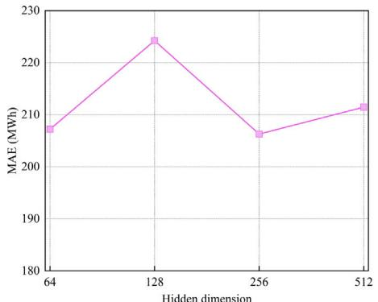  
(a)Hidden state dimension

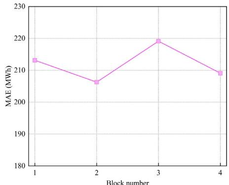  
(b) Number of layer

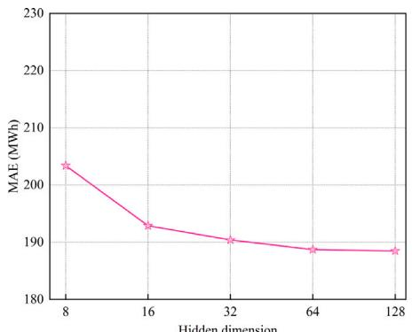  
Fig. 4. Hyperparameter sensitivity with respect to the hidden dimension size and number of LSTM layers (lookback window length: 72; forecast horizons: 168).   
(a) Dimension of model

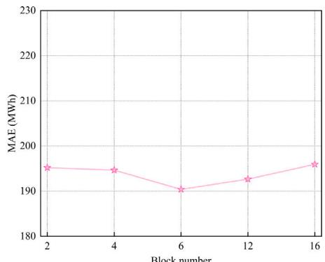  
(b) Number of LLM layer   
Fig. 5. Hyperparameter sensitivity with respect to the dimension size of model and number of LLM layers (lookback window length: 72; forecast horizons: 168).

# 2.4. Model setup

For all baseline models except the LSTM, hyperparameters were set to the optimal values reported in their original publications. For the LSTM and our proposed model, to assess model robustness and determine optimal hyperparameter settings, we performed sensitivity analyses on both the LSTM baseline and our MultiAttLLM framework.

• LSTM: We evaluated combinations of layer depth $L \in \{ 1 , 2 , 3 , 4 \}$ and hidden-state dimension $h \in \{ 6 4 , 1 2 8 , 2 5 6 , 5 1 2 \}$ . For each configuration, we recorded MSE on the validation set. The resulting performance grid is plotted in Fig. 4.   
• MultiAttLLM: We varied the transformer model dimension $d _ { m o d e l } \in \{ 8 , 1 6 , 3 2 , 6 4 , 1 2 8 \}$ and the number of LLM layers $N \in$ {2, 4, 6, 12, 16}. For each configuration, we recorded MSE on the validation set. The outcomes are illustrated in Fig. 5. These experiments show that the proposed MultiAttLLM model exhibits strong robustness to hyperparameter selection, achieving optimal or near-optimal accuracy across nearly all tested configurations.

Drawing from these settings and further experimentation, we identified the parameter sets that delivered the best performance in terms of predictive accuracy and computational efficiency. Table 3 summarizes the chosen parameters for each model, including the number of layers, hidden dimensions, attention heads, and other key settings.

Each parameter set was chosen to balance model complexity with computational feasibility, ensuring that models could be effectively trained within the limits of available resources while achieving optimal forecasting performance. The parameters were adjusted based on the characteristics of the time series data, such as the number of features and the frequency of observations, to ensure that the models were well-suited for the forecasting tasks.

Table 3 Hyperparameters configurations for benchmark models and our model.   

<table><tr><td>Model</td><td>Hyperparameter</td><td>Value</td></tr><tr><td rowspan="2">LSTM</td><td>Hidden size</td><td>256</td></tr><tr><td>Number of layers</td><td>2</td></tr><tr><td rowspan="4">Informer</td><td>Dimensions of model</td><td>512</td></tr><tr><td>Dimensions of feed-forward</td><td>2048</td></tr><tr><td>Number of encoder layers</td><td>4</td></tr><tr><td>Number of decoder layers</td><td>2</td></tr><tr><td rowspan="4">Autoformer</td><td>Dimensions of model</td><td>512</td></tr><tr><td>Dimensions of feed-forward</td><td>2048</td></tr><tr><td>Number of encoder layers</td><td>2</td></tr><tr><td>Number of decoder layers</td><td>1</td></tr><tr><td rowspan="4">iTransformer</td><td>Dimensions of model</td><td>512</td></tr><tr><td>Dimensions of feed-forward</td><td>512</td></tr><tr><td>Number of encoder layers</td><td>3</td></tr><tr><td>Number of decoder layers</td><td>1</td></tr><tr><td rowspan="4">TimesNet</td><td>Dimensions of model</td><td>32</td></tr><tr><td>Dimensions of feed-forward</td><td>64</td></tr><tr><td>Number of encoder layers</td><td>2</td></tr><tr><td>Number of decoder layers</td><td>1</td></tr><tr><td rowspan="3">TimeLLM</td><td>Dimensions of patch embedding</td><td>32</td></tr><tr><td>Text Prototype</td><td>1000</td></tr><tr><td>Number of LLM layers</td><td>6</td></tr><tr><td rowspan="4">MultiAttLLM</td><td>Dimensions of model</td><td>64</td></tr><tr><td>Dimensions of feed-forward</td><td>128</td></tr><tr><td>Number of LLM layers</td><td>6</td></tr><tr><td>Number of decoder layers</td><td>4</td></tr></table>

To ensure fair comparisons across all models, we used consistent training settings, employing the Adam optimizer with an initial learning rate of 0.001. Each model was trained for a total of 10 epochs, with the learning rate reduced to 95 percent of its value from the previous epoch after each epoch to facilitate convergence. The mean squared error (MSE) loss function was employed as the optimization objective

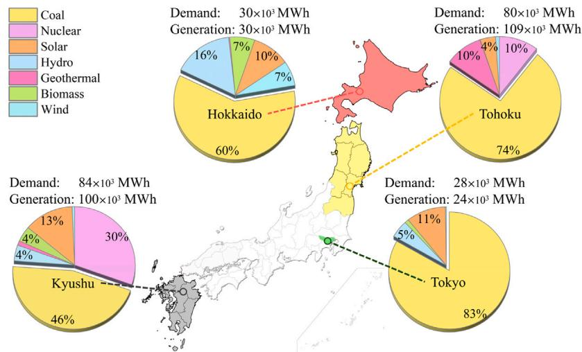  
Fig. 6. An Overview of electricity demand and generation data for selected regions of Japan in 2023.

for all models. The MSE is defined as:

$$
\mathrm {M S E} = \frac {1}{n} \sum_ {i = 1} ^ {n} \left(y _ {i} - \hat {y} _ {i}\right) ^ {2} \tag {12}
$$

where $y _ { i }$ and $\hat { y } _ { i }$ represent the measured value and the predicted value; ?? is the number of batch size which is 24 in this study. This loss function penalizes large prediction errors more heavily, making it particularly effective for minimizing overall prediction deviations. All experiments were conducted on a consistent computational environment to ensure reproducibility. All the code of models and datasets are open sourced in MultiAttLLM GitHub Repository.

All models were encoded using PyTorch and trained on a computer with a 14th Intel(R) Core(TM) i9-14900F CPU 3.20 GHz and 64 GB of working memory (RAM). The models were solved and calculated using a GPU (NVIDIA GeForce RTX 4090 24 GB).

# 3. Case study

# 3.1. Introduction of the dataset

The datasets used for the case study include hourly electricity data (demand and generation), as well as weather data. The electricity data spans from 2016 to 2023, covering four regions in Japan: Kyushu, Tokyo, Tohoku, and Hokkaido. For each region, the dataset includes hourly total electricity demand and generation data from various sources. Electricity data comes from public data of power companies in various regions. Fig. 6 illustrates the electricity demand and generation by different energy sources for the four selected regions in Japan in 2023. As shown in Fig. 6, the Tokyo and Hokkaido regions exhibit similar patterns, with total generation and demand both around 30 MWh. In these regions, renewable energy generation primarily comes from solar and hydroelectric sources. In contrast, the Tohoku and Kyushu regions have much higher electricity demand and generation, both reaching approximately 100 MWh. Notably, in these regions, nuclear energy also constitutes a significant portion of the renewable energy mix. This variation in energy profiles across regions reflects the diversity in energy infrastructure and resource availability, making them ideal for testing the generalization capability of the proposed model.

In addition to electricity demand and generation data, the weather conditions in the four selected regions – Fukuoka (Kyushu region), Tokyo (Tokyo region), Sendai (Tohoku region), and Sapporo (Hokkaido region) – play a crucial role in influencing both energy consumption and generation from renewable sources. The weather data, sourced from the Japan Meteorological Agency, also covers the period from

2016 to 2023. The weather data from 2023, as shown in Fig. 7, captures key meteorological variables such as maximum and minimum daily temperatures and solar radiation for each region, providing important context for understanding the seasonal variations in energy patterns.

Hokkaido, located in the northernmost part of Japan, experiences long, cold winters with significant snowfall and relatively cool summers. Solar radiation is lower compared to other regions. Tohoku, in northeastern Japan, also has cold winters, though less severe than Hokkaido. The region experiences distinct seasons, with cooler temperatures in winter and moderate summers. Tokyo, located in the central part of Japan, has a temperate climate with hot, humid summers and mild winters. The relatively higher solar radiation in Tokyo, particularly during summer months, contributes significantly to solar power generation. Kyushu, in the southernmost part of Japan, enjoys a warm climate year-round with hot, humid summers and mild winters. The region receives the highest solar radiation among the four regions, making solar power a key contributor to its renewable energy mix. Kyushu also benefits from a higher proportion of nuclear energy generation, complementing its renewable energy sources.

The details of all features in our datasets are summarized in Table 4. The selection of these four regions was made to ensure a comprehensive representation of Japan’s diverse climatic zones, ranging from the warmer southern regions to the cooler northern areas. Additionally, these regions feature varying compositions of electricity generation sources, which allows for a thorough evaluation of the proposed model’s generalization capability across different climatic and energy production conditions.

# 3.2. Data standardization

Data standardization adjusts different data ranges to a common scale, which helps to minimize regression errors while preserving correlations within the dataset [61]. This study utilizes Z-score standardization, which normalizes the data to have a mean of zero and a standard deviation of one [62]. The formula for Z-score standardization is:

$$
x ^ {\prime} = \frac {x - \mu}{\delta} \tag {13}
$$

where $x ^ { \prime }$ and $x$ represent the standardized data and original data, respectively; and $\mu$ and ?? represent the mean and the standard deviation of the original data, respectively. Standardization of all feature data is essential before model integration. The formula for inverse standardization can be expressed as

$$
x = x ^ {\prime} \times \delta + \mu \tag {14}
$$

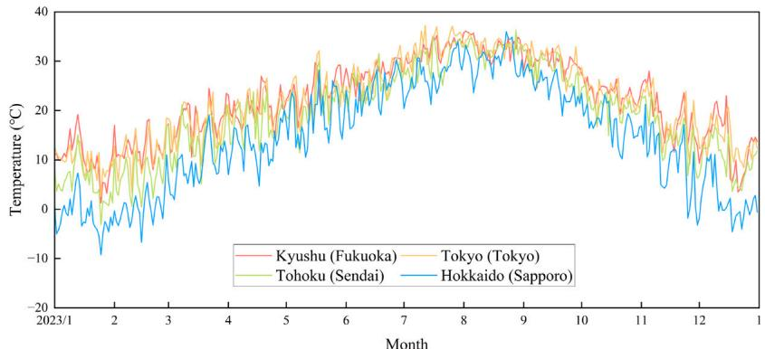  
(a) Daily maximum temperature

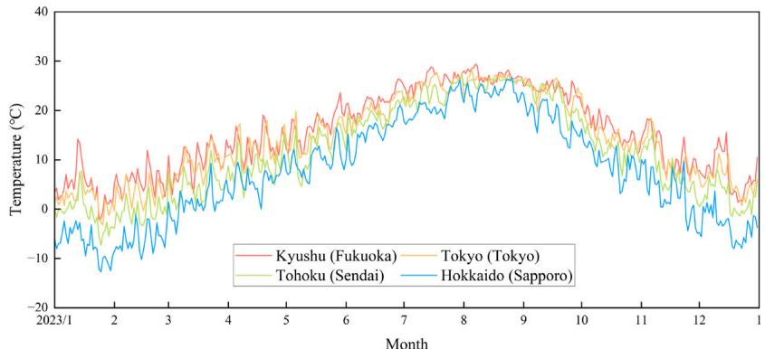  
(b) Daily minimum temperature

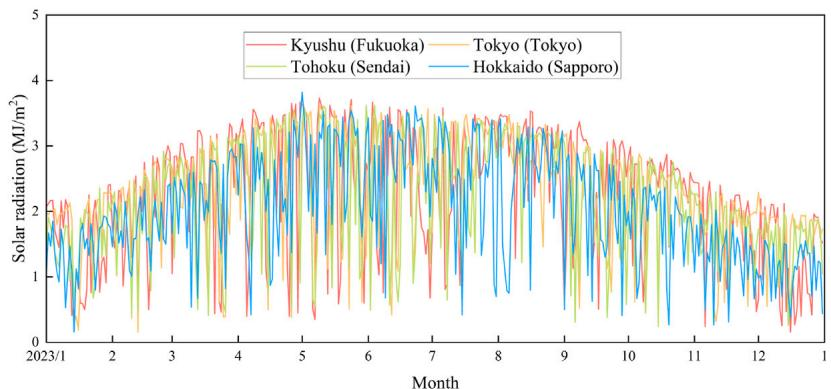  
(c) Daily maximum solar radiation   
Fig. 7. An Overview of daily weather data for selected regions of Japan in 2023.

# 3.3. Data splitting methodology

To validate model effectiveness, we collected eight years of data from 2016 to 2023. First, we assessed how training-set length impacts forecasting accuracy by training representative models on spans ranging from one to six years. The results, shown in Fig. 8, indicate that performance stabilizes once the training period exceeds four years. Balancing predictive gains against computational cost, we therefore selected 2018–2021 as our training dataset. To evaluate generalization to the most recent data, 2022 was used as the validation dataset and 2023 as the test dataset, with the checkpoint achieving the lowest validation loss retained during training.

We employed a fixed-window, interval-output forecasting protocol: at each prediction point, the model ingests the entire historical lookback window and simultaneously outputs all future horizon values in a single forward pass. This interval-output approach prevents any overlap between inputs and targets – unlike rolling-window schemes – thereby avoiding data leakage.

# 3.4. Evaluation metrics

We incorporated three widely used criteria to assess the predictive performance of the model from multiple perspectives: mean absolute error (MAE), mean absolute percentage error (MAPE), root mean squared error (RMSE) and correlation coefficient $( \mathbb { R } ^ { 2 } )$ . These evaluation metrics enable us to gauge the predictive ability of the model from various angles. The formulas to calculate MAE, MAPE, RMSE and $\mathbb { R } ^ { 2 }$ are

$$
\mathrm {M A E} = \frac {1}{n} \sum_ {i = 1} ^ {n} \left| y _ {i} - \hat {y} _ {i} \right| \tag {15}
$$

$$
\mathrm {M A P E} = \frac {1}{n} \sum_ {i = 1} ^ {n} \left| \frac {y _ {i} - \hat {y} _ {i}}{y _ {i}} \right| \tag {16}
$$

$$
\mathrm {R M S E} = \sqrt {\frac {1}{n} \sum_ {i = 1} ^ {n} \left(y _ {i} - \hat {y} _ {i}\right) ^ {2}} \tag {17}
$$

$$
R ^ {2} = 1 - \frac {\sum_ {i = 1} ^ {n} \left(y _ {i} - \hat {y} _ {i}\right) ^ {2}}{\sum_ {i = 1} ^ {n} \left(y _ {i} - \bar {y}\right) ^ {2}} \tag {18}
$$

Table 4 Description of the datasets(*:The value of renewable energy generation is equal to the sum of all other generation except fossil energy generation; data interval: one-hour).   

<table><tr><td>Data</td><td>Features</td></tr><tr><td>Electricity demand</td><td>Total demand</td></tr><tr><td rowspan="8">Electricity generation</td><td>Fossil</td></tr><tr><td>Nuclear</td></tr><tr><td>Hydro</td></tr><tr><td>Geothermal</td></tr><tr><td>Biomass</td></tr><tr><td>Solar</td></tr><tr><td>Wind</td></tr><tr><td>Renewable energy*</td></tr><tr><td rowspan="9">Weather</td><td>Temperature</td></tr><tr><td>Relative humidity</td></tr><tr><td>Precipitation</td></tr><tr><td>Dew point</td></tr><tr><td>Vapor pressure</td></tr><tr><td>Wind speed</td></tr><tr><td>Sunshine duration</td></tr><tr><td>Snowfall</td></tr><tr><td>Global horizontal irradiance</td></tr></table>

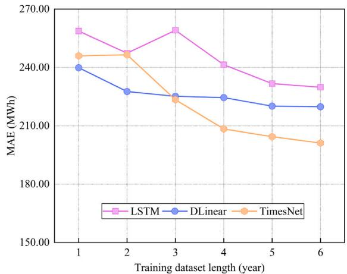  
Fig. 8. Impact of training dataset length (1–6 years) on MAE for LSTM, DLinear, and TimesNet models (2022 as the validation dataset and 2023 as the test dataset).

where ?? , $\hat { y } _ { i }$ , and $\bar { y }$ represent the measured value, predicted value, and mean of measured value, respectively; $n$ is the length of sequence. In addition, in order to evaluate the versatility of the model on different data sets, we also used a dimensionless indicator relative absolute error (RAE), which is calculated as follows:

$$
\mathrm {R A E} = \frac {\sum_ {i = 1} ^ {n} \left| y _ {i} - \hat {y} _ {i} \right|}{\sum_ {i = 1} ^ {n} \left| y _ {i} - \bar {y} \right|} \tag {19}
$$

As all input data is standardized beforehand, the output of the model represents the predicted value after standardization. We de-standardize the predicted value output by the model and compute the evaluation metrics based on the measured values to more intuitively compare the performance of the model.

# 3.5. Experimental setup

Fossil fuel energy and renewable energy play critical roles in shaping energy policies and grid management strategies [63]. Accurate forecasting of electricity demand, as well as generation from fossil fuels and renewable sources, is essential for optimizing grid operations, planning energy transitions, and ensuring energy security [64,65]. Given the growing emphasis on carbon emission reduction and renewable energy integration, accurate forecasting is essential. Our model aims to provide reliable predictions for these key metrics. Therefore, the

selected targets for prediction include overall electricity demand, fossil fuel-based power generation, and renewable energy generation, as shown in Fig. 9. By focusing on these aspects, the proposed model can support more informed decision-making for energy policy and grid management.

To further validate the generalization capability of the proposed model, we employed a zero-shot learning approach. The model, trained solely on the Tokyo dataset, was tested on the remaining three regions: Hokkaido, Tohoku, and Kyushu. This approach allowed us to evaluate the model’s ability to adapt and provide accurate forecasts without additional training on the new regions’ datasets. By comparing the zeroshot performance across these regions, we could assess the robustness and generalization capacity of the proposed model under different climatic and energy generation conditions. In all the above tasks, we fixed the input of historical data for 3 days (72 h) and predicted the data for the next week (168 h).

To select an appropriate LLM backbone, we evaluated four candidate models—BERT (420 MB) [66], GPT2 (522 MB) [67], LLAMA-3.2- 1b (2.30 GB) [68], and LLAMA-3.2-3b (5.97 GB) [68]. Their memory footprints and per-iteration training times are plotted in Fig. 10, and the average MAE across three forecasting targets was 213, 202, 201, and 198, respectively. While LLAMA-3.2-3b achieves the lowest error, it incurs a very large memory footprint and training latency. GPT2, by contrast, delivers near-state-of-the-art accuracy with the shortest training time, making it the most practical choice on our single-GPU setup. Accordingly, we adopt GPT2 as the LLM component in all subsequent experiments.

# 4. Results and discussions

# 4.1. Ablation study

The results of the ablation study, shown in Table 5, demonstrate that each module in the proposed model positively contributes to its predictive performance. The pre-trained LLM has the most significant impact on the model’s accuracy, as removing this module leads to a $1 7 . 3 \%$ drop in MAE. The self-attention module also plays a critical role in extracting relationships between non-target and target features, with its removal resulting in a $1 6 . 3 \%$ decrease in MAE.

Other modules, such as the feature extractor and the word projection, have relatively smaller effects on the model’s performance. Removing the feature extractor decreases the MAE by $1 0 . 4 \%$ , while removing the word projection module decreases the MAE by $5 . 9 \%$ . These findings indicate that, while all components contribute positively to the model’s overall performance, the pre-trained LLM and the selfattention mechanisms are particularly crucial for achieving the model’s high accuracy.

Additionally, we also evaluated the model under the CI training strategy. As shown in Table 5 last two row, adopting CI causes a substantial degradation in accuracy: MAE increases by $1 9 . 3 \%$ compared to our standard setup. When CI is applied with only the target variable as input (i.e., only use pre-trained LLM without feature extractor), MAE still increases by $1 4 . 9 \%$ . This drop arises because CI computes the loss for a single variable at each iteration. With all variables supplied, the model optimizes to minimize the aggregate loss across every channel, rather than focusing on the intended target, which harms its ability to predict that target accurately. Meantime, when only the target variable is provided, the model cannot leverage cross-channel information, resulting in a further reduction in predictive performance.

# 4.2. Performance under different prompt engineering

To evaluate the influence of prompt engineering on model performance, we compared the LLM-based TimeLLM model with the proposed MultiAttLLM model under different prompt conditions. The results, shown in Table 6, include scenarios without a prompt and with

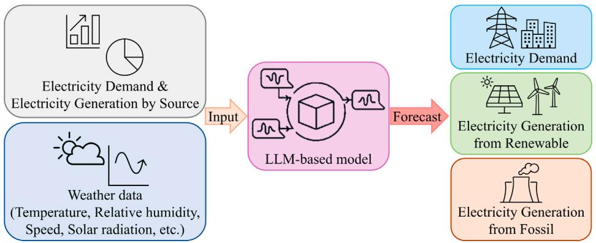  
Fig. 9. Electricity demand and generation forecasting task.

Table 5 Performance of the MultiAttLLM model after removing specific components (- indicates the full model without the corresponding part; * indicates that only the target variable is used as input; $\textcircled{1}$ : Word Projection; $\textcircled{2}$ : Cross-Attention; $\textcircled{3}$ : Pre-trained LLM; $\textcircled{4}$ : Feature Extractor; $\textcircled{5}$ : Self-Attention; $\textcircled{6}$ : Output Projection).   

<table><tr><td>Descriptions</td><td>①</td><td>②</td><td>③</td><td>④</td><td>⑤</td><td>⑥</td><td>MAE</td></tr><tr><td>Full model</td><td>✓</td><td>✓</td><td>✓</td><td>✓</td><td>✓</td><td>✓</td><td>202 (0.0%)</td></tr><tr><td>- Cross-Attention</td><td>✗</td><td>✗</td><td>✓</td><td>✓</td><td>✓</td><td>✓</td><td>214 (5.9% ↓)</td></tr><tr><td>- Pre-trained LLM</td><td>✗</td><td>✗</td><td>✗</td><td>✓</td><td>✓</td><td>✓</td><td>237 (17.3% ↓)</td></tr><tr><td>- Feature Extractor</td><td>✗</td><td>✗</td><td>✗</td><td>✗</td><td>✓</td><td>✓</td><td>241 (19.3% ↓)</td></tr><tr><td>- Feature Extractor</td><td>✓</td><td>✓</td><td>✓</td><td>✗</td><td>✓</td><td>✓</td><td>223 (10.4% ↓)</td></tr><tr><td>- Self-Attention</td><td>✓</td><td>✓</td><td>✓</td><td>✓</td><td>✗</td><td>✓</td><td>235 (16.3% ↓)</td></tr><tr><td>Full model (CI)</td><td>✓</td><td>✓</td><td>✓</td><td>✓</td><td>✓</td><td>✓</td><td>241 (19.3% ↓)</td></tr><tr><td>- Feature Extractor* (CI)</td><td>✓</td><td>✓</td><td>✗</td><td>✓</td><td>✓</td><td>✓</td><td>232 (14.9% ↓)</td></tr></table>

Table 6 Performance of LLM-based models under different prompts (Prompt1: description of the prediction task only; Prompt2: description of the prediction task and dataset; Prompt3: description of the prediction task, dataset, and input sequence statistics; lookback window length: 72; forecast horizons: 168; the unit of MAE and RMSE is MWh, MAPE is $\% )$ .   

<table><tr><td>Model</td><td colspan="4">TimeLLM</td><td colspan="4">MultiAttLLM</td></tr><tr><td>Metrics</td><td>MAE</td><td>MAPE</td><td>RMSE</td><td>R²</td><td>MAE</td><td>MAPE</td><td>RMSE</td><td>R²</td></tr><tr><td>Without prompt</td><td>236</td><td>21.02</td><td>325</td><td>0.70</td><td>202</td><td>15.40</td><td>283</td><td>0.77</td></tr><tr><td>Prompt1</td><td>235</td><td>21.79</td><td>325</td><td>0.70</td><td>209</td><td>16.46</td><td>292</td><td>0.75</td></tr><tr><td>Prompt2</td><td>230</td><td>19.20</td><td>320</td><td>0.71</td><td>208</td><td>16.40</td><td>291</td><td>0.75</td></tr><tr><td>Prompt3</td><td>217</td><td>16.24</td><td>307</td><td>0.73</td><td>205</td><td>16.20</td><td>288</td><td>0.76</td></tr></table>

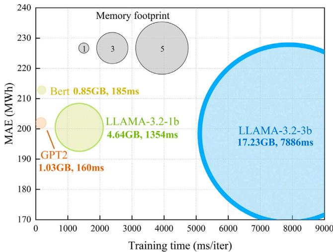  
Fig. 10. LLM efficiency comparison for proposed model (lookback window length: 72; forecast horizons: 168).

three progressively more complex prompts (Prompt1, Prompt2, and Prompt3). A detailed introduction to prompt is shown in Appendix A.2.

The results indicate that designing more complex and accurate prompts can improve the prediction accuracy of the TimeLLM model. Specifically, for TimeLLM, using Prompt3 improves the MAE by up to $8 . 1 \%$ compared to the no-prompt condition. However, the proposed MultiAttLLM model shows minimal sensitivity to prompt complexity. Regardless of the prompt condition, the MultiAttLLM consistently outperforms TimeLLM, achieving the highest accuracy (MAE: 202, RMSE: 283, $\mathtt { R } ^ { 2 }$ : 0.77) even without any prompt.

These findings suggest that the proposed MultiAttLLM model can effectively extract and process feature relationships through its multimodule architecture without relying on prompt design. This highlights its robustness and efficiency in utilizing LLMs, making it highly suitable for time series forecasting tasks without the added complexity of prompt engineering.

4.3. Performance comparison of benchmark models and the proposed MultiAttLLM model

The electricity demand and generation forecasting results for both the benchmark models and the proposed model are presented in Table 7. The results demonstrate that the traditional LSTM model performs the worst across all prediction targets and metrics. The proposed MultiAttLLM model achieves the best results for all targets and metrics, outperforming the other models in terms of MAE, RMSE, and $\mathtt { R } ^ { 2 }$

Table 7 Electricity demand and generation forecasting results (lookback window length: 72; forecast horizons: 168; the unit of MAE and RMSE is MWh, MAPE is $\% ;$ ; boldface indicates the best performance; underlined values denote the second-best performance).   

<table><tr><td rowspan="2">Target variable</td><td rowspan="2">Metrics</td><td colspan="8">Method</td></tr><tr><td>LSTM</td><td>DLinear</td><td>Informer</td><td>Autoformer</td><td>iTTransformer</td><td>TimesNet</td><td>TimeLLM</td><td>MultiAttLLM</td></tr><tr><td rowspan="4">Electricity demand</td><td>MAE</td><td>288</td><td>259</td><td>235</td><td>265</td><td>232</td><td>251</td><td>250</td><td>228</td></tr><tr><td>MAPE</td><td>8.88</td><td>7.77</td><td>7.15</td><td>8.23</td><td>7.01</td><td>7.58</td><td>7.42</td><td>6.89</td></tr><tr><td>RMSE</td><td>384</td><td>355</td><td>317</td><td>356</td><td>313</td><td>337</td><td>346</td><td>311</td></tr><tr><td>R²</td><td>0.73</td><td>0.77</td><td>0.80</td><td>0.75</td><td>0.82</td><td>0.79</td><td>0.78</td><td>0.82</td></tr><tr><td rowspan="4">Generation (Renewable energy)</td><td>MAE</td><td>165</td><td>153</td><td>135</td><td>154</td><td>150</td><td>148</td><td>139</td><td>127</td></tr><tr><td>MAPE</td><td>48.35</td><td>39.25</td><td>26.39</td><td>43.43</td><td>36.46</td><td>35.63</td><td>29.34</td><td>27.47</td></tr><tr><td>RMSE</td><td>237</td><td>243</td><td>222</td><td>222</td><td>237</td><td>235</td><td>232</td><td>213</td></tr><tr><td>R²</td><td>0.75</td><td>0.73</td><td>0.73</td><td>0.73</td><td>0.75</td><td>0.75</td><td>0.76</td><td>0.80</td></tr><tr><td rowspan="4">Generation (Fossil energy)</td><td>MAE</td><td>278</td><td>257</td><td>271</td><td>258</td><td>252</td><td>251</td><td>262</td><td>251</td></tr><tr><td>MAPE</td><td>13.19</td><td>11.97</td><td>13.05</td><td>11.86</td><td>11.85</td><td>11.49</td><td>11.96</td><td>11.83</td></tr><tr><td>RMSE</td><td>360</td><td>336</td><td>343</td><td>335</td><td>326</td><td>332</td><td>342</td><td>325</td></tr><tr><td>R²</td><td>0.60</td><td>0.66</td><td>0.62</td><td>0.64</td><td>0.68</td><td>0.66</td><td>0.64</td><td>0.68</td></tr><tr><td rowspan="4">Mean</td><td>MAE</td><td>244</td><td>223</td><td>214</td><td>226</td><td>211</td><td>216</td><td>217</td><td>202</td></tr><tr><td>MAPE</td><td>23.47</td><td>19.66</td><td>15.53</td><td>21.17</td><td>18.44</td><td>18.23</td><td>16.24</td><td>15.40</td></tr><tr><td>RMSE</td><td>327</td><td>311</td><td>294</td><td>304</td><td>292</td><td>302</td><td>307</td><td>283</td></tr><tr><td>R²</td><td>0.69</td><td>0.72</td><td>0.72</td><td>0.71</td><td>0.75</td><td>0.75</td><td>0.73</td><td>0.77</td></tr></table>

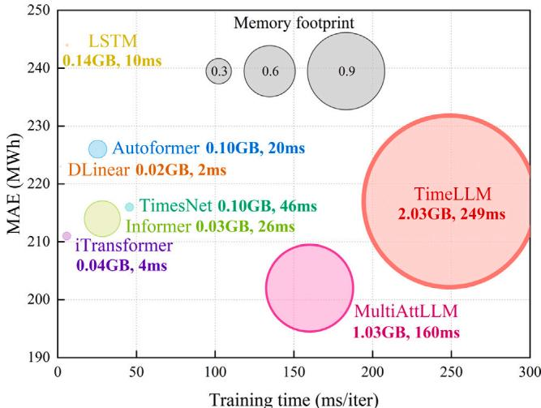  
Fig. 11. Model efficiency comparison (lookback window length: 72; forecast horizons: 168).

scores. The models that improve upon traditional approaches, Informer, iTransformer, Autoformer and TimesNet, show similar performance. For some specific variables and metrics, these models can match the best results achieved by the proposed model.

Furthermore, we also compared each model’s per-iteration training time and memory footprint, as shown in Fig. 11. DLinear exhibits the smallest memory footprint $_ { ( \approx 0 . 0 2 }$ GB) and the fastest speed (≈2ms/iter), though with only moderate forecasting accuracy. The transformer-based baselines (Informer, Autoformer, iTransformer, TimesNet) cluster around similar MAE values and training times, each outperforming the vanilla LSTM while maintaining comparable efficiency. Under nearly identical parameter counts (TimeLLM: 61.7M; MultiAttLLM: 62.4M), our MultiAttLLM reduces memory usage by about $4 9 . 3 \%$ (from 2.03 GB down to 1.03 GB) and cuts per-iteration training time by roughly $3 5 . 7 \%$ (from 249 ms to 160 ms). Meanwhile, the proposed model outperforms TimeLLM, with average improvements of $6 . 9 \%$ , $7 . 8 \%$ , and $5 . 5 \%$ in MAE, RMSE, and R2, respectively.

# 4.4. Model performance for different target variables

The relative errors for predicting electricity demand, renewable energy generation, and fossil fuel energy generation across all models

are shown in Fig. 12. The calculation method for relative error (RE) is as follows:

$$
\mathrm {R E} = \frac {\hat {y} _ {i} - y _ {i}}{y _ {i}} \tag {20}
$$

where $y _ { i }$ and $\hat { y } _ { i }$ represent the measured value and predicted value.

The results indicate that all models perform best when predicting electricity demand, followed by fossil fuel energy generation. The prediction accuracy for renewable energy generation is the lowest. This is primarily because electricity demand and fossil fuel generation in a given region tend to be more stable and are less influenced by seasonal or weather changes. In contrast, renewable energy generation, which includes solar, hydro, and wind power, is highly dependent on weather and seasonal variations, making it more challenging to predict accurately.

As illustrated in Fig. 13, a portion of the electricity demand forecasting results shows that the daily variation patterns are fairly consistent across all days, with peaks occurring during the day and troughs at night. When the peak demand and fluctuations between consecutive days are similar, all models show strong predictive performance. However, when there are significant deviations in peak demand or fluctuations compared to the preceding and following days, the performance of all models decreases to some extent. Nonetheless, the proposed model continues to exhibit the best overall performance, particularly in scenarios with greater variability in demand.

# 4.5. Performance across different forecasting horizons

To assess how horizon length impacts predictive accuracy, we evaluated every model on horizons ranging from 1 step (1 h) to 720 steps (30 days) for electricity demand forecasting, with the average results of three target variables plotted in Fig. 14. When forecasting just one step ahead, all models achieve very high accuracy due to the strong correlation between immediate history and the next value. As the horizon extends from 1 to 24 steps, performance for every method declines sharply. Beyond 24 steps, however, the rate of accuracy degradation slows markedly—longer-term targets bear weaker links to input history, so error growth tapers off. Among the baselines, Informer and TimesNet show the slowest drop in precision over long horizons, but our MultiAttLLM model consistently maintains the highest accuracy across both short-term and long-term forecasts.

# 4.6. Generalization performance through zero-shot learning

To evaluate the generalization capability of the proposed model, we conducted zero-shot learning experiments. For each experiment, data

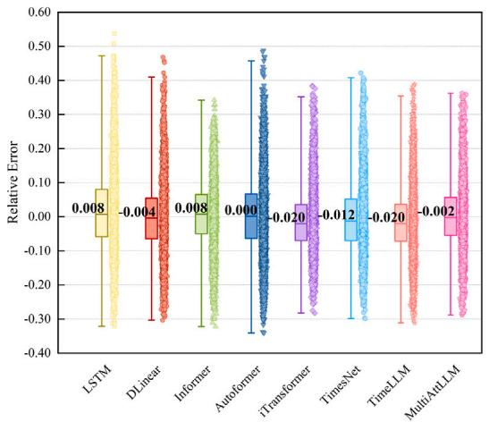  
(a) Electricity demand

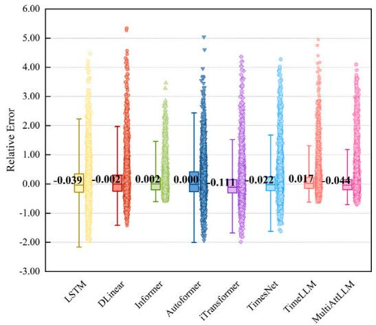  
(b) Generation from renewable energy

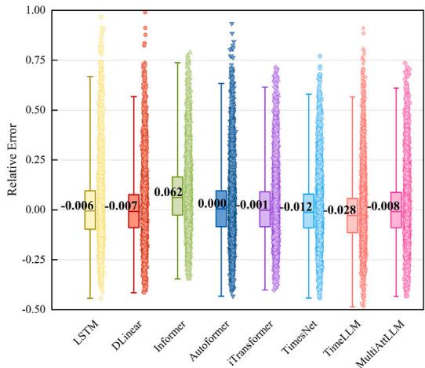  
(c) Generation from fossil energy

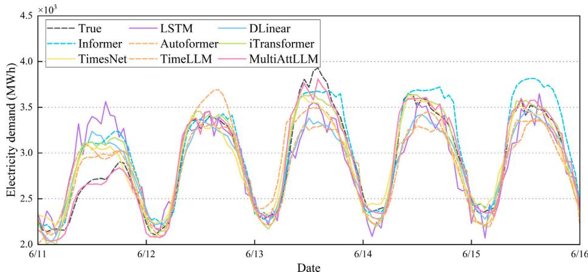  
Fig. 12. Relative error for electricity demand, renewable energy generation, and fossil energy generation predictions across different models(lookback window length: 72; forecast horizons: 168).   
Fig. 13. Comparison of electricity demand forecasting results across different models.

from one of the four regions – Tokyo, Hokkaido, Tohoku, or Kyushu – was used as the source domain to train the model. The trained model was then tested on all four target domains without any fine-tuning or adjustments. The average results for each target domain are presented in Table 8. These results demonstrate that the proposed MultiAttLLM model consistently achieves the best generalization performance across

all target domains. The TimeLLM model achieves the second-best accuracy, highlighting the superior generalization ability of LLM-based models. The DLinear and TimesNet model, which leverages time series decomposition, demonstrates a moderate level of generalization. In contrast, the self-attention based models, which perform reasonably well in non-transfer learning settings, show significant drops in performance when tested on unseen datasets. Detailed results for using

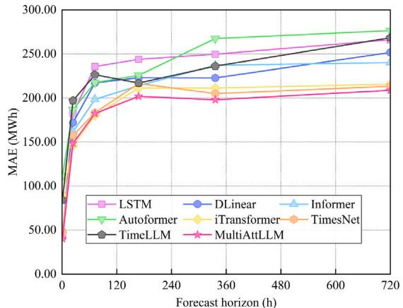  
(a)MAE

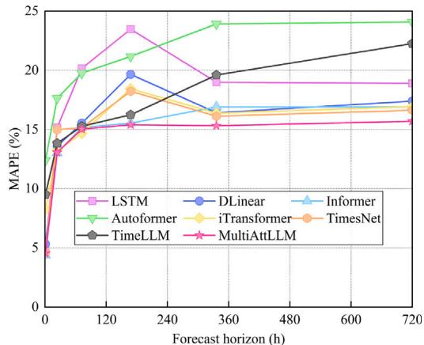  
(b)MAPE

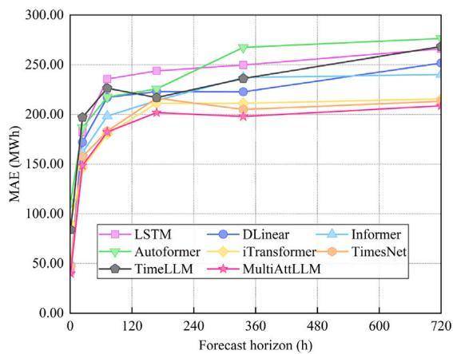  
(c)RMSE

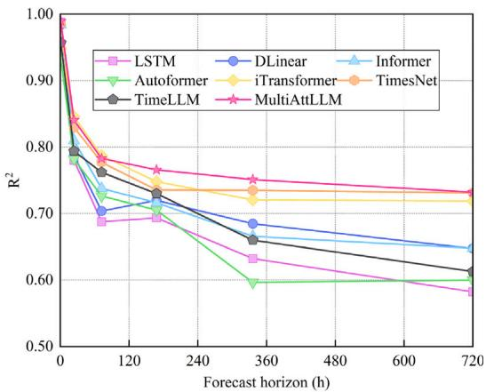  
(d)R²   
Fig. 14. Performance across different forecasting horizons (from 1 steps to 720 steps).

Table 8 Zero-shot learning performance across target domains using different source regions (Results averaged across target domains for each source region; lookback window length: 72; forecast horizons: 168; the unit of MAE and RMSE is MWh).   

<table><tr><td rowspan="2">Target domain metrics</td><td colspan="4">Tokyo</td><td colspan="4">Hokkaido</td><td colspan="4">Tohoku</td><td colspan="4">Kyushu</td></tr><tr><td>MAE</td><td>RMSE</td><td>RAE</td><td>R2</td><td>MAE</td><td>RMSE</td><td>RAE</td><td>R2</td><td>MAE</td><td>RMSE</td><td>RAE</td><td>R2</td><td>MAE</td><td>RMSE</td><td>RAE</td><td>R2</td></tr><tr><td>LSTM</td><td>253</td><td>351</td><td>0.52</td><td>0.64</td><td>250</td><td>330</td><td>0.48</td><td>0.74</td><td>1097</td><td>1426</td><td>0.57</td><td>0.64</td><td>880</td><td>1210</td><td>0.52</td><td>0.66</td></tr><tr><td>DLinear</td><td>227</td><td>316</td><td>0.47</td><td>0.71</td><td>241</td><td>318</td><td>0.46</td><td>0.75</td><td>928</td><td>1245</td><td>0.48</td><td>0.73</td><td>824</td><td>1159</td><td>0.49</td><td>0.69</td></tr><tr><td>Informer</td><td>250</td><td>341</td><td>0.53</td><td>0.63</td><td>307</td><td>395</td><td>0.62</td><td>0.57</td><td>928</td><td>1240</td><td>0.54</td><td>0.64</td><td>906</td><td>1218</td><td>0.56</td><td>0.62</td></tr><tr><td>Autoformer</td><td>276</td><td>367</td><td>0.59</td><td>0.58</td><td>277</td><td>359</td><td>0.56</td><td>0.65</td><td>1018</td><td>1339</td><td>0.60</td><td>0.58</td><td>928</td><td>1238</td><td>0.58</td><td>0.60</td></tr><tr><td>iTransformer</td><td>288</td><td>380</td><td>0.60</td><td>0.56</td><td>352</td><td>474</td><td>0.60</td><td>0.57</td><td>1164</td><td>1528</td><td>0.59</td><td>0.60</td><td>1133</td><td>1501</td><td>0.67</td><td>0.48</td></tr><tr><td>TimesNet</td><td>237</td><td>328</td><td>0.49</td><td>0.69</td><td>244</td><td>323</td><td>0.46</td><td>0.75</td><td>1201</td><td>1576</td><td>0.62</td><td>0.54</td><td>841</td><td>1170</td><td>0.50</td><td>0.68</td></tr><tr><td>TimeLLM</td><td>229</td><td>318</td><td>0.47</td><td>0.71</td><td>238</td><td>314</td><td>0.45</td><td>0.76</td><td>943</td><td>1261</td><td>0.49</td><td>0.72</td><td>849</td><td>1185</td><td>0.51</td><td>0.68</td></tr><tr><td>MultiAttLLM</td><td>211</td><td>304</td><td>0.43</td><td>0.73</td><td>234</td><td>310</td><td>0.44</td><td>0.77</td><td>891</td><td>1220</td><td>0.46</td><td>0.74</td><td>796</td><td>1131</td><td>0.47</td><td>0.71</td></tr></table>

each region as the source domain and the corresponding predictions on different target domains are provided in Appendix A.3.

When using the Tokyo dataset as the source domain, the zeroshot learning results for Hokkaido, Tohoku, and Kyushu are shown in Fig. 15. The dimensionless metrics reveal that transformer-based models and the LSTM model exhibit the poorest generalization capability. While these models maintain reasonable accuracy on the Tohoku dataset, which shares geographic and climatic similarities with Tokyo, their performance significantly deteriorates on the Hokkaido and Kyushu datasets, which feature distinct climatic and energy generation characteristics. In contrast, the proposed MultiAttLLM model demonstrates the best generalization performance across all test regions, achieving the lowest relative errors and maintaining robust predictions even under varying conditions.

# 5. Conclusion

Large language models (LLM) have garnered significant attention in time series forecasting due to their strong performance across diverse tasks. However, their application to multivariate forecasting remains challenged by channel-independent training strategies that impede learning of cross-channel interactions and by the complexity of prompt engineering. To overcome these obstacles, we introduced a novel multi-attention LLM framework that integrates cross-attention, self-attention, and a frozen pre-trained LLM to extract rich interdependencies among target and auxiliary variables without any manual prompt design.

Extensive ablation studies demonstrate that every component of our architecture contributes positively to forecasting accuracy, with the pre-trained LLM backbone and the attention modules yielding

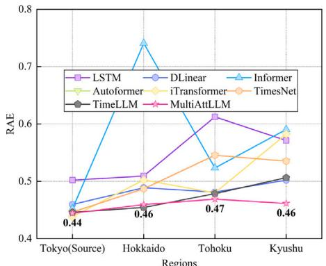  
(a)RAE

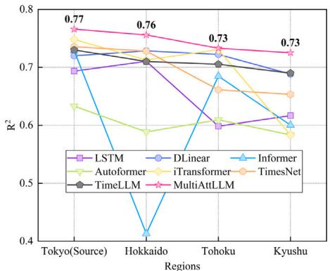  
(b)R²   
Fig. 15. Zero-shot learning results of two dimensionless metrics (Source domain: Tokyo; Target domains: Hokkaido, Tohoku, Kyushu; lookback window length: 72; forecast horizons: 168).

Table 9 Zero-shot learning performance across target domains using Kyushu region as source domain (The unit of MAE and RMSE is MWh).   

<table><tr><td rowspan="2">Target domain metrics</td><td colspan="4">Tokyo</td><td colspan="4">Hokkaido</td><td colspan="4">Tohoku</td><td colspan="4">Kyushu</td></tr><tr><td>MAE</td><td>RMSE</td><td>RAE</td><td>R2</td><td>MAE</td><td>RMSE</td><td>RAE</td><td>R2</td><td>MAE</td><td>RMSE</td><td>RAE</td><td>R2</td><td>MAE</td><td>RMSE</td><td>RAE</td><td>R2</td></tr><tr><td>LSTM</td><td>268</td><td>379</td><td>0.55</td><td>0.59</td><td>264</td><td>349</td><td>0.50</td><td>0.71</td><td>1036</td><td>1345</td><td>0.54</td><td>0.68</td><td>804</td><td>1126</td><td>0.48</td><td>0.71</td></tr><tr><td>DLinear</td><td>231</td><td>329</td><td>0.48</td><td>0.68</td><td>248</td><td>327</td><td>0.47</td><td>0.74</td><td>917</td><td>1232</td><td>0.48</td><td>0.73</td><td>784</td><td>1109</td><td>0.47</td><td>0.72</td></tr><tr><td>Informer</td><td>238</td><td>321</td><td>0.51</td><td>0.68</td><td>302</td><td>393</td><td>0.61</td><td>0.58</td><td>882</td><td>1203</td><td>0.52</td><td>0.67</td><td>718</td><td>985</td><td>0.45</td><td>0.75</td></tr><tr><td>Autoformer</td><td>284</td><td>383</td><td>0.61</td><td>0.55</td><td>274</td><td>355</td><td>0.55</td><td>0.65</td><td>1053</td><td>1400</td><td>0.63</td><td>0.54</td><td>844</td><td>1152</td><td>0.53</td><td>0.66</td></tr><tr><td>iTransformer</td><td>282</td><td>375</td><td>0.59</td><td>0.58</td><td>314</td><td>418</td><td>0.53</td><td>0.67</td><td>1114</td><td>1470</td><td>0.57</td><td>0.63</td><td>1056</td><td>1417</td><td>0.62</td><td>0.54</td></tr><tr><td>TimesNet</td><td>235</td><td>328</td><td>0.49</td><td>0.68</td><td>258</td><td>350</td><td>0.49</td><td>0.70</td><td>1554</td><td>2054</td><td>0.79</td><td>0.26</td><td>761</td><td>1072</td><td>0.45</td><td>0.74</td></tr><tr><td>TimeLLM</td><td>229</td><td>318</td><td>0.47</td><td>0.71</td><td>239</td><td>315</td><td>0.46</td><td>0.76</td><td>934</td><td>1251</td><td>0.49</td><td>0.72</td><td>849</td><td>1184</td><td>0.50</td><td>0.68</td></tr><tr><td>MultiAttLLM</td><td>211</td><td>304</td><td>0.43</td><td>0.73</td><td>237</td><td>314</td><td>0.45</td><td>0.76</td><td>891</td><td>1223</td><td>0.46</td><td>0.74</td><td>796</td><td>1130</td><td>0.47</td><td>0.71</td></tr></table>

Table 10 Zero-shot learning performance across target domains using Hokkaido region as source domain (The unit of MAE and RMSE is MWh).   

<table><tr><td rowspan="2">Target domain metrics</td><td colspan="4">Tokyo</td><td colspan="4">Hokkaido</td><td colspan="4">Tohoku</td><td colspan="4">Kyushu</td></tr><tr><td>MAE</td><td>RMSE</td><td>RAE</td><td>R2</td><td>MAE</td><td>RMSE</td><td>RAE</td><td>R2</td><td>MAE</td><td>RMSE</td><td>RAE</td><td>R2</td><td>MAE</td><td>RMSE</td><td>RAE</td><td>R2</td></tr><tr><td>LSTM</td><td>261</td><td>359</td><td>0.54</td><td>0.63</td><td>238</td><td>317</td><td>0.45</td><td>0.76</td><td>1177</td><td>1521</td><td>0.61</td><td>0.59</td><td>907</td><td>1237</td><td>0.54</td><td>0.65</td></tr><tr><td>DLinear</td><td>234</td><td>321</td><td>0.48</td><td>0.70</td><td>226</td><td>299</td><td>0.43</td><td>0.78</td><td>938</td><td>1256</td><td>0.49</td><td>0.72</td><td>808</td><td>1136</td><td>0.48</td><td>0.70</td></tr><tr><td>Informer</td><td>285</td><td>380</td><td>0.61</td><td>0.56</td><td>266</td><td>343</td><td>0.54</td><td>0.68</td><td>1182</td><td>1560</td><td>0.70</td><td>0.44</td><td>1054</td><td>1398</td><td>0.65</td><td>0.51</td></tr><tr><td>Autoformer</td><td>307</td><td>405</td><td>0.65</td><td>0.50</td><td>261</td><td>341</td><td>0.53</td><td>0.68</td><td>1073</td><td>1408</td><td>0.63</td><td>0.54</td><td>958</td><td>1273</td><td>0.60</td><td>0.58</td></tr><tr><td>iTransformer</td><td>295</td><td>387</td><td>0.62</td><td>0.54</td><td>371</td><td>503</td><td>0.63</td><td>0.52</td><td>1187</td><td>1555</td><td>0.59</td><td>0.59</td><td>1159</td><td>1533</td><td>0.68</td><td>0.45</td></tr><tr><td>TimesNet</td><td>255</td><td>349</td><td>0.52</td><td>0.66</td><td>231</td><td>305</td><td>0.44</td><td>0.77</td><td>1053</td><td>1384</td><td>0.55</td><td>0.66</td><td>862</td><td>1196</td><td>0.51</td><td>0.67</td></tr><tr><td>TimeLLM</td><td>231</td><td>321</td><td>0.47</td><td>0.70</td><td>236</td><td>312</td><td>0.45</td><td>0.76</td><td>950</td><td>1272</td><td>0.49</td><td>0.71</td><td>853</td><td>1192</td><td>0.51</td><td>0.67</td></tr><tr><td>MultiAttLLM</td><td>210</td><td>303</td><td>0.43</td><td>0.73</td><td>226</td><td>302</td><td>0.43</td><td>0.78</td><td>888</td><td>1216</td><td>0.46</td><td>0.74</td><td>791</td><td>1130</td><td>0.47</td><td>0.71</td></tr></table>

Table 11 Zero-shot learning performance across target domains using Tokyo region as source domain (The unit of MAE and RMSE is MWh).   

<table><tr><td rowspan="2">Target domain metrics</td><td colspan="4">Tokyo</td><td colspan="4">Hokkaido</td><td colspan="4">Tohoku</td><td colspan="4">Kyushu</td></tr><tr><td>MAE</td><td>RMSE</td><td>RAE</td><td>R2</td><td>MAE</td><td>RMSE</td><td>RAE</td><td>R2</td><td>MAE</td><td>RMSE</td><td>RAE</td><td>R2</td><td>MAE</td><td>RMSE</td><td>RAE</td><td>R2</td></tr><tr><td>LSTM</td><td>222</td><td>305</td><td>0.46</td><td>0.73</td><td>261</td><td>338</td><td>0.50</td><td>0.72</td><td>999</td><td>1318</td><td>0.52</td><td>0.69</td><td>902</td><td>1241</td><td>0.54</td><td>0.64</td></tr><tr><td>DLinear</td><td>208</td><td>293</td><td>0.43</td><td>0.75</td><td>264</td><td>347</td><td>0.50</td><td>0.71</td><td>919</td><td>1236</td><td>0.47</td><td>0.73</td><td>894</td><td>1258</td><td>0.53</td><td>0.63</td></tr><tr><td>Informer</td><td>208</td><td>288</td><td>0.45</td><td>0.73</td><td>370</td><td>470</td><td>0.74</td><td>0.41</td><td>898</td><td>1190</td><td>0.52</td><td>0.68</td><td>949</td><td>1252</td><td>0.59</td><td>0.60</td></tr><tr><td>Autoformer</td><td>256</td><td>341</td><td>0.55</td><td>0.63</td><td>307</td><td>391</td><td>0.62</td><td>0.59</td><td>1035</td><td>1335</td><td>0.61</td><td>0.59</td><td>975</td><td>1270</td><td>0.61</td><td>0.58</td></tr><tr><td>iTransformer</td><td>280</td><td>370</td><td>0.60</td><td>0.57</td><td>354</td><td>473</td><td>0.60</td><td>0.57</td><td>1168</td><td>1534</td><td>0.59</td><td>0.60</td><td>1160</td><td>1523</td><td>0.68</td><td>0.47</td></tr><tr><td>TimesNet</td><td>203</td><td>287</td><td>0.42</td><td>0.76</td><td>254</td><td>331</td><td>0.48</td><td>0.73</td><td>1142</td><td>1483</td><td>0.60</td><td>0.59</td><td>880</td><td>1216</td><td>0.52</td><td>0.66</td></tr><tr><td>TimeLLM</td><td>226</td><td>313</td><td>0.46</td><td>0.72</td><td>240</td><td>315</td><td>0.46</td><td>0.76</td><td>938</td><td>1250</td><td>0.49</td><td>0.72</td><td>843</td><td>1171</td><td>0.50</td><td>0.68</td></tr><tr><td>MultiAttLLM</td><td>202</td><td>283</td><td>0.42</td><td>0.77</td><td>246</td><td>323</td><td>0.46</td><td>0.76</td><td>898</td><td>1227</td><td>0.47</td><td>0.73</td><td>806</td><td>1135</td><td>0.46</td><td>0.73</td></tr></table>

the largest gains. In benchmark comparisons, our model outperforms state-of-the-art transformer-based and LLM-based approaches, reducing mean absolute error by up to $2 0 . 8 \%$ relative to standard LSTM models. Compared with the current best time-series LLM, the proposed model reduces memory usage by $4 9 . 3 \%$ and shortens training time by $3 5 . 7 \%$ . Moreover, it maintains superior trend-following capabilities under volatile conditions, achieving the highest accuracy across electricity demand, renewable generation, and fossil generation forecasts. Crucially, in zero-shot evaluations on four geographically diverse Japanese regions, our framework improves MAE by an average of $1 6 . 6 \%$ over LSTM, demonstrating exceptional generalization ability. These findings

underscore the effectiveness of multi-attention reprogramming in unlocking the full potential of LLMs for accurate, robust, and generalizable multivariate time series forecasting.

However, this study has some limitations. First, the model was not fine-tuned for specific time series forecasting tasks, which could further improve its performance. Additionally, the computational complexity of LLMs remains a challenge, particularly for real-time applications. In future work, we aim to explore further improvements by fine-tuning the LLMs module for specific time series forecasting tasks and incorporating more complex data sources, such as real-time data streams. Additionally, extending the model to handle multi-horizon forecasting and

Table 12 Zero-shot learning performance across target domains using Tohoku region as source domain (The unit of MAE and RMSE is MWh).   

<table><tr><td rowspan="2">Target domain metrics</td><td colspan="4">Tokyo</td><td colspan="4">Hokkaido</td><td colspan="4">Tohoku</td><td colspan="4">Kyushu</td></tr><tr><td>MAE</td><td>RMSE</td><td>RAE</td><td>\( R^2 \)</td><td>MAE</td><td>RMSE</td><td>RAE</td><td>\( R^2 \)</td><td>MAE</td><td>RMSE</td><td>RAE</td><td>\( R^2 \)</td><td>MAE</td><td>RMSE</td><td>RAE</td><td>\( R^2 \)</td></tr><tr><td>LSTM</td><td>289</td><td>375</td><td>0.60</td><td>0.59</td><td>287</td><td>369</td><td>0.55</td><td>0.67</td><td>961</td><td>1267</td><td>0.50</td><td>0.72</td><td>1255</td><td>1594</td><td>0.73</td><td>0.42</td></tr><tr><td>DLinear</td><td>222</td><td>304</td><td>0.46</td><td>0.73</td><td>236</td><td>308</td><td>0.45</td><td>0.77</td><td>892</td><td>1195</td><td>0.46</td><td>0.75</td><td>828</td><td>1177</td><td>0.49</td><td>0.68</td></tr><tr><td>Informer</td><td>267</td><td>374</td><td>0.56</td><td>0.57</td><td>290</td><td>374</td><td>0.59</td><td>0.62</td><td>748</td><td>1009</td><td>0.44</td><td>0.77</td><td>902</td><td>1237</td><td>0.57</td><td>0.60</td></tr><tr><td>Autoformer</td><td>256</td><td>340</td><td>0.55</td><td>0.64</td><td>265</td><td>349</td><td>0.54</td><td>0.67</td><td>909</td><td>1215</td><td>0.53</td><td>0.66</td><td>934</td><td>1257</td><td>0.58</td><td>0.60</td></tr><tr><td>iTransformer</td><td>292</td><td>384</td><td>0.61</td><td>0.55</td><td>360</td><td>482</td><td>0.61</td><td>0.56</td><td>1168</td><td>1535</td><td>0.59</td><td>0.60</td><td>1159</td><td>1529</td><td>0.68</td><td>0.46</td></tr><tr><td>TimesNet</td><td>543</td><td>696</td><td>1.08</td><td>-0.33</td><td>396</td><td>515</td><td>0.75</td><td>0.36</td><td>928</td><td>1262</td><td>0.48</td><td>0.72</td><td>1489</td><td>1981</td><td>0.89</td><td>0.06</td></tr><tr><td>TimeLLM</td><td>234</td><td>325</td><td>0.48</td><td>0.69</td><td>238</td><td>315</td><td>0.45</td><td>0.76</td><td>961</td><td>1284</td><td>0.50</td><td>0.71</td><td>873</td><td>1211</td><td>0.52</td><td>0.67</td></tr><tr><td>MultiAttLLM</td><td>210</td><td>304</td><td>0.43</td><td>0.73</td><td>230</td><td>307</td><td>0.44</td><td>0.77</td><td>886</td><td>1215</td><td>0.46</td><td>0.74</td><td>791</td><td>1129</td><td>0.47</td><td>0.71</td></tr></table>

integrating domain-specific knowledge into the attention mechanisms could further enhance the model’s accuracy and applicability in various industries.

# CRediT authorship contribution statement

Zehuan Hu: Writing – review & editing, Writing – original draft, Visualization, Validation, Resources, Methodology, Investigation, Data curation, Conceptualization. Yuan Gao: Writing – review & editing, Supervision. Luning Sun: Resources. Masayuki Mae: Project administration.

# Declaration of competing interest

The authors declare that they have no known competing financial interests or personal relationships that could have appeared to influence the work reported in this paper.

# Acknowledgment

This work was supported by project No. 23KJ0766 funded by the Japan Society for the Promotion of Science.

# Appendix

# A.1. Long short-term memory network

The core functionality of the long short-term memory (LSTM) unit lies in its three gating mechanisms, which are controlled by sigmoid functions. These gates regulate the proportion of past and current input information used in the unit’s calculations, ultimately determining the output for the current time step through the output gate (denoted as $\mathbf { } _ { \mathbf { } h } ( t )$ in Fig. A.1). The cell state, $c ^ { ( t ) }$ , remains largely unaffected by the gates and stays relatively stable throughout the computation process. This ‘‘conveyor belt’’ system plays a critical role in maintaining the long-term memory capabilities of the LSTM network.

LSTM is calculated using:

$$
\boldsymbol {f} ^ {(t)} = \sigma \left(\boldsymbol {W} _ {f} \left[ \boldsymbol {h} ^ {(t - 1)}, \boldsymbol {x} ^ {(t)} \right] + \boldsymbol {b} _ {f}\right) \tag {A.1}
$$

$$
\boldsymbol {i} ^ {(t)} = \sigma \left(\boldsymbol {W} _ {i} \left[ \boldsymbol {h} ^ {(t - 1)}, \boldsymbol {x} ^ {(t)} \right] + \boldsymbol {b} ^ {(t)}\right) \tag {A.2}
$$

$$
\tilde {c} ^ {(t)} = \tanh  \left(\boldsymbol {W} _ {c} \left[ \boldsymbol {h} ^ {(t - 1)}, \boldsymbol {x} ^ {(t)} \right] + \boldsymbol {b} _ {c}\right) \tag {A.3}
$$

$$
\boldsymbol {c} ^ {(t)} = \boldsymbol {f} ^ {(t)} \odot \boldsymbol {c} ^ {(t - 1)} + \boldsymbol {i} ^ {(t)} \odot \tilde {\boldsymbol {c}} ^ {(t)} \tag {A.4}
$$

$$
\boldsymbol {o} ^ {(t)} = \sigma \left(\boldsymbol {W} _ {o} \left[ \boldsymbol {h} ^ {(t - 1)}, \boldsymbol {x} ^ {(t)} \right] + \boldsymbol {b} _ {o}\right) \tag {A.5}
$$

$$
\boldsymbol {h} ^ {(t)} = \boldsymbol {o} ^ {(t)} \odot \tanh  (\boldsymbol {c} ^ {(t)}) \tag {A.6}
$$

where $f ^ { ( t ) } , i ^ { ( t ) }$ , and $o ^ { ( t ) }$ represents the calculation results of the forget gate, input gate, and output gate, respectively; $\tilde { \mathbf { \boldsymbol { c } } } ^ { ( t ) }$ is the cell state update; $\mathbf { } _ { \pmb { h } } ( t )$ is the hidden state; ?? , ?? , and ?? refer to the weights and biases in the model; $\odot$ is the Hadamard product; $\sigma$ is the sigmoid function.

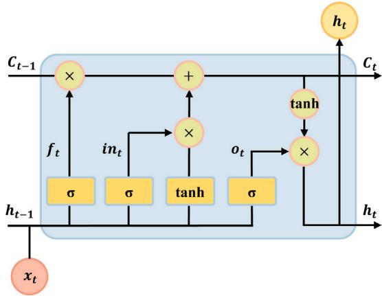  
Fig. A.1. Unfold structure of the LSTM unit.

# A.2. Prompt engineering

Based on the prompt engineering described in [36], we designed three types of prompts tailored for time series forecasting tasks. These prompts are detailed as follows ({} is task-specific configurations or calculated input statistics):

(1) Prompt1 (prediction task description only): ⟨|start_prompt|⟩ Task description: forecast the next {forecast sequence length} steps given the previous {input sequence length} steps information ⟨|end_prompt|⟩   
(2) Prompt2 (prediction task and dataset description): ⟨|start_prompt|⟩ Task description: forecast the next {forecast sequence length} steps given the previous {input sequence length} steps information; Dataset description: Electricity dataset is recorded every $^ { 1 \mathrm { ~ h ~ } }$ , which contains meteorological indicators and power source composition of Japan, such as air temperature, humidity, solar, coal nuclear, etc. ⟨|end_prompt|⟩   
(3) Prompt3 (prediction task, dataset description, and input sequence statistics): ⟨|start_prompt|⟩ Task description: forecast the next {forecast sequence length} steps given the previous {input sequence length} steps information; Dataset description: Electricity dataset is

recorded every 1 h, which contains meteorological indicators and power source composition of Japan, such as air temperature, humidity, solar, coal nuclear, etc.; Input statistics: min value {min values}, max value {max values}, median value {median values}, the trend of input is {upward or downward}, top $\{ \mathrm { t o p } _ { k } \}$ , lags are : {lags values} ⟨|end_prompt|⟩

# A.3. Results of zero-shot learning

See Tables 9–12.

# References

[1] Y. Oswald, A. Owen, J.K. Steinberger, Large inequality in international and intranational energy footprints between income groups and across consumption categories, Nat. Energy 5 (3) (2020) 231–239.   
[2] C. Dingbang, C. Cang, C. Qing, S. Lili, C. Caiyun, Does new energy consumption conducive to controlling fossil energy consumption and carbon emissions?-Evidence from China, Resour. Policy 74 (2021) 102427.   
[3] R. Khalili, A. Khaledi, M. Marzband, A.F. Nematollahi, B. Vahidi, P. Siano, Robust multi-objective optimization for the Iranian electricity market considering green hydrogen and analyzing the performance of different demand response programs, Appl. Energy 334 (2023) 120737.   
[4] M.S.S. Danish, T. Senjyu, T. Funabashia, M. Ahmadi, A.M. Ibrahimi, R. Ohta, H.O.R. Howlader, H. Zaheb, N.R. Sabory, M.M. Sediqi, A sustainable microgrid: A sustainability and management-oriented approach, Energy Procedia 159 (2019) 160–167.   
[5] C.-T. Hsiao, C.-S. Liu, D.-S. Chang, C.-C. Chen, Dynamic modeling of the policy effect and development of electric power systems: A case in Taiwan, Energy Policy 122 (2018) 377–387.   
[6] M. Ghiasi, T. Niknam, Z. Wang, M. Mehrandezh, M. Dehghani, N. Ghadimi, A comprehensive review of cyber-attacks and defense mechanisms for improving security in smart grid energy systems: Past, present and future, Electr. Power Syst. Res. 215 (2023) 108975.   
[7] T. Hong, P. Pinson, Y. Wang, R. Weron, D. Yang, H. Zareipour, Energy forecasting: A review and outlook, IEEE Open Access J. Power Energy 7 (2020) 376–388.   
[8] P. Akbary, M. Ghiasi, M.R.R. Pourkheranjani, H. Alipour, N. Ghadimi, Extracting appropriate nodal marginal prices for all types of committed reserve, Comput. Econ. 53 (2019) 1–26.   
[9] M. Sharma, N. Mittal, A. Mishra, A. Gupta, Survey of electricity demand forecasting and demand side management techniques in different sectors to identify scope for improvement, Smart Grids Sustain. Energy 8 (2) (2023) 9.   
[10] M. Ghiasi, Z. Wang, M. Mehrandezh, S. Jalilian, N. Ghadimi, Evolution of smart grids towards the Internet of energy: Concept and essential components for deep decarbonisation, IET Smart Grid 6 (1) (2023) 86–102.   
[11] A.O. Aderibigbe, E.C. Ani, P.E. Ohenhen, N.C. Ohalete, D.O. Daraojimba, Enhancing energy efficiency with ai: a review of machine learning models in electricity demand forecasting, Eng. Sci. Technol. J. 4 (6) (2023) 341–356.   
[12] A. Román-Portabales, M. López-Nores, J.J. Pazos-Arias, Systematic review of electricity demand forecast using ANN-based machine learning algorithms, Sensors 21 (13) (2021) 4544.   
[13] N. Sultana, S.Z. Hossain, S.H. Almuhaini, D. Düştegör, Bayesian optimization algorithm-based statistical and machine learning approaches for forecasting short-term electricity demand, Energies 15 (9) (2022) 3425.   
[14] C.E. Velasquez, M. Zocatelli, F.B. Estanislau, V.F. Castro, Analysis of time series models for Brazilian electricity demand forecasting, Energy 247 (2022) 123483.   
[15] W. Jiang, X. Wang, H. Huang, D. Zhang, N. Ghadimi, Optimal economic scheduling of microgrids considering renewable energy sources based on energy hub model using demand response and improved water wave optimization algorithm, J. Energy Storage 55 (2022) 105311.   
[16] J.F. Torres, F. Martínez-Álvarez, A. Troncoso, A deep LSTM network for the Spanish electricity consumption forecasting, Neural Comput. Appl. 34 (13) (2022) 10533–10545.   
[17] H. Wu, T. Hu, Y. Liu, H. Zhou, J. Wang, M. Long, Timesnet: Temporal 2dvariation modeling for general time series analysis, 2022, arXiv preprint arXiv: 2210.02186.   
[18] H. Zhou, S. Zhang, J. Peng, S. Zhang, J. Li, H. Xiong, W. Zhang, Informer: Beyond efficient transformer for long sequence time-series forecasting, in: Proceedings of the AAAI Conference on Artificial Intelligence, vol. 35, 2021, pp. 11106–11115.   
[19] H. Wu, J. Xu, J. Wang, M. Long, Autoformer: Decomposition transformers with auto-correlation for long-term series forecasting, Adv. Neural Inf. Process. Syst. 34 (2021) 22419–22430.   
[20] M.E. Günay, Forecasting annual gross electricity demand by artificial neural networks using predicted values of socio-economic indicators and climatic conditions: Case of Turkey, Energy Policy 90 (2016) 92–101.   
[21] H. Iftikhar, J.E. Turpo-Chaparro, P. Canas Rodrigues, J.L. López-Gonzales, Dayahead electricity demand forecasting using a novel decomposition combination method, Energies 16 (18) (2023) 6675.   
[22] F. Pallonetto, C. Jin, E. Mangina, Forecast electricity demand in commercial building with machine learning models to enable demand response programs, Energy AI 7 (2022) 100121.   
[23] T.G. Grandón, J. Schwenzer, T. Steens, J. Breuing, Electricity demand forecasting with hybrid classical statistical and machine learning algorithms: Case study of Ukraine, Appl. Energy 355 (2024) 122249.   
[24] E. Cebekhulu, A.J. Onumanyi, S.J. Isaac, Performance analysis of machine learning algorithms for energy demand–supply prediction in smart grids, Sustainability 14 (5) (2022) 2546.   
[25] Z. Wang, Z. Chen, Y. Yang, C. Liu, X. Li, J. Wu, A hybrid autoformer framework for electricity demand forecasting, Energy Rep. 9 (2023) 3800–3812.

[26] C. Wu, J. Li, W. Liu, Y. He, S. Nourmohammadi, Short-term electricity demand forecasting using a hybrid ANFIS–ELM network optimised by an improved parasitism–predation algorithm, Appl. Energy 345 (2023) 121316.   
[27] C. Sekhar, R. Dahiya, Robust framework based on hybrid deep learning approach for short term load forecasting of building electricity demand, Energy 268 (2023) 126660.   
[28] E.C. May, A. Bassam, L.J. Ricalde, M.E. Soberanis, O. Oubram, O.M. Tzuc, A.Y. Alanis, A. Livas-García, Global sensitivity analysis for a real-time electricity market forecast by a machine learning approach: A case study of Mexico, Int. J. Electr. Power Energy Syst. 135 (2022) 107505.   
[29] Y. Jiang, T. Gao, Y. Dai, R. Si, J. Hao, J. Zhang, D.W. Gao, Very short-term residential load forecasting based on deep-autoformer, Appl. Energy 328 (2022) 120120.   
[30] M. Alhussein, K. Aurangzeb, S.I. Haider, Hybrid CNN-LSTM model for short-term individual household load forecasting, IEEE Access 8 (2020) 180544–180557.   
[31] R.-x. Nie, Z.-p. Tian, R.-y. Long, W. Dong, Forecasting household electricity demand with hybrid machine learning-based methods: Effects of residents’ psychological preferences and calendar variables, Expert Syst. Appl. 206 (2022) 117854.   
[32] T.B. Brown, Language models are few-shot learners, 2020, arXiv preprint arXiv: 2005.14165.   
[33] A. Vaswani, Attention is all you need, Adv. Neural Inf. Process. Syst. (2017).   
[34] M.U. Hadi, R. Qureshi, A. Shah, M. Irfan, A. Zafar, M.B. Shaikh, N. Akhtar, J. Wu, S. Mirjalili, et al., A survey on large language models: Applications, challenges, limitations, and practical usage, 2023, Authorea Preprint.   
[35] J. Kaddour, J. Harris, M. Mozes, H. Bradley, R. Raileanu, R. McHardy, Challenges and applications of large language models, 2023, arXiv preprint arXiv:2307. 10169.   
[36] M. Jin, S. Wang, L. Ma, Z. Chu, J.Y. Zhang, X. Shi, P.-Y. Chen, Y. Liang, Y.-F. Li, S. Pan, et al., Time-llm: Time series forecasting by reprogramming large language models, 2023, arXiv preprint arXiv:2310.01728.   
[37] A. Nazir, A.K. Shaikh, A.S. Shah, A. Khalil, Forecasting energy consumption demand of customers in smart grid using Temporal Fusion Transformer (TFT), Results Eng. 17 (2023) 100888.   
[38] J. Su, C. Jiang, X. Jin, Y. Qiao, T. Xiao, H. Ma, R. Wei, Z. Jing, J. Xu, J. Lin, Large language models for forecasting and anomaly detection: A systematic literature review, 2024, arXiv preprint arXiv:2402.10350.   
[39] N. Gruver, M. Finzi, S. Qiu, A.G. Wilson, Large language models are zero-shot time series forecasters, Adv. Neural Inf. Process. Syst. 36 (2023) 19622–19635.   
[40] H. Xue, F.D. Salim, Promptcast: A new prompt-based learning paradigm for time series forecasting, IEEE Trans. Knowl. Data Eng. 36 (11) (2023) 6851–6864.   
[41] D. Cao, F. Jia, S.O. Arik, T. Pfister, Y. Zheng, W. Ye, Y. Liu, Tempo: Promptbased generative pre-trained transformer for time series forecasting, 2023, arXiv preprint arXiv:2310.04948.   
[42] M. Tan, M. Merrill, V. Gupta, T. Althoff, T. Hartvigsen, Are language models actually useful for time series forecasting? Adv. Neural Inf. Process. Syst. 37 (2024) 60162–60191.   
[43] T. Zhou, P. Niu, L. Sun, R. Jin, et al., One fits all: Power general time series analysis by pretrained lm, Adv. Neural Inf. Process. Syst. 36 (2023) 43322–43355.   
[44] C. Chang, W.-Y. Wang, W.-C. Peng, T.-F. Chen, Llm4ts: Aligning pre-trained llms as data-efficient time-series forecasters, 2023, arXiv preprint arXiv:2308.08469.   
[45] C. Sun, H. Li, Y. Li, S. Hong, Test: Text prototype aligned embedding to activate llm’s ability for time series, 2023, arXiv preprint arXiv:2308.08241.   
[46] H. Xue, F.D. Salim, Utilizing language models for energy load forecasting, in: Proceedings of the 10th ACM International Conference on Systems for Energy-Efficient Buildings, Cities, and Transportation, 2023, pp. 224–227.   
[47] T. Wu, Q. Ling, STELLM: Spatio-temporal enhanced pre-trained large language model for wind speed forecasting, Appl. Energy 375 (2024) 124034.   
[48] D. Han, W. Guo, H. Chen, B. Wang, Z. Guo, LEST: Large language models and spatio-temporal data analysis for enhanced Sino-US exchange rate forecasting, Int. Rev. Econ. Financ. 96 (2024) 103508.   
[49] Z. Lai, T. Wu, X. Fei, Q. Ling, BERT4ST:: Fine-tuning pre-trained large language model for wind power forecasting, Energy Convers. Manage. 307 (2024) 118331.   
[50] X. Yu, Z. Chen, Y. Ling, S. Dong, Z. Liu, Y. Lu, Temporal data meets LLM– explainable financial time series forecasting, 2023, arXiv preprint arXiv:2306. 11025.   
[51] G. Liu, Y. Bai, K. Wen, X. Wang, Y. Liu, G. Liang, J. Zhao, Z.Y. Dong, Lfllm: A large language model for load forecasting, 2024, Authorea Preprint.   
[52] Y. Wang, H.A. Karimi, Exploring large language models for climate forecasting, 2024, arXiv preprint arXiv:2411.13724.   
[53] Z. Duan, C. Bian, S. Yang, C. Li, Prompting large language model for multilocation multi-step zero-shot wind power forecasting, Expert Syst. Appl. (2025) 127436.   
[54] W. Wang, Y. Luo, M. Ma, J. Wang, C. Sui, A novel forecasting framework leveraging large language model and machine learning for methanol price, Energy 320 (2025) 135123.   
[55] T. Guo, E. Hauptmann, Fine-tuning large language models for stock return prediction using newsflow, 2024, arXiv preprint arXiv:2407.18103.

[56] E. Spiliotis, Time series forecasting with statistical, machine learning, and deep learning methods: Past, present, and future, in: Forecasting with Artificial Intelligence: Theory and Applications, Springer, 2023, pp. 49–75.   
[57] L. Han, H.-J. Ye, D.-C. Zhan, The capacity and robustness trade-off: Revisiting the channel independent strategy for multivariate time series forecasting, IEEE Trans. Knowl. Data Eng. (2024).   
[58] S. Hochreiter, Long short-term memory, in: Neural Computation, MIT- Press, 1997.   
[59] A. Zeng, M. Chen, L. Zhang, Q. Xu, Are transformers effective for time series forecasting? in: Proceedings of the AAAI Conference on Artificial Intelligence, vol. 37, 2023, pp. 11121–11128.   
[60] Y. Liu, T. Hu, H. Zhang, H. Wu, S. Wang, L. Ma, M. Long, Itransformer: Inverted transformers are effective for time series forecasting, 2023, arXiv preprint arXiv: 2310.06625.   
[61] M. Shanker, M.Y. Hu, M.S. Hung, Effect of data standardization on neural network training, Omega 24 (4) (1996) 385–397.

[62] N. Fei, Y. Gao, Z. Lu, T. Xiang, Z-score normalization, hubness, and few-shot learning, in: Proceedings of the IEEE/CVF International Conference on Computer Vision, 2021, pp. 142–151.   
[63] IEA, World Energy Outlook 2023, IEA, Paris, 2023, Licence: CC BY 4.0 (report); CC BY NC SA 4.0 (Annex A). URL https://www.iea.org/reports/world-energyoutlook-2023.   
[64] X. Fang, S. Misra, G. Xue, D. Yang, Smart grid—The new and improved power grid: A survey, IEEE Commun. Surv. Tutor. 14 (4) (2011) 944–980.   
[65] A. Olabi, M.A. Abdelkareem, Renewable energy and climate change, Renew. Sustain. Energy Rev. 158 (2022) 112111.   
[66] J. Devlin, Bert: Pre-training of deep bidirectional transformers for language understanding, 2018, arXiv preprint arXiv:1810.04805.   
[67] A. Radford, J. Wu, R. Child, D. Luan, D. Amodei, I. Sutskever, et al., Language models are unsupervised multitask learners, OpenAI Blog 1 (8) (2019) 9.   
[68] A. Dubey, A. Jauhri, A. Pandey, A. Kadian, A. Al-Dahle, A. Letman, A. Mathur, A. Schelten, A. Yang, A. Fan, et al., The llama 3 herd of models, 2024, arXiv preprint arXiv:2407.21783.