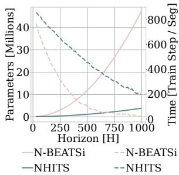
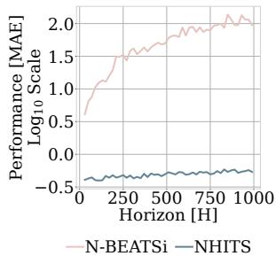
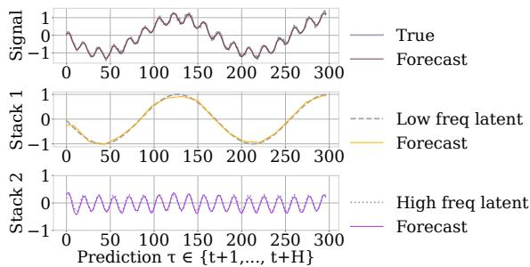
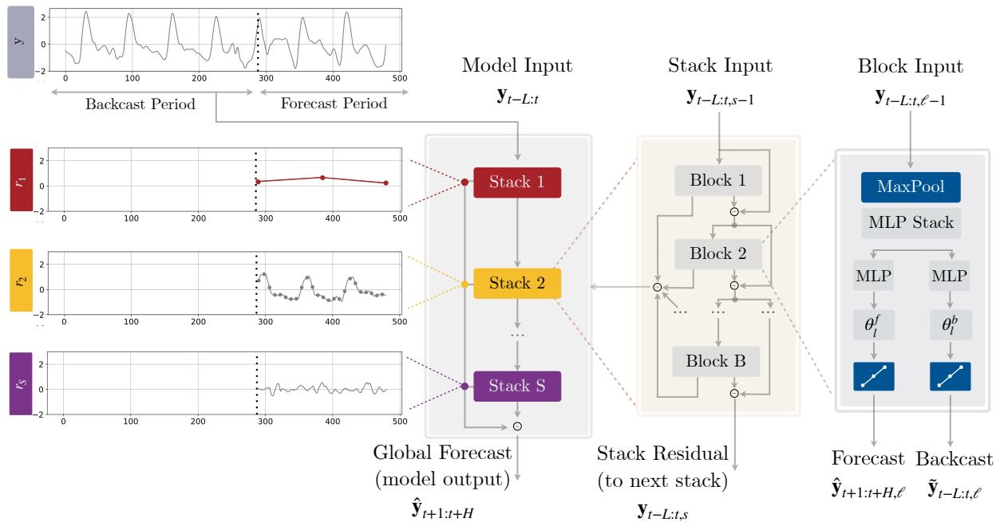
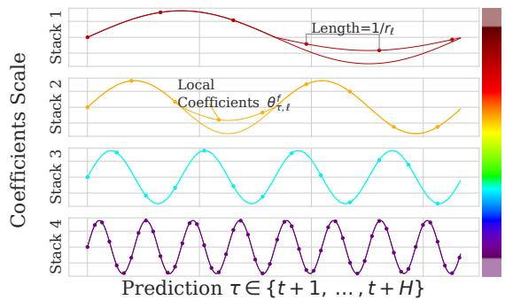
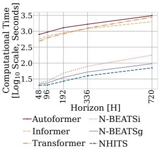
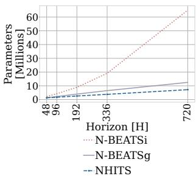
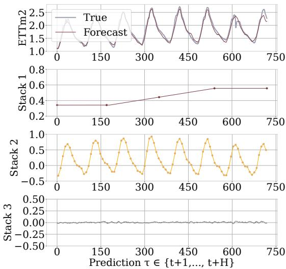
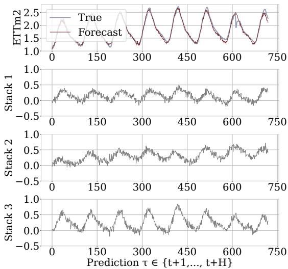

# NHITS: Neural Hierarchical Interpolation for Time Series Forecasting

# Cristian Challu1*, Kin G. Olivares1*, Boris N. Oreshkin2, Federico Garza Ramirez3, Max Mergenthaler-Canseco3, Artur Dubrawski1

1 Auton Lab, School of Computer Science, Carnegie Mellon University, Pittsburgh, PA, USA

$^{2}$ Unity Technologies, Labs, Montreal, QC, Canada

$^{3}$ Nixtla, Pittsburgh, PA, USA

{cchallu, kdgutier, awd} @cs.cmu.edu, boris.oreshkin@unity3d.com, {federico, max} @nixtla.io

# Abstract

Recent progress in neural forecasting accelerated improvements in the performance of large-scale forecasting systems. Yet, long-horizon forecasting remains a very difficult task. Two common challenges afflicting the task are the volatility of the predictions and their computational complexity. We introduce NHITS, a model which addresses both challenges by incorporating novel hierarchical interpolation and multi-rate data sampling techniques. These techniques enable the proposed method to assemble its predictions sequentially, emphasizing components with different frequencies and scales while decomposing the input signal and synthesizing the forecast. We prove that the hierarchical interpolation technique can efficiently approximate arbitrarily long horizons in the presence of smoothness. Additionally, we conduct extensive large-scale dataset experiments from the long-horizon forecasting literature, demonstrating the advantages of our method over the state-of-the-art methods, where NHITS provides an average accuracy improvement of almost $20\%$ over the latest Transformer architectures while reducing the computation time by an order of magnitude (50 times). Our code is available at https://github.com/Nixtla/neuralforecast.

# Introduction

Long-horizon forecasting is critical in many important applications, including risk management and planning. Notable examples include power plant maintenance scheduling (Hyndman and Fan 2009) and planning for infrastructure construction (Ziel and Steinert 2018), as well as early warning systems that help mitigate vulnerabilities due to extreme weather events (Basher 2006; Field et al. 2012). In healthcare, predictive monitoring of vital signs enables the detection of preventable adverse outcomes and application of life-saving interventions (Churpek, Adhikari, and Edelson 2016).

Recently, neural time series forecasting has progressed in a few promising directions. First, the architectural evolution included adopting the attention mechanism and the rise of Transformer-inspired approaches (Li et al. 2019; Fan et al. 2019; Alaa and van der Schaar 2019; Lim et al. 2021), as well as the introduction of attention-free architectures composed of deep stacks of fully connected layers (Oreshkin et al.

  
(a) Computational Cost

  
(b) Prediction Errors   
(c) Neural Hierarchical Interpolation   
Figure 1: (a) The computational costs in time and memory (b) and mean absolute errors (MAE) of the predictions of a high capacity fully connected model exhibit evident deterioration with growing forecast horizons. (c) Specializing a flexible model's outputs in the different signal frequencies through hierarchical interpolation combined with multi-rate input processing offers a solution.

2020; Olivares et al. 2021a). Both approaches are relatively easy to scale up in terms of capacity, compared to LSTMs, and have proven capable of capturing long-range dependencies. The attention-based approaches are generic as they can explicitly model direct interactions between every pair of input-output elements. Unsurprisingly, they happen to be the most computationally expensive. The architectures based on fully connected stacks implicitly capture input-output relationships and tend to be more compute-efficient. Second, both approaches have replaced the recurrent forecast generation strategy with the multi-step prediction strategy. Aside from

its convenient bias-variance benefits and robustness (Marcellino, Stock, and Watson 2006; Atiya and Taieb 2016), the multi-step strategy has enabled the models to efficiently predict long sequences in a single forward pass (Wen et al. 2017; Zhou et al. 2020; Lim et al. 2021).

Despite all the recent progress, long-horizon forecasting remains challenging for neural networks because their unbounded expressiveness translates directly into excessive computational complexity and forecast volatility, both of which become especially pronounced in this context. For instance, both attention and fully connected layers scale quadratically in memory and computational cost with respect to the forecasting horizon length. Fig. 1 illustrates how forecasting errors and computation costs inflate dramatically with the growing forecasting horizon in the case of the fully connected architecture electricity consumption predictions. Attention-based predictions show similar behavior.

Neural long-horizon forecasting research has mostly focused on attention efficiency making self-attention sparse (Child et al. 2019; Li et al. 2019; Zhou et al. 2020) or local (Li et al. 2019). In the same vein, attention has been cleverly redefined through locality-sensitive hashing (Kitaev, Lukasz Kaiser, and Levskaya 2020) or FFT (Wu et al. 2021). Although that research has led to incremental improvements in computing cost and accuracy, the silver bullet long-horizon forecasting solution is yet to be found. In this paper, we make a bold step in this direction by developing a novel forecasting approach that cuts long-horizon compute cost by an order of magnitude while simultaneously offering $16\%$ accuracy improvements on a large array of multi-variate forecasting datasets compared to existing state-of-the-art Transformer-based techniques. We redefine existing fully-connected N-BEATS architecture (Oreshkin et al. 2020) by enhancing its input decomposition via multi-rate data sampling and its output synthesizer via multi-scale interpolation. Our extensive experiments show the importance of the proposed novel architectural components and validate significant improvements in the accuracy and computational complexity of the proposed algorithm.

Our contributions are summarized below:

1. Multi-Rate Data Sampling: We incorporate subsampling layers in front of fully-connected blocks, significantly reducing the memory footprint and the amount of computation needed, while maintaining the ability to model long-range dependencies.

2. Hierarchical Interpolation: We enforce smoothness of the multi-step predictions by reducing the dimensionality of neural network's prediction and matching its time scale with that of the final output via multi-scale hierarchical interpolation. This novel technique is not unique to our proposed model, and can be incorporated into different architectures.

3. NHITS architecture: A novel way of hierarchically synchronizing the rate of input sampling with the scale of output interpolation across blocks, which induces each block to specialize in forecasting its own frequency band of the time-series signal.

4. State-of-the-art results on six large-scale benchmark datasets from the long-horizon forecasting literature: electricity transformer temperature, exchange rate, electricity consumption, San Francisco bay area highway traffic, weather, and influenza-like illness.

The remainder of this paper is structured as follows. First, we review the relevant literature. Second, we introduce notation and describe the methodology. After it, we describe and analyze our empirical findings. The last section concludes the paper.

# Related Work

Neural forecasting. Over the past few years, deep forecasting methods have become ubiquitous in industrial forecasting systems, with examples in optimal resource allocation and planning in transportation (Laptev et al. 2017), large e-commerce retail (Wen et al. 2017; Olivares et al. 2021b; Paria et al. 2021; Rangapuram et al. 2021), or financial trading (Sezer, Gudelek, and Ozbayoglu 2020). The evident success of the methods in recent forecasting competitions (Makridakis, Spiliotis, and Assimakopoulos 2020, 2021) has renovated the interest within the academic community (Benidis et al. 2020). In the context of multi-variate long-horizon forecasting, Transformer-based approaches have dominated the landscape in recent years, including Autoformer (Wu et al. 2021), an encoder-decoder model with decomposition capabilities and an approximation to attention based on Fourier transform, Informer (Zhou et al. 2020), Transformer with MLP based multi-step prediction strategy, that approximates self-attention with sparsity, Reformer (Kitaev, Lukasz Kaiser, and Levskaya 2020), Transformer that approximates attention with locality-sensitive hashing and LogTrans (Li et al. 2019), Transformer with local/log-sparse attention.

Multi-step forecasting. Investigations of the bias/variance trade-off in multi-step forecasting strategies reveal that the direct strategy, which allocates a different model for each step, has low bias and high variance, avoiding error accumulation across steps, exhibited by the classical recursive strategy, but losing in terms of net model parsimony. Conversely, in the joint forecasting strategy, a single model produces forecasts for all steps in one shot, striking the perfect balance between variance and bias, avoiding error accumulation and leveraging shared model parameters (Bao, Xiong, and Hu 2014; Atiya and Taieb 2016; Wen et al. 2017).

Multi-rate input sampling. Previous forecasting literature recognized challenges of extremely long horizon predictions, and proposed mixed data sampling regression (MIDAS; Ghysels, Sinko, and Valkanov 2007; Armesto, Engemann, and Owyang 2010) to ameliorate the problem of parameter proliferation while preserving high-frequency temporal information. MIDAS regressions maintained the classic recursive forecasting strategy of linear auto-regressive models but defined a parsimonious fashion of feeding the inputs.

Interpolation. Interpolation has been extensively used to augment the resolution of modeled signals in many fields such as signal and image processing (Meijering 2002). In time-series forecasting, its applications range from com

  
Figure 2: NHITS architecture. The model is composed of several MLPs with ReLU nonlinearities. Blocks are connected via doubly residual stacking principle with the backcast $\tilde{\mathbf{y}}_{t - L:t,\ell}$ and forecast $\hat{\mathbf{y}}_{t + 1:t + H,\ell}$ outputs of the $\ell$ -th block. Multi-rate input pooling, hierarchical interpolation and backcast residual connections together induce the specialization of the additive predictions in different signal bands, reducing memory footprint and compute time, improving architecture parsimony and accuracy.

pleting unevenly sampled data and noise filters (Chow and loh Lin 1971; Fernandez 1981; Shukla and Marlin 2019; Rubanova, Chen, and Duvenaud 2019) to fine-grained quantile-regressions with recurrent networks (Gasthaus et al. 2019). To our knowledge, temporal interpolation has not been used to induce multi-scale hierarchical time-series forecasts.

# NHITS Methodology

In this section, we describe our proposed approach, NHITS, whose high-level diagram and main principles of operation are depicted in Fig. 2. Our method extends the Neural Basis Expansion Analysis approach (N-BEATS; Oreshkin et al. 2020) in several important respects, making it more accurate and computationally efficient, especially in the context of long-horizon forecasting. In essence, our approach uses multi-rate sampling of the input signal and multi-scale synthesis of the forecast, resulting in a hierarchical construction of forecast, greatly reducing computational requirements and improving forecasting accuracy.

Similarly to N-BEATS, NHITS performs local nonlinear projections onto basis functions across multiple blocks. Each block consists of a multilayer perceptron (MLP), which learns to produce coefficients for the backcast and forecast outputs of its basis. The backcast output is used to clean the inputs of subsequent blocks, while the forecasts are summed to compose the final prediction. The blocks are grouped in stacks, each specialized in learning a different characteristic of the data using a different set of basis functions. The overall network input, $\mathbf{y}_{t - L:t}$ , consists of $L$ lags.

NHITS is composed of $S$ stacks, $B$ blocks each. Each

block contains an MLP predicting forward and backward basis coefficients. The next subsections describe the novel components of our architecture. Note that in the following, we skip the stack index $s$ for brevity.

# Multi-Rate Signal Sampling

At the input to each block $\ell$ , we propose to use a MaxPool layer with kernel size $k_{\ell}$ to help it focus on analyzing components of its input with a specific scale. Larger $k_{\ell}$ will tend to cut more high-frequency/small-time-scale components from the input of the MLP, forcing the block to focus on analyzing large scale/low frequency content. We call this multi-rate signal sampling, referring to the fact that the MLP in each block faces a different effective input signal sampling rate. Intuitively, this helps the blocks with larger pooling kernel size $k_{\ell}$ focus on analyzing large scale components critical for producing consistent long-horizon forecasts.

Additionally, multi-rate processing reduces the width of the MLP input for most blocks, limiting the memory footprint and the amount of computation as well as reducing the number of learnable parameters and hence alleviating the effects of overfitting, while maintaining the original receptive field. Given block $\ell$ input $\mathbf{y}_{t - L:t,\ell}$ (the input to the first block $\ell = 1$ is the network-wide input, $\mathbf{y}_{t - L:t,1} \equiv \mathbf{y}_{t - L:t}$ ), this operation can be formalized as follows:

$$
\mathbf {y} _ {t - L: t, \ell} ^ {(p)} = \operatorname {M a x P o o l} \left(\mathbf {y} _ {t - L: t, \ell}, k _ {\ell}\right) \tag {1}
$$

# Non-Linear Regression

Following subsampling, block $\ell$ looks at its input and nonlinearly regresses forward $\theta_{\ell}^{f}$ and backward $\theta_{\ell}^{b}$ interpolation

MLP coefficients that learn hidden vector $\mathbf{h}_{\ell} \in \mathbb{R}^{N_h}$ , which is then linearly projected:

$$
\mathbf {h} _ {\ell} = \mathbf {M L P} _ {\ell} \left(\mathbf {y} _ {t - L: t, \ell} ^ {(p)}\right) \tag {2}
$$

$$
\pmb {\theta} _ {\ell} ^ {f} = \mathbf {L I N E A R} ^ {f} (\mathbf {h} _ {\ell}) \quad \pmb {\theta} _ {\ell} ^ {b} = \mathbf {L I N E A R} ^ {b} (\mathbf {h} _ {\ell})
$$

The coefficients are then used to synthesize backcast $\tilde{\mathbf{y}}_{t - L:t,\ell}$ and forecast $\hat{\mathbf{y}}_{t + 1:t + H,\ell}$ outputs of the block, via the process described below.

# Hierarchical Interpolation

In most multi-horizon forecasting models, the cardinality of the neural network prediction equals the dimensionality of the horizon, $H$ . For example, in N-BEATS i $|\pmb{\theta}_{\ell}^{f}| = H$ ; in Transformer-based models, decoder attention layer cross-correlates $H$ output embeddings with $L$ encoded input embeddings ( $L$ tends to grow with growing $H$ ). This leads to quick inflation in compute requirements and unnecessary explosion in model expressiveness as horizon $H$ increases.

We propose to use temporal interpolation to combat these issues. We define the dimensionality of the interpolation coefficients in terms of the expressiveness ratio $r_{\ell}$ that controls the number of parameters per unit of output time, $|\pmb{\theta}_{\ell}^{f}| = \lceil r_{\ell}H\rceil$ . To recover the original sampling rate and predict all $H$ points in the horizon, we use temporal interpolation via the interpolation function $g$ :

$$
\hat {y} _ {\tau , \ell} = g (\tau , \boldsymbol {\theta} _ {\ell} ^ {f}), \quad \forall \tau \in \{t + 1, \dots , t + H \}, \tag {3}
$$

$$
\tilde {y} _ {\tau , \ell} = g (\tau , \boldsymbol {\theta} _ {\ell} ^ {b}), \quad \forall \tau \in \{t - L, \dots , t \}.
$$

Interpolation can vary in smoothness, $g \in \mathcal{C}^0, \mathcal{C}^1, \mathcal{C}^2$ . In Appendix G we explore the nearest neighbor, piece-wise linear, and cubic alternatives. For concreteness, the linear interpolator $g \in \mathcal{C}^1$ , along with the time partition $\mathcal{T} = \{t + 1, t + 1 + 1 / r_{\ell}, \dots, t + H - 1 / r_{\ell}, t + H\}$ , is defined as

$$
g (\tau , \theta) = \theta [ t _ {1} ] + \left(\frac {\theta [ t _ {2} ] - \theta [ t _ {1} ]}{t _ {2} - t _ {1}}\right) (\tau - t _ {1}) \tag {4}
$$

$$
t_{1} = \arg \min_{t\in \mathcal{T}:t\leq \tau}\tau -t,\quad t_{2} = t_{1} + 1 / r_{\ell}.
$$

The hierarchical interpolation principle is implemented by distributing expressiveness ratios across blocks in a manner synchronized with multi-rate sampling. Blocks closer to the input have smaller $r_{\ell}$ and larger $k_{\ell}$ , implying that input blocks generate low-granularity signals via more aggressive interpolation, being also forced to look at more aggressively sub-sampled (and smoothed) signals. The resulting hierarchical forecast $\hat{\mathbf{y}}_{t + 1:t + H}$ is assembled by summing the outputs of all blocks, essentially composing it out of interpolations at different time-scale hierarchy levels.

Since each block specializes on its own scale of input and output signal, this induces a clearly structured hierarchy of interpolation granularity, the intuition conveyed in Fig. 1 and 3. We propose to use exponentially increasing expressiveness ratios to handle a wide range of frequency bands while controlling the number of parameters. Alternatively, each

  
Figure 3: NHITS composes its predictions hierarchically using blocks specializing on different frequencies, through expressiveness ratios, and interpolation. The coefficients are locally determined along the horizon, allowing NHITS to reconstruct non-periodic/stationary signals, beyond constant Fourier transform.

stack can specialize in modeling a different known cycle of the time-series (weekly, daily etc.) using a matching $r_{\ell}$ (see Table A.3). Finally, the backcast residual formed at previous hierarchy scale is subtracted from the input of the next hierarchy level to amplify the focus of the next level block on signals outside of the band that has already been handled by the previous hierarchy members.

$$
\hat {\mathbf {y}} _ {t + 1: t + H} = \sum_ {l = 1} ^ {L} \hat {\mathbf {y}} _ {t + 1: t + H, \ell}
$$

$$
\mathbf {y} _ {t - L: t, \ell + 1} = \mathbf {y} _ {t - L: t, \ell} - \tilde {\mathbf {y}} _ {t - L: t, \ell}
$$

Hierarchical interpolation has advantageous theoretical guarantees. We show in Appendix A, that it can approximate infinitely/dense horizons. As long as the interpolating function $g$ is characterized by projections to informed multi-resolution functions $V_{w}$ , and the forecast relationships are smooth.

Neural Basis Approximation Theorem. Let a forecast mapping be $\mathcal{V}(\cdot \mid \mathbf{y}_{t - L:t}):[0,1]^L\to \mathcal{F}$ , where the forecast functions $\mathcal{F} = \{\mathcal{Y}(\tau):[0,1]\to \mathbb{R}\} = \mathcal{L}^2 ([0,1])$ representing a infinite/dense horizon, are square integrable. If the multi-resolution functions $V_{w} = \{\phi_{w,h}(\tau) = \phi (2^{w}(\tau - h))\mid w\in \mathbb{Z},h\in 2^{-w}\times [0,\dots ,2^{w}]\}$ can arbitrarily approximate $\mathcal{L}^2 ([0,1])$ . And the projection $\mathrm{Proj}_{V_w}(\mathcal{V}(\tau))$ varies smoothly on $\mathbf{y}_{t - L:t}$ . Then the forecast mapping $\mathcal{V}(\cdot \mid \mathbf{y}_{t - L:t})$ can be arbitrarily approximated by a neural basis expansion learning a finite number of multi-resolution coefficients $\hat{\theta}_{w,h}$ . That is $\forall \epsilon >0$ ,

$$
\int \left| \mathcal {Y} (\tau \mid \mathbf {y} _ {t - L: t}) - \sum_ {w, h} \hat {\theta} _ {w, h} \left(\mathbf {y} _ {t - L: t}\right) \phi_ {w, h} (\tau) \right| d \tau \leq \epsilon \tag {5}
$$

Examples of multi-resolution functions $V_{w} = \{\phi_{w,h}(\tau) = \phi (2^{w}(\tau -h))\mid w\in \mathbb{Z},h\in 2^{-w}\times [0,\dots ,2^{w}]\}$ include piece-wise constants, piece-wise linear functions and splines with arbitrary approximation capabilities.

# Experimental Results

We follow the experimental settings from (Wu et al. 2021; Zhou et al. 2020) (NeurIPS 2021 and AAAI 2021 Best Paper Award). We first describe datasets, baselines and metrics used for the quantitative evaluation of our model. Table 1 presents our key results, demonstrating SoTA performance of our method relative to existing work. We then carefully describe the details of training and evaluation setups. We conclude the section by describing ablation studies.

# Datasets

All large-scale datasets used in our empirical studies are publicly available and have been used in neural forecasting literature, particularly in the context of long-horizon (Lai et al. 2017; Zhou et al. 2019; Li et al. 2019; Wu et al. 2021). Table A1 summarizes their characteristics. Each set is normalized with the train data mean and standard deviation.

Electricity Transformer Temperature. The $\mathrm{ETTm_2}$ dataset measures an electricity transformer from a region of a province of China including oil temperature and variants of load (such as high useful load and high useless load) from July 2016 to July 2018 at a fifteen minutes frequency. Exchange-Rate. The Exchange dataset is a collection of daily exchange rates of eight countries relative to the US dollar. The countries include Australia, UK, Canada, Switzerland, China, Japan, New Zealand and Singapore from 1990 to 2016. Electricity. The ECL dataset reports the fifteen minute electricity consumption (KWh) of 321 customers from 2012 to 2014. For comparability, we aggregate it hourly. San Francisco Bay Area Highway Traffic. This TrafficL dataset was collected by the California Department of Transportation, it reports road hourly occupancy rates of 862 sensors, from January 2015 to December 2016. Weather. This Weather dataset contains the 2020 year of 21 meteorological measurements recorded every 10 minutes from the Weather Station of the Max Planck Biogeochemistry Institute in Jena, Germany. Influenza-like illness. The ILI dataset reports weekly recorded influenza-like illness (ILI) patients from Centers for Disease Control and Prevention of the United States from 2002 to 2021. It is a ratio of ILI patients vs. the week's total.

# Evaluation Setup

We evaluate the accuracy of our approach using mean absolute error (MAE) and mean squared error (MSE) metrics, which are well-established in the literature (Zhou et al. 2020; Wu et al. 2021), for varying horizon lengths $H$ :

$$
\mathrm {M S E} = \frac {1}{H} \sum_ {\tau = t} ^ {t + H} \left(\mathbf {y} _ {\tau} - \hat {\mathbf {y}} _ {\tau}\right) ^ {2}, \quad \text {M A E} = \frac {1}{H} \sum_ {\tau = t} ^ {t + H} \left| \mathbf {y} _ {\tau} - \hat {\mathbf {y}} _ {\tau} \right| \tag {6}
$$

Note that for multivariate datasets, our algorithm produces forecast for each feature in the dataset and metrics are averaged across dataset features. Since our model is univariate, each variable is predicted using only its own history, $\mathbf{y}_{t - L:t}$ as input. Datasets are partitioned into train, validation and test splits. Train split is used to train model parameters, validation split is used to tune hyperparameters, and test split is used to compute metrics reported in Table 1. Appendix C

  
(a) Time Efficiency

  
(b) Memory Efficiency   
Figure 4: Computational efficiency comparison. NHITS exhibits the best training time compared to Transformer-based and fully connected models, and smallest memory footprint.

shows partitioning into train, validation and test splits: seventy, ten, and twenty percent of the available observations respectively, with the exception of $\mathrm{ETTm}_2$ that uses twenty percent as validation.

# Key Results

We compare NHITS to the following SoTA multivariate baselines: (1) FEDformer (Zhou et al. 2022), (2) Autoformer (Wu et al. 2021), (3) Informer (Zhou et al. 2020), (4) Reformer (Kitaev, Lukasz Kaiser, and Levskaya 2020) and (5) LogTrans (Li et al. 2019). Additionally, we consider the univariate baselines: (6) DilRNN (Chang et al. 2017) and (7) auto-ARIMA (Hyndman and Khandakar 2008).

Forecasting Accuracy. Table 1 summarizes the multivariate forecasting results. NHITS outperforms the best baseline, with average relative error decrease across datasets and horizons of $14\%$ in MAE and $16\%$ in MSE. NHITS maintains a comparable performance to other state-of-the-art methods for the shortest measured horizon (96/24), while for the longest measured horizon (720/60) decreases multivariate MAE by $11\%$ and MSE by $17\%$ . We complement the key results in Table 1, with the additional univariate forecasting experiments in Appendix F, again demonstrating state-of-the-art performance against baselines.

Computational Efficiency. We measure the computational training time of NHITS, N-BEATS and Transformer-based methods in the multivariate setting and show compare in Figure 4. The experiment monitors the whole training process for the $\mathrm{ETTm_2}$ dataset. For the Transformer-based models we used hyperparameters reported in (Wu et al. 2021). Compared to the Transformer-based methods, NHITS is $45\times$ faster than Autoformer. In terms of memory, NHITS has less than $26\%$ of the parameters of the second-best alternative since it scales linearly with respect to the input's length. Compared to the original N-BEATS, our method is $1.26\times$ faster and requires only $54\%$ of the parameters. Finally, while NHITS is an univariate model, it has global (shared) parameters for all time-series in the dataset. Just like (Oreshkin et al. 2020), our experiments (Appendix I) show that NHITS maintains constant parameter/training computational complexity regarding dataset's size.

Table 1: Main empirical results in long-horizon forecasting setup, lower scores are better. Metrics are averaged over eight runs, best results are highlighted in bold. In Appendix E we complement the main results with standard deviations.   

<table><tr><td rowspan="2">H.</td><td colspan="2">NHITS</td><td colspan="2">N-BEATS</td><td colspan="2">FEDformer</td><td colspan="2">Autoformer</td><td colspan="2">Informer</td><td colspan="2">LogTrans</td><td colspan="2">DilRNN</td><td colspan="2">ARIMA</td><td></td></tr><tr><td>MSE</td><td>MAE</td><td>MSE</td><td>MAE</td><td>MSE</td><td>MAE</td><td>MSE</td><td>MAE</td><td>MSE</td><td>MAE</td><td>MSE</td><td>MAE</td><td>MSE</td><td>MAE</td><td>MSE</td><td>MAE</td><td></td></tr><tr><td rowspan="4">ETTm2</td><td>96</td><td>0.176</td><td>0.255</td><td>0.184</td><td>0.263</td><td>0.203</td><td>0.287</td><td>0.255</td><td>0.339</td><td>0.365</td><td>0.453</td><td>0.768</td><td>0.642</td><td>0.343</td><td>0.401</td><td>0.225</td><td>0.301</td></tr><tr><td>192</td><td>0.245</td><td>0.305</td><td>0.273</td><td>0.337</td><td>0.269</td><td>0.328</td><td>0.281</td><td>0.340</td><td>0.533</td><td>0.563</td><td>0.989</td><td>0.757</td><td>0.424</td><td>0.468</td><td>0.298</td><td>0.345</td></tr><tr><td>336</td><td>0.295</td><td>0.346</td><td>0.309</td><td>0.355</td><td>0.325</td><td>0.366</td><td>0.339</td><td>0.372</td><td>1.363</td><td>0.887</td><td>1.334</td><td>0.872</td><td>0.632</td><td>1.083</td><td>0.370</td><td>0.386</td></tr><tr><td>720</td><td>0.401</td><td>0.413</td><td>0.411</td><td>0.425</td><td>0.421</td><td>0.415</td><td>0.422</td><td>0.419</td><td>3.379</td><td>1.388</td><td>3.048</td><td>1.328</td><td>0.634</td><td>0.594</td><td>0.478</td><td>0.445</td></tr><tr><td rowspan="4">ECL</td><td>96</td><td>0.147</td><td>0.249</td><td>0.145</td><td>0.247</td><td>0.183</td><td>0.297</td><td>0.201</td><td>0.317</td><td>0.274</td><td>0.368</td><td>0.258</td><td>0.357</td><td>0.233</td><td>0.927</td><td>1.220</td><td>0.814</td></tr><tr><td>192</td><td>0.167</td><td>0.269</td><td>0.180</td><td>0.283</td><td>0.195</td><td>0.308</td><td>0.222</td><td>0.334</td><td>0.296</td><td>0.386</td><td>0.266</td><td>0.368</td><td>0.265</td><td>0.921</td><td>1.264</td><td>0.842</td></tr><tr><td>336</td><td>0.186</td><td>0.290</td><td>0.200</td><td>0.308</td><td>0.212</td><td>0.313</td><td>0.231</td><td>0.338</td><td>0.300</td><td>0.394</td><td>0.280</td><td>0.380</td><td>0.235</td><td>0.896</td><td>1.311</td><td>0.866</td></tr><tr><td>720</td><td>0.243</td><td>0.340</td><td>0.266</td><td>0.362</td><td>0.231</td><td>0.343</td><td>0.254</td><td>0.361</td><td>0.373</td><td>0.439</td><td>0.283</td><td>0.376</td><td>0.322</td><td>0.890</td><td>1.364</td><td>0.891</td></tr><tr><td rowspan="4">Exchange</td><td>96</td><td>0.092</td><td>0.202</td><td>0.098</td><td>0.206</td><td>0.139</td><td>0.276</td><td>0.197</td><td>0.323</td><td>0.847</td><td>0.752</td><td>0.968</td><td>0.812</td><td>0.383</td><td>0.45</td><td>0.296</td><td>0.214</td></tr><tr><td>192</td><td>0.208</td><td>0.322</td><td>0.225</td><td>0.329</td><td>0.256</td><td>0.369</td><td>0.300</td><td>0.369</td><td>1.204</td><td>0.895</td><td>1.040</td><td>0.851</td><td>1.123</td><td>0.834</td><td>1.056</td><td>0.326</td></tr><tr><td>336</td><td>0.301</td><td>0.403</td><td>0.493</td><td>0.482</td><td>0.426</td><td>0.464</td><td>0.509</td><td>0.524</td><td>1.672</td><td>1.036</td><td>1.659</td><td>1.081</td><td>1.612</td><td>1.051</td><td>2.298</td><td>0.467</td></tr><tr><td>720</td><td>0.798</td><td>0.596</td><td>1.108</td><td>0.804</td><td>1.090</td><td>0.800</td><td>1.447</td><td>0.941</td><td>2.478</td><td>1.310</td><td>1.941</td><td>1.127</td><td>1.827</td><td>1.131</td><td>20.666</td><td>0.864</td></tr><tr><td rowspan="4">Traffic</td><td>96</td><td>0.402</td><td>0.282</td><td>0.398</td><td>0.282</td><td>0.562</td><td>0.349</td><td>0.613</td><td>0.388</td><td>0.719</td><td>0.391</td><td>0.684</td><td>0.384</td><td>0.580</td><td>0.308</td><td>1.997</td><td>0.924</td></tr><tr><td>192</td><td>0.420</td><td>0.297</td><td>0.409</td><td>0.293</td><td>0.562</td><td>0.346</td><td>0.616</td><td>0.382</td><td>0.696</td><td>0.379</td><td>0.685</td><td>0.390</td><td>0.739</td><td>0.383</td><td>2.044</td><td>0.944</td></tr><tr><td>336</td><td>0.448</td><td>0.313</td><td>0.449</td><td>0.318</td><td>0.570</td><td>0.323</td><td>0.622</td><td>0.337</td><td>0.777</td><td>0.420</td><td>0.733</td><td>0.408</td><td>0.804</td><td>0.419</td><td>2.096</td><td>0.960</td></tr><tr><td>720</td><td>0.539</td><td>0.353</td><td>0.589</td><td>0.391</td><td>0.596</td><td>0.368</td><td>0.660</td><td>0.408</td><td>0.864</td><td>0.472</td><td>0.717</td><td>0.396</td><td>0.695</td><td>0.372</td><td>2.138</td><td>0.971</td></tr><tr><td rowspan="4">Weather</td><td>96</td><td>0.158</td><td>0.195</td><td>0.167</td><td>0.203</td><td>0.217</td><td>0.296</td><td>0.266</td><td>0.336</td><td>0.300</td><td>0.384</td><td>0.458</td><td>0.490</td><td>0.193</td><td>0.245</td><td>0.217</td><td>0.258</td></tr><tr><td>192</td><td>0.211</td><td>0.247</td><td>0.229</td><td>0.261</td><td>0.276</td><td>0.336</td><td>0.307</td><td>0.367</td><td>0.598</td><td>0.544</td><td>0.658</td><td>0.589</td><td>0.255</td><td>0.306</td><td>0.263</td><td>0.299</td></tr><tr><td>336</td><td>0.274</td><td>0.300</td><td>0.287</td><td>0.304</td><td>0.339</td><td>0.380</td><td>0.359</td><td>0.395</td><td>0.578</td><td>0.523</td><td>0.797</td><td>0.652</td><td>0.329</td><td>0.360</td><td>0.330</td><td>0.347</td></tr><tr><td>720</td><td>0.351</td><td>0.353</td><td>0.368</td><td>0.359</td><td>0.403</td><td>0.428</td><td>0.419</td><td>0.428</td><td>1.059</td><td>0.741</td><td>0.869</td><td>0.675</td><td>0.521</td><td>0.495</td><td>0.425</td><td>0.405</td></tr><tr><td rowspan="4">HI</td><td>24</td><td>1.862</td><td>0.869</td><td>1.879</td><td>0.886</td><td>2.203</td><td>0.963</td><td>3.483</td><td>1.287</td><td>5.764</td><td>1.677</td><td>4.480</td><td>1.444</td><td>4.538</td><td>1.449</td><td>5.554</td><td>1.434</td></tr><tr><td>36</td><td>2.071</td><td>0.934</td><td>2.210</td><td>1.018</td><td>2.272</td><td>0.976</td><td>3.103</td><td>1.148</td><td>4.755</td><td>1.467</td><td>4.799</td><td>1.467</td><td>3.709</td><td>1.273</td><td>6.940</td><td>1.676</td></tr><tr><td>48</td><td>2.134</td><td>0.932</td><td>2.440</td><td>1.088</td><td>2.209</td><td>0.981</td><td>2.669</td><td>1.085</td><td>4.763</td><td>1.469</td><td>4.800</td><td>1.468</td><td>3.436</td><td>1.238</td><td>7.192</td><td>1.736</td></tr><tr><td>60</td><td>2.137</td><td>0.968</td><td>2.547</td><td>1.057</td><td>2.545</td><td>1.061</td><td>2.770</td><td>1.125</td><td>5.264</td><td>1.564</td><td>5.278</td><td>1.560</td><td>3.703</td><td>1.272</td><td>6.648</td><td>1.656</td></tr></table>

  
(a) hie. interp., multi-rate sampling

  
(b) No hie. interp., multi-rate sampling   
Figure 5: ETTm2 and 720 ahead forecasts using NHITS (left panel), NHITS with hierarchical linear interpolation and multi-rate sampling removed (right panel). The top row shows the original signal and the forecast. The second, third and fourth rows show the forecast components for each stack. The last row shows the residuals, $y - \hat{y}$ . In (a), each block shows scale specialization, unlike (b), in which signals are not interpretable.

Table 2: Empirical evaluation of long multi-horizon multivariate forecasts for NHITS with/without enhancements. MAE for predictions averaged over eight runs, and five datasets.   

<table><tr><td>H.</td><td>NHITS</td><td>NHITS2</td><td>NHITS3</td><td>NHITS4</td><td>N-BEATSi</td></tr><tr><td>96</td><td>0.239</td><td>0.241</td><td>0.237</td><td>0.240</td><td>0.254</td></tr><tr><td>192</td><td>0.290</td><td>0.299</td><td>0.291</td><td>0.300</td><td>0.307</td></tr><tr><td>336</td><td>0.338</td><td>0.342</td><td>0.346</td><td>0.352</td><td>0.405</td></tr><tr><td>720</td><td>0.439</td><td>0.450</td><td>0.454</td><td>0.468</td><td>0.597</td></tr></table>

# Training and Hyperparameter Optimization

We consider a minimal search space. We tune the kernel size for multi-rate sampling from Equation (1) and the number of coefficients from Equation (2), some matching common functionalities and others exponentially increasing. Additionally, we tune the random seed to escape underperforming local minima. Details are reported in Table A3 in Appendix D.

During the hyperparameter optimization phase, we measure MAE on the validation set and use a Bayesian optimization library (HYPEROPT; Bergstra et al. 2011), with 20 iterations. We use the optimal configuration based on the validation loss to make predictions on the test set. We refer to the combination of hyperparameter optimization and test prediction as a run. NHITS is implemented in PyTorch (Paszke et al. 2019) and trained using ADAM optimizer (Kingma and Ba 2014), MAE loss, batch size 256 and initial learning rate of 1e-3, halved three times across the training procedure. All our experiments are conducted on a GeForce RTX 2080 GPU.

# Ablation Studies

We believe that the advantages of the NHITS architecture are rooted in its multi-rate hierarchical nature. Fig. 5 shows a qualitative comparison of NHITS with and without hierarchical interpolation/multi-rate sampling components. Unlike the control model, we clearly see NHITS developing the ability to produce interpretable forecast decomposition providing valuable information about trends and seasonality in separate channels. Appendix G presents the decomposition for the different interpolation techniques.

We support our qualitative conclusion with quantitative results. We define the following set of alternative models: $\mathrm{NHITS}_2$ only hierarchical interpolation, $\mathrm{NHITS}_3$ only multi-rate sampling, $\mathrm{NHITS}_4$ no multi-rate sampling or interpolation (corresponds to the original N-BEATSg (Oreshkin et al. 2020)), finally N-BEATSi, the interpretable version of the N-BEATS ((Oreshkin et al. 2020)). Tab. 2 clearly shows that combining both proposed components results in the best performance, emphasizing their complementary nature in long-horizon forecasting. We see that the original N-BEATS is consistently worse, especially the N-BEATSi. The advantages of multi-rate sampling, and interpolation for long-horizon forecasting, are not limited to the NHITS architecture. In Appendix H we demonstrate how adding them to a Di1RNN improves its performance.

Additional ablation studies are reported in Appendix G. The MaxPool multi-rate sampling wins over Average-

Pool. Linear interpolation wins over nearest neighbor and cubic. Finally and most importantly, we show that the order in which hierarchical interpolation is implemented matters significantly. The best configuration is to have the low-frequency/large-scale components synthesized and removed from analysis first, followed by more fine-grained modeling of high-frequency/intermittent signals.

# Discussion of Findings

Our results indicate the complementarity and effectiveness of multi-rate sampling and hierarchical interpolation for long-horizon time-series forecasting. Table 2 indicates that these components enforce a useful inductive bias compared to both the free-form model NHITS $_4$ (plain fully connected architecture) and the parametric model N-BEATS $_1$ (polynomial trend and sinusoidal seasonality used as basis functions in two respective stacks). The latter provides a detrimental inductive bias for long-horizon forecasting. We barely scratched the surface in the right direction and further progress is possible using advanced multi-scale processing approaches in the forecasting context, motivating further research.

NHITS outperforms SoTA baselines and provides an interpretable non-linear decomposition. Fig. 1 and 5 showcase NHITS perfectly specializing and reconstructing latent harmonic signals from synthetic and real data respectively. This novel interpretable decomposition can provide insights to users, improving their confidence in high-stakes applications like healthcare. Finally, NHITS hierarchical interpolation is connected to Wavelet's multi-resolution analysis (Daubechies 1992). Replacing the interpolation functions with orthogonal Wavelet spaces is a possible research line.

Our study questions the effectiveness of existing long-horizon multi-variate forecasting approaches, as all of them are substantially outperformed by our univariate algorithm. If these approaches underperform due to overfitting problems at the level of marginals, the integration of our approach with Transformer-inspired architectures is a promising research direction as Appendix F results suggest. However, there is a chance that existing approaches underperform due to their inability to integrate information from multiple variables, which clearly hints at possibly untapped research potential. Whichever is the case, we believe our results provide a strong guidance signal and a valuable baseline for future research in the area of long-horizon multivariate forecasting.

# Conclusions

We proposed a novel neural forecasting algorithm NHITS that combines two complementary techniques, multi-rate input sampling, and hierarchical interpolation, to produce drastically improved, interpretable, and computationally efficient long-horizon time-series predictions. Our model, operating in the univariate regime and accepting only the predicted time-series history, significantly outperforms all previous Transformer-based multi-variate models using an order of magnitude less computation. This sets a new baseline for all ensuing multivariate work on six popular datasets and motivates research to effectively use information across variables.

# Acknowledgements

This work was partially supported by the Defense Advanced Research Projects Agency (award FA8750-17-2-0130), the National Science Foundation (grant 2038612), the Space Technology Research Institutes grant from NASA's Space Technology Research Grants Program, the U.S. Department of Homeland Security (award 18DN-ARI-00031), and by the U.S. Army Contracting Command (contracts W911NF20D0002 and W911NF22F0014 delivery order #4). Thanks to Mengfei Cao for in-depth discussion and comments on the method, and Kartik Gupta for his insights on the connection of NHITS with Wavelet's theory. The authors are also grateful to Stefania La Vattiata for her assistance in the upbeat visualization of the Neural Hierarchical Interpolation for Time Series method.

# References

Alaa, A. M.; and van der Schaar, M. 2019. Attentive State-Space Modeling of Disease Progression. In Wallach, H.; Larochelle, H.; Beygelzimer, A.; d'Alché-Buc, F.; Fox, E.; and Garnett, R., eds., 33rd Conference on Neural Information Processing Systems (NeurIPS 2019), volume 32. Curran Associates, Inc.   
Armesto, M. T.; Engemann, K. M.; and Owyang, M. T. 2010. Forecasting with Mixed Frequencies. *Federal Reserve Bank of St. Louis Review*, 92: 521-536.   
Atiya, A.; and Taieb, B. 2016. A Bias and Variance Analysis for Multistep-Ahead Time Series Forecasting. IEEE transactions on neural networks and learning systems, 27(1): 2162-2388.   
Bao, Y.; Xiong, T.; and Hu, Z. 2014. Multi-step-ahead time series prediction using multiple-output support vector regression. Neurocomputing, 129: 482-493.   
Basher, R. 2006. Global early warning systems for natural hazards: Systematic and people-centred. Philosophical transactions. Series A, Mathematical, physical, and engineering sciences, 364: 2167-82.   
Benidis, K.; Rangapuram, S. S.; Flunkert, V.; Wang, B.; Maddix, D.; Turkmen, C.; Gasthaus, J.; Bohlke-Schneider, M.; Salinas, D.; Stella, L.; Callot, L.; and Januschowski, T. 2020. Neural forecasting: Introduction and literature overview. Computing Research Repository.   
Bergstra, J.; Bardenet, R.; Bengio, Y.; and Kégl, B. 2011. Algorithms for Hyper-Parameter Optimization. In Shawe-Taylor, J.; Zemel, R.; Bartlett, P.; Pereira, F.; and Weinberger, K. Q., eds., Advances in Neural Information Processing Systems, volume 24, 2546-2554. Curran Associates, Inc.   
Chang, S.; Zhang, Y.; Han, W.; Yu, M.; Guo, X.; Tan, W.; Cui, X.; Witbrock, M.; Hasegawa-Johnson, M. A.; and Huang, T. S. 2017. Dilated Recurrent Neural Networks. In Guyon, I.; Luxburg, U. V.; Bengio, S.; Wallach, H.; Fergus, R.; Vishwanathan, S.; and Garnett, R., eds., Advances in Neural Information Processing Systems, volume 30. Curran Associates, Inc.   
Child, R.; Gray, S.; Radford, A.; and Sutskever, I. 2019. Generating Long Sequences with Sparse Transformers. CoRR, abs/1904.10509.

Chow, G. C.; and loh Lin, A. 1971. Best Linear Unbiased Interpolation, Distribution, and Extrapolation of Time Series by Related Series. The Review of Economics and Statistics, 53(4): 372-375.   
Churpek, M. M.; Adhikari, R.; and Edelson, D. P. 2016. The value of vital sign trends for detecting clinical deterioration on the wards. *Resuscitation*, 102: 1-5.   
Daubechies, I. 1992. Ten lectures on wavelets. SIAM.   
Fan, C.; Zhang, Y.; Pan, Y.; Li, X.; Zhang, C.; Yuan, R.; Wu, D.; Wang, W.; Pei, J.; and Huang, H. 2019. Multi-Horizon Time Series Forecasting with Temporal Attention Learning. In Proceedings of the 25th ACM SIGKDD International Conference on Knowledge Discovery & Data Mining, KDD '19, 2527-2535. New York, NY, USA: Association for Computing Machinery. ISBN 9781450362016.   
Fernandez, R. B. 1981. A Methodological Note on the Estimation of Time Series. The Review of Economics and Statistics, 63(3): 471-476.   
Field, C. B.; Barros, V.; Stocker, T. F.; and Dahe, Q. 2012. Managing the risks of extreme events and disasters to advance climate change adaptation: special report of the intergovernmental panel on climate change. Cambridge University Press.   
Gasthaus, J.; Benidis, K.; Wang, B.; Rangapuram, S. S.; Salinas, D.; Flunkert, V.; and Januschowski, T. 2019. Probabilistic Forecasting with Spline Quantile Function RNNs. In AISTATS.   
Ghysels, E.; Sinko, A.; and Valkanov, R. 2007. MIDAS Regressions: Further Results and New Directions. *Econometric Reviews*, 26(1): 53-90.   
Hyndman, R. J.; and Fan, S. 2009. Density forecasting for long-term peak electricity demand. IEEE Transactions on Power Systems, 25(2): 1142-1153.   
Hyndman, R. J.; and Khandakar, Y. 2008. Automatic Time Series Forecasting: The forecast Package for R. Journal of Statistical Software, Articles, 27(3): 1-22.   
Kingma, D. P.; and Ba, J. 2014. ADAM: A Method for Stochastic Optimization. Cite arxiv:1412.6980Comment: Published as a conference paper at the 3rd International Conference for Learning Representations (ICLR), San Diego, 2015.   
Kitaev, N.; Lukasz Kaiser; and Levskaya, A. 2020. Reformer: The Efficient Transformer. In 8th International Conference on Learning Representations, (ICLR 2020).   
Lai, G.; Chang, W.; Yang, Y.; and Liu, H. 2017. Modeling Long- and Short-Term Temporal Patterns with Deep Neural Networks. *Special Interest Group on Information Retrieval Conference* 2018 (SIGIR 2018), abs/1703.07015.   
Laptev, N.; Yosinsk, J.; Erran, L. L.; and Smyl, S. 2017. Time-series extreme event forecasting with neural networks at UBER. In 34th International Conference on Machine Learning ICML 2017, Time Series Workshop.   
Li, S.; Jin, X.; Xuan, Y.; Zhou, X.; Chen, W.; Wang, Y.; and Yan, X. 2019. Enhancing the Locality and Breaking the Memory Bottleneck of Transformer on Time Series Forecasting. In Wallach, H.; Larochelle, H.; Beygelzimer, A.; d'Alché-Buc,

F.; Fox, E.; and Garnett, R., eds., 33rd Conference on Neural Information Processing Systems (NeurIPS 2019), volume 32. Curran Associates, Inc.   
Lim, B.; Arik, S. Ö.; Loeff, N.; and Pfister, T. 2021. Temporal Fusion Transformers for interpretable multi-horizon time series forecasting. International Journal of Forecasting.   
Makridakis, S.; Spiliotis, E.; and Assimakopoulos, V. 2020. The M4 Competition: 100,000 time series and 61 forecasting methods. International Journal of Forecasting, 36(1): 54-74. M4 Competition.   
Makridakis, S.; Spiliotis, E.; and Assimakopoulos, V. 2021. Predicting/hypothesizing the findings of the M5 competition. International Journal of Forecasting.   
Marcellino, M.; Stock, J. H.; and Watson, M. W. 2006. A comparison of direct and iterated multistep AR methods for forecasting macroeconomic time series. Journal of Econometrics, 135(1): 499-526.   
Meijering, E. 2002. A chronology of interpolation: from ancient astronomy to modern signal and image processing. Proceedings of the IEEE, 90(3): 319-342.   
Olivares, K. G.; Challu, C.; Marcjasz, G.; Weron, R.; and Dubrawski, A. 2021a. Neural basis expansion analysis with exogenous variables: Forecasting electricity prices with NBEATSx. International Journal of Forecasting, submitted, Working Paper version available at arXiv:2104.05522.   
Olivares, K. G.; Meetei, N. O.; Ma, R.; Reddy, R.; Cao, M.; and Dicker, L. 2021b. Probabilistic Hierarchical Forecasting with Deep Poisson Mixtures. International Journal of Forecasting (Hierarchical Forecasting special issue), submitted, Working Paper version available at arXiv:2110.13179.   
Oreshkin, B. N.; Carpov, D.; Chapados, N.; and Bengio, Y. 2020. N-BEATS: Neural basis expansion analysis for interpretable time series forecasting. In 8th International Conference on Learning Representations, ICLR 2020.   
Paria, B.; Sen, R.; Ahmed, A.; and Das, A. 2021. Hierarchically Regularized Deep Forecasting. In Submitted to Proceedings of the 39th International Conference on Machine Learning. PMLR. Working Paper version available at arXiv:2106.07630.   
Paszke et al. 2019. PyTorch: An Imperative Style, High-Performance Deep Learning Library. In Wallach, H.; Larochelle, H.; Beygelzimer, A.; d Alché-Buc, F.; Fox, E.; and Garnett, R., eds., Advances in Neural Information Processing Systems 32, 8024–8035. Curran Associates, Inc.   
Rangapuram, S. S.; Werner, L. D.; Benidis, K.; Mercado, P.; Gasthaus, J.; and Januschowski, T. 2021. End-to-End Learning of Coherent Probabilistic Forecasts for Hierarchical Time Series. In Balcan, M. F.; and Meila, M., eds., Proceedings of the 38th International Conference on Machine Learning, Proceedings of Machine Learning Research. PMLR.   
Rubanova, Y.; Chen, R. T. Q.; and Duvenaud, D. 2019. Latent ODEs for Irregularly-Sampled Time Series. In Advances in Neural Information Processing Systems 33 (NeurIPS 2019).   
Sezer, O. B.; Gudelek, M. U.; and Ozbayoglu, A. M. 2020. Financial time series forecasting with deep learning: A systematic literature review: 2005-2019. Applied soft computing, 90: 106181.

Shukla, S. N.; and Marlin, B. M. 2019. Interpolation-Prediction Networks for Irregularly Sampled Time Series. In 7th International Conference on Learning Representations, (ICLR 2019).   
Wen, R.; Torkkola, K.; Narayanaswamy, B.; and Madeka, D. 2017. A Multi-Horizon Quantile Recurrent Forecaster. In 31st Conference on Neural Information Processing Systems NIPS 2017, Time Series Workshop.   
Wu, H.; Xu, J.; Wang, J.; and Long, M. 2021. Autoformer: Decomposition Transformers with Auto-Correlation for Long-Term Series Forecasting. In Ranzato, M.; Beygelzime, A.; Liang, P.; Vaughan, J.; and Dauphin, Y., eds., Advances in Neural Information Processing Systems 35 (NeurIPS 2021).   
Zhou, H.; Zhang, S.; Peng, J.; Zhang, S.; Li, J.; Xiong, H.; and Zhang, W. 2020. Informer: Beyond Efficient Transformer for Long Sequence Time-Series Forecasting. The Association for the Advancement of Artificial Intelligence Conference 2021 (AAAI 2021), abs/2012.07436.   
Zhou, S.; Zhou, L.; Mao, M.; Tai, H.; and Wan, Y. 2019. An Optimized Heterogeneous Structure LSTM Network for Electricity Price Forecasting. IEEE Access, 7: 108161-108173.   
Zhou, T.; Ma, Z.; Wen, Q.; Wang, X.; Sun, L.; and Jin, R. 2022. FEDformer: Frequency Enhanced Decomposed Transformer for Long-term Series Forecasting. Computing Research Repository, abs/2201.12740.   
Ziel, F.; and Steinert, R. 2018. Probabilistic mid- and long-term electricity price forecasting. Renewable and Sustainable Energy Reviews, 94: 251-266.