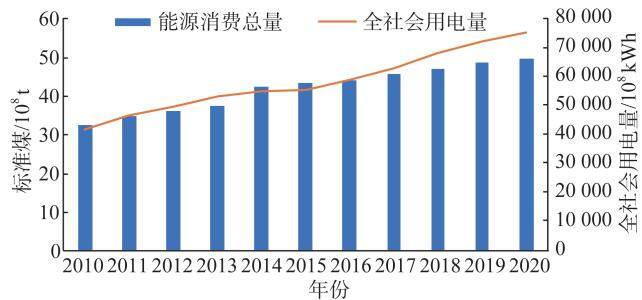
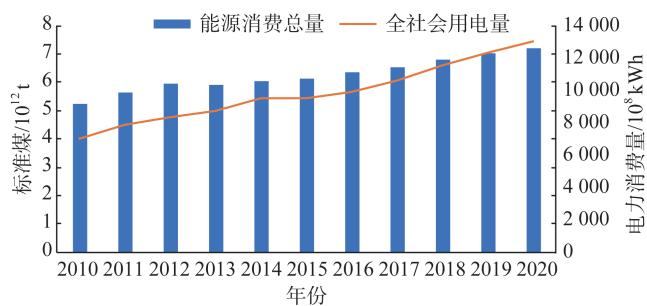
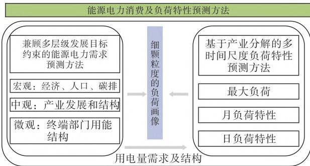
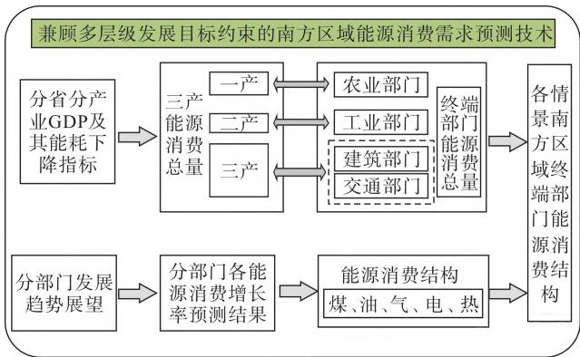
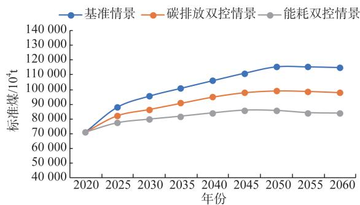
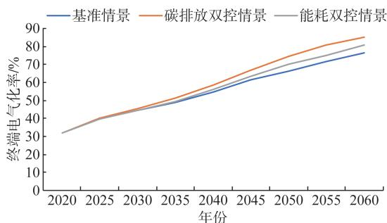
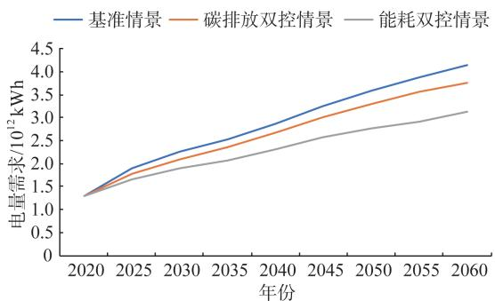
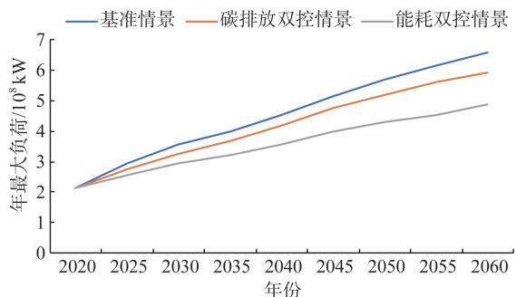
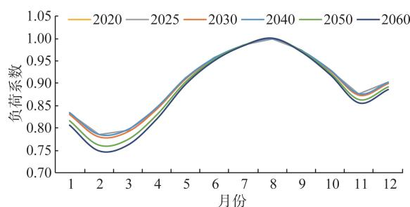
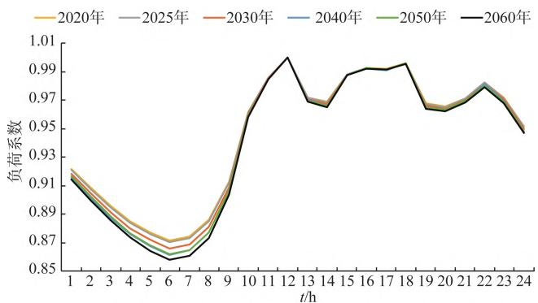

# “双碳”目标下南方区域能源电力消费及负荷特性预测

卓映君，周保荣，姚文峰，王嘉阳，卢斯煜

（直流输电技术全家重点实验室（南方电网科学研究院），广州 510663）

摘要：针对双碳目标，在全国能源消费预测已有研究基础上，提出了兼顾多层级发展目标约束的南方区域能源电力消费需求预测技术，构建了基准情景、能耗双控情景、碳排放双控情景 种南方区域能源电力消费情景；建立了基于产业分解的多时间尺度负荷特性预测模型，推演了未来南方区域的电力负荷特性。研究结果表明，碳排放双控情景下，南方区域终端能源消费量在 年前进入达峰平台期，峰值约 亿吨标准煤；终端部门用电量保持合理增长态势，在 年后进入年均增长率为 $3 \%$ 左右的平台期，在 年后年均增长率进一步下降至 $1 \%$ ；受产业结构转型影响，南方区域电力负荷不均衡特性将逐步加大。电力部门承担的减排压力逐步凸显，需要加快南方区域新型电力系统建设，促进能源低碳转型，支撑“双碳”目标实现。

关键词：“双碳”目标；南方区域；能源消费；负荷预测

# Prediction of Energy and Electricity Consumption and Load Characteristics in the Southern Region Under the Carbon Peak and Carbon Neutrality Target

ZHUO Yingjun, ZHOU Baorong, YAO Wenfeng, WANG Jiayang, LU Siyu

（State Key Laboratory of HVDC , Electric Power Research Institute, CSG, Guangzhou 510663, China）

Abstract：Aiming at carbon peaking and carbon neutrality goals, based on the existing research on the national energy consumption forecast, a forecasting technology for energy and electricity consumption demand in the southern region that takes into account the constraints of multi-level development goals is proposed. Three energy and electricity consumption scenarios in the southern region are constructed: the baseline scenario, dual-control of energy consumption scenario, and dual-control of carbon emission scenario. A forecasting method for multi-timescale load characteristics based on industrial decomposition is established, and the future power load characteristics of the southern region are deduced. The result shows that under the dual-control of carbon emission scenario, the terminal energy consumption in the southern region will reach a peak plateau before 2045, with a peak of 1 billion tons of standard coal. Terminal sector electricity consumption maintains a reasonable growth trend, entering a plateau with an average annual growth rate of about $3 \%$ after 2025, and further decreasing to $1 \%$ after 2050. Affected by the transformation of industrial structure, the fluctuation characteristics of load in the southern region will gradually increase. The pressure on the power sector to reduce emissions has gradually become prominent, and it is necessary to speed up the construction of new power systems in the southern region for promoting the low-carbon energy transformation and supporting the achievement of the carbon peaking and carbon neutrality goals.

Key words：carbon peaking and carbon neutrality target；southern region；energy consumption；load forecast

# 0　引言

为了应对世界气候变化，许多国家和地区陆续提出碳中和目标［1］ ，我国也积极宣誓“双碳”目标，并出台了一系列“双碳”政策文件，加快我国能源绿色低碳转型建设［2-3］ 。实现“双碳”目标，能源是主战场，电力是主力军，能源电力低碳转型是实现碳达峰、碳中和的关键环节［5-7］ 。中长期能源电力消费预测是指导能源政策、电网规划的重要基础，准确把握能源电力消费发展趋势， 对于保障国民经济高质量发展、保障能源供应安全以及保障“双碳”目标实现具有重要意义。

国内外已有不少组织机构和学者对我国能源电力转型路径开展深入研究，对我国碳达峰阶段和碳中和阶段的能源需求和电量需求有初步的研究成果［8-13］ 。南方区域作为我国新型电力系统建设的先行者，更应提前做好布局和谋划。然而，目前关于南方区域能源低碳转型的研究较少，亟需对“双碳”目标下南方区域未来能源电力消费情景进行预测。准确把握未来能源电力消费发展趋势，不仅可以指导终端部门加速能源技术升级、加快能源消费结构转型；还可以为电力部门提供负荷画像，指导电网建设和电源投资，保障电力供应安全。

在“双碳”背景下，能源电力消费情景不仅需要满足经济、能源、碳排放等宏观约束性指标，同时还需考虑产业转型目标、区域发展规划以及终端部门电能替代技术潜力等多层级发展约束，因此需要采用自上而下与自下而上相结合的综合评估的方法［14-16］ 。此外，负荷画像颗粒度越精细，对支撑电源规划、电网发展、市场建设等电力供需保障工作的作用越大。如何准确刻画未来负荷特性的变化是进一步深化能源电力消费预测研究的重要工作。

目前已有的能源电力消费预测研究聚焦于能源和电力消费总量的预测，时间尺度通常以年为单位；已有的负荷特性预测方法聚焦于单一时间尺度的负荷特性预测，预测时间跨度通常为数年以内［17-19］ 。新型电力系统背景下负荷画像的精度要求逐步提高，需要在能源电力系统视角下兼顾宏观-中观-微观多层级发展目标，对中长期的负荷需求及多时间尺度特性进行预测，因此，亟需研究一套完备的负荷需求及特性预测方法。

本文提出了可满足新型电力系统建设需求的能

源电力消费及负荷特性的预测方法，并基于该方法对南方区域的未来负荷情景进行描绘。首先，在全国和南方区域的能源供需现状分析基础上，结合目前已有的关于我国未来能源发展的研究成果，从经济发展、人口发展、能源发展三个维度对南方区域能源电力消费发展趋势进行展望，把握南方区域能源电力消费的客观发展规律；采用兼顾多层级发展目标约束的南方区域能源电力消费需求预测技术和情景分析方法，构建了“双碳”目标约束下南方区域的能源电力消费情景；在此基础上，采用基于产业分解的多时间尺度负荷特性预测方法，刻画了“双碳”目标约束下南方区域负荷画像。以期为碳达峰、碳中和目标下南方区域能源电力消费预测和能源电力低碳转型提供基础参考。

# 1　能源电力消费现状分析与未来发展趋势展望

能源电力消费预测是指在历史和现状的数据基础上，提炼客观发展规律，对未来进行预测。本文通过统计分析全国与南方区域的能源供需现状、调研已有的全国能源发展趋势预测结果，展望南方区域未来能源消费发展趋势。

# 1.1　能源电力消费现状分析

# . . 　全国能源消费现状

2020 年 ， 全 国 国 内 生 产 总 值（gross domesticproduct， GDP）总量为 . 万亿元，相比 年年均增长率为 $6 , 8 \%$ 。其中，第一产业占比 $7 . 7 \%$ ，相比2010年处于下降状态，年均下降率为 $2 . 0 \%$ ；第二产业占比 $3 7 . 8 \%$ ，相比 年处于下降状态，年均下降率为 $2 , 0 \%$ ；第三产业占比 $5 4 . 5 \%$ ，相比2010 年 处 于 逐 年 上 升 状 态 ， 年 均 增 长 率 为. %［19］ 。 $2 . 1 \%$

年，全国总人口为 . 亿人，相比年年均增长率为 $0 . 5 \%$ 。其中，城镇占比为 $6 3 . 9 \%$ ，相比 年处于逐年上升状态，年均增长率为$2 . 5 \%$ ；乡村占比为 $3 6 . 1 \%$ ，相比 年处于逐年下降状态，年均下降率为3. 2%［20］ 。 $3 . 2 \% ^ { [ 2 0 ] }$

全国能源消费需求逐年增长，终端部门能源消费结构不断改善，电力消费持续增长（如图 所示），电能替代技术存在较大发展空间。能源消费结构不断优化， 年能源消费总量为 . 亿吨标准煤， 年上升至 . 亿吨标准煤，化石能

源消费占比从 $9 0 . 6 \%$ 下降至 $8 4 . 1 \%$ 。2020年全国电力消费量为 . PWh，相比 年年均增长率为$6 \% ^ { [ 2 1 ] }$ 。2020 年全国电能消费占终端能源消费比重达到约 26. 5%［22］ 。

  
图1　全国电力消费情况  
Fig. 1 National electricity consumption

# . . 　南方区域能源消费现状

年，南方区域GDP总量为 . 万亿元，相比2010年年均增长率为 $7 . 9 \%$ 。其中，第一产业占比 $8 , 6 \%$ ，相比 年下降 $0 . 7 \%$ ；第二产业占比$3 6 . 7 \%$ ，相比 年下降 $1 0 . 6 \%$ ；第三产业占比$5 4 . 8 \%$ ，相比 年上升 $1 1 . 3 \%$ ［19］ 。

年，南方区域人口总量为 . 亿人口，相比2010年年均增长率为 $0 . 9 \%$ 。2020年，南方区域人口和GDP占全国比重均为 $18 \%$ 左右，人均GDP为 . 万元/年，略低于全国平均水平（ . 万元/年）。

年南方五省终端能源消费量为 . 亿吨标准煤，约占全国能源消费总量 $14 \%$ ，相比 2010 年. 亿吨标准煤年均增长 $3 . 1 \%$ 。 年南方区域非化石能源消费占比 $30 . 2 \%$ ，单位 GDP 能耗约. t标准煤/万元（当年价），均远低于全国水平$( 1 5 . 9 \%$ ， . t标准煤/万元）

年南方区域电力消费量为 $1 . 3 \ \mathrm { P W h }$ ，近a的年均增长率为 $6 , 4 \%$ ，南方区域约占全国电力消费的 $17 \%$ ，如图 所示。 年南方区域人均用电量约 $5 ~ 0 0 0 ~ \mathrm { k W h / a }$ ，略低于全国平均水平（kWh/a）。 年南方区域最大电力负荷为GW，近 a的年均增长率为 $7 . 5 \%$ ，负荷小时数达到约 $6 ~ 0 6 0 ~ \mathrm { h }$ 。全年最大电力负荷发生在 — 月，月负荷系数峰谷差值约为 . ；日负荷特性曲线呈现双峰特性，夏季日最大电力负荷出现在正午时左右，冬季最大电力负荷出现在晚上 时左右，日负荷系数峰谷差值分别约为 . 和 . 。

  
图2　南方电力消费量  
Fig. 2 Electricity consumption in the southern region

# 1.2　未来发展趋势研判

# 1. 2. 1　中国能源消费发展趋势预测结果

我国是全球应对气候变化事业的积极参与者与重要贡献者，其能源需求和能源转型是全球关注的焦点［23］ 。国内外机构纷纷开展相关研究，设置了不同的假设情景，对碳中和背景下中国能源需求、碳排放和能源电力转型路径进行预测［24-27］ 。本文调研了国内外11家机构的预测结果。

# 1）人口变化

目前我国人口老龄化速度加快，根据调研成果显示，我国将提前进入人口自然增长率为负值的阶段。预计人口总规模将在 年前后达到峰值14. 4~14. 6 亿 ， 2050 年 下 降 至 13. 6~14. 0 亿 ， 到年人口数量将下降至 . 亿以下。

# ）生产总值GDP

大多数发达国家经验显示，碳达峰进程往往伴随GDP进入较低增速阶段，碳达峰前 年GDP增长率比后 年GDP增长率高 个百分点左右或以上，碳达峰后GDP增长率下降至 $3 \%$ 以下。考虑中国仍然属于发展中国家，存在较大的客观发展需求，预计我国 GDP 增长率在 年将下降至$4 . 5 \% { \sim } 5 . 0 \%$ ，在 年下降至 $3 . 0 \% { \sim } 3 . 5 \%$ ，在年进一步下降至 $2 . 5 \%$ 以下。 年我国人均GDP超过发达国家碳达峰时人均GDP平均水平（万美元/年）， 年人均GDP可以超过美国、日本等发达国家碳达峰时人均 GDP 水平（ ~ 万美元/年）。

# ）能源消费总量

结合国际经验来看，多数国家的能源消费达峰时间是在碳达峰同年或一段时期后出现，部分发达国家如德国、法国等国家的能源消费峰值时间晚于碳达峰 ~ a以上。调研结果显示，碳中和情景下

的能源消费无论是绝对值还是趋势都较为接近，预计我国能源消费总量达峰时间晚于碳达峰时间，将在2030—2045年间达峰，峰值在60亿吨标准煤左右。

# 1. 2. 2　南方区域发展趋势研判

# 1）人口发展趋势

参考全国人口总量达峰时间及未来变化趋势的预测结果，结合南方区域历史人口数据表现，考虑区域发展红利，南方区域人口总量达峰时间将略迟于全国人口达峰时间，预计将在2035年左右达峰，届时南方区域人口占全国人口比重将超过 $20 \%$ ，最终稳定在 $21 \%$ 左右。

# 2）GDP发展趋势

借鉴国际经验和我国经济发展未来趋势，南方区域GDP增速随人口增速下降而放缓，预计南方区域GDP增长率略高于全国平均水平，GDP增长率在 年将下降至 $5 . 0 \% { \sim } 5 . 5 \%$ ，在 年下降至 $3 . 2 \% { \sim } 3 . 5 \%$ ，人均 GDP 可以超过发达国家碳达峰时人均GDP平均水平，约 . 万美元/年（以年为基准价，按 美元 $= 6 . 5$ 元换算，下同），在年进一步下降至 $2 . 5 \%$ 以下，人均GDP可以超过美国、日本等发达国家碳达峰时人均GDP，约万美元/年。

# ）能源消费发展趋势

参考全国能源消费总量预测结果，考虑南方区域发展驱动因素，预计南方区域能源消费总量将在年前达到峰值，南方区域能源消费总量峰值约为全国能源消费总量峰值的 $15 \%$ 左右。在“双碳”目标下，南方区域将通过加快能源结构清洁化转型进程，保障区域经济发展带来的能源消费合理增长需求。

# 2　能源电力消费及负荷特性预测方法

负荷画像预测是指导能源政策、电源投资、电网规划的重要基础。对此，本文采用了兼顾多层级发展目标约束的南方区域能源消费情景预测方法和基于产业分解的多时间尺度负荷特性预测方法，在能源电力系统视角下构建南方区域电力消费情景，精细刻画南方区域负荷画像，为能源电力低碳转型研究工作提供参考。图 为能源电力消费及负荷特性预测方法的技术框架。

# 2.1　兼顾多层级发展目标约束的能源电力需求预测方法

本文提出了兼顾自上而下和自下而上［24-25］ 相结

  
图3　电力消费及负荷特性预测方法  
Fig. 3 Prediction method of electricity consumption and demand characsteristics in the southern region

合的方法，兼顾多层级发展目标约束的南方区域能源电力消费情景预测技术。分析在“双碳”目标约束下和产业结构转型驱动下，各终端部门能源结构调整和电气化技术实施带来的南方区域能源消费和电量消费需求变化。

兼顾多层级发展目标约束的南方区域能源电力消费情景预测技术研究思路如图4所示。具体实现步骤如下。

  
图4　南方区域能源电力消费情景预测技术  
Fig. 4 Prediction technology of energy and electricity consumption scenarios in the southern region

）预测宏观发展趋势：根据人口发展趋势和人均GDP增长研判预测南方区域GDP增长量，根据碳排放强度指标和GDP预测结果计算南方区域碳排放上限。并考虑未来将进一步加大对产业结构调整的力度，预测南方区域GDP产业结构的变化情况。  
）预测分产业和终端部门能源消费：结合全国能源消费总量变化趋势和能源强度下降指标，预测南方区域分产业部门能源消费强度下降情况，结合南方区域分产业GDP预测结果可求得分产业能

源消费需求预测结构；依据产业与终端部门的对应关系，可进一步得到终端部门的能源消费总量。

3）预测能源消费结构：在能源消费结构现状基础上，结合终端部门各种能源技术发展潜力和电能替代潜能，在碳排放约束下测算终端各部门的能源消费结构，通过反复迭代最终形成一套可满足多层级发展目标约束的南方区域终端能源消费结构。

多层级发展目标约束公式表达如下。

# ）宏观发展目标约束

根据人口发展趋势和人均GDP增长研判预测南方区域GDP增长量。由碳排放强度下降目标约束预计南方区域未来碳排放强度变化，结合GDP预测结果确定南方区域未来碳排放总量约束。

$$
P \times G _ {\mathrm {p}} = G \tag {1}
$$

$$
G \times E _ {\mathrm {C O} _ {2}} = B \tag {2}
$$

式中： $G$ 为社会生产总值； $G _ { \mathrm { { p } } }$ 为人均GDP预测值；$P$ 为预测的人口数量； $B$ 为碳排放总量的最大约束值，由碳排放强度目标 $E _ { \mathrm { { C O } _ { 2 } } }$ 和 GDP 预测值共同决定。

# ）中观发展目标约束

考虑未来将进一步加大对产业结构调整的力度，分产业部门的能源强度和分产业的GDP将发生变化，进一步可得到分产业的能源消费量需求预测情况：

$$
G = \sum_ {j = 1} ^ {3} G _ {j} \tag {3}
$$

$$
G _ {j} = \alpha_ {j} \times G \tag {4}
$$

$$
\sum_ {i = 1} ^ {5} A _ {i, j} = G _ {j} \times E _ {j} \tag {5}
$$

式中： $G _ { j }$ 为第j个产业对应的生产总值； $\alpha _ { j }$ 为第 $j$ 个产业的GDP在总GDP中的占比， $j = 1 \sim 3$ 分别对应第一产业、第二产业和第三产业； $E _ { j }$ 为第 $j$ 个产业对应的能源强度，需要满足能源强度下降目标要求； $A _ { i , }$ 为第 $j$ 个产业的第i种能源消费品种的未来消费量。

根据三级产业与终端部门的对应关系，进一步可得到终端部门的能源消费总量，终端部门能源消费平衡约束为：

$$
\sum_ {j = 1} ^ {3} \sum_ {i = 1} ^ {5} A _ {i, j} = \sum_ {k = 1} ^ {4} \sum_ {i = 1} ^ {5} x _ {i, k} \tag {6}
$$

$$
\sum_ {i = 1} ^ {5} A _ {i, 1} = \sum_ {i = 1} ^ {5} x _ {i, 1} \tag {7}
$$

$$
\sum_ {i = 1} ^ {5} A _ {i, 2} = \sum_ {i = 1} ^ {5} x _ {i, 2} \tag {8}
$$

$$
\sum_ {i = 1} ^ {5} A _ {i, 3} = \sum_ {k = 3} ^ {4} \sum_ {i = 1} ^ {5} x _ {i, k} \tag {9}
$$

式中 $x _ { i , \ast }$ 为第 $k$ 个部门的第i种能源消费品种的未来消费量， $i = 1 \sim 5$ 分别对应煤、石油、天然气、热力和电力， $k = 1 \sim 4$ 分别对应农业部门、工业部门、建筑部门和交通部门。其中电力消费需求考虑了直接电力消费部分和非直接电力消费部分，非直接电力消费考虑了电制氢电量需求和供热电量需求。

# ）微观发展目标约束

根据现有技术比例和经验数据预测各种能源技术未来渗透率比例关系，进一步可得到终端部门的能源消费结构，需要满足各部门能源品种消费总量平衡约束和碳排放目标约束：

$$
x _ {i, k} = x _ {i, k} ^ {\mathrm {i n i}} \times \left(\beta_ {i, k} + 1\right) \tag {10}
$$

$$
\sum_ {k = 1} ^ {4} x _ {i, k} = \sum_ {m = 1} ^ {3} A _ {i, m} \tag {11}
$$

$$
C _ {\mathrm {O} _ {2}} = \sum_ {k = 1} ^ {4} \sum_ {i = 1} ^ {5} x _ {i, k} \times \gamma_ {i} <   B \tag {12}
$$

式中： $\boldsymbol { x } _ { i , \ k } ^ { \mathrm { i n i } }$ 为参考的第 $k$ 个部门的第i种能源消费品种消费量； $\beta _ { i , \cdot }$ 为第 $k$ 个部门的第i种能源消费品种的未来增长率，需要满足各部门的能源技术发展潜力和电能替代潜力的约束； $\gamma _ { i }$ 为第 i 个能源的碳排因子； $C _ { \mathrm { o } _ { 2 } }$ 为所有终端部门的碳排放之和。

# 2. 2　基于产业分解的多时间尺度负荷特性预测方法

负荷特性预测是负荷预测的核心内容之一，是电网规划与运行管理工作的重要基础。本文根据指标选取的科学性、综合性以及数据的可得性，提出了基于产业分解的多时间尺度的负荷特性预测方法，包括年最大负荷特性、月负荷系数和日负荷系数的负荷特性预测。为深化能源电力消费预测研究、刻画未来负荷特性变化提供一种思路，在实际应用中可根据掌握的数据对各模型的输入指标进行调整和优化。

结合目前掌握的数据颗粒度和丰富度，对于年、月负荷特性的预测，主要考虑了“双碳”背景下产业发展和电能替代引起的电量需求变化影响，若掌握分产业/行业的负荷特性历史数据，可将其作为解释变量构造更为精细的年/月负荷特性预测模

型；对于日负荷特性的预测，主要考虑了产业用电结构和典型日负荷特性曲线的影响，若掌握各细分行业的典型日负荷特性曲线，可基于细分行业的日负荷特性预测未来典型日负荷特性。

# 1）年最大负荷特性预测

建立以年最大负荷为被解释变量，以GDP、用电量需求、三产用电量结构三类指标作为解释变量的多元线性回归方程，经历史 a数据检验，回归方程精度可达到 $9 9 \%$ 以上。表达式如式（13）所示。

$$
Y _ {\mathrm {y}} = \alpha_ {\mathrm {y}, 1} x _ {\mathrm {G D P}} + \alpha_ {\mathrm {y}, 2} x _ {\mathrm {e}} + \alpha_ {\mathrm {y}, 3} x _ {\mathrm {e}, 2} + \alpha_ {\mathrm {y}, 4} x _ {\mathrm {e}, 3} + \beta_ {\mathrm {y}} (1 3)
$$

式中： $Y _ { \mathrm { y } }$ 为年最大负荷值； $x _ { \mathrm { G D P } }$ 为 GDP值； $x _ { \mathrm { e } }$ 为用电量需求；xe，， $x _ { \mathrm { e } }$ ， 分别为二产、三产的电量需求； $\alpha _ { \mathrm { y , ~ 1 ~ } } \sim \alpha _ { \mathrm { y } }$ ， 为各项指标系数； $\beta _ { y }$ 为残差项。

# ）月负荷特性预测

建立以月负荷特性系数为被解释量，以三产用电量结构、月份特征、区内各省份月温度特性三类指标作为被解释变量的多元线性回归方程。经历史a 数据检验，回归方程精度可达到 $9 5 \%$ 以上。表达式如式（ ）所示。

$$
\begin{array}{l} Y _ {\mathrm {m}} = \alpha_ {\mathrm {m}, 1} x _ {\mathrm {m}} + \alpha_ {\mathrm {m}, 2} x _ {\mathrm {e}, 1} + \alpha_ {\mathrm {m}, 3} x _ {\mathrm {e}, 2} + \alpha_ {\mathrm {m}, 4} x _ {\mathrm {e}, 3} + \\ \sum_ {p r o \in s} \alpha_ {\mathrm {m}, p r o} x _ {p r o} + \beta_ {\mathrm {m}} \end{array} \tag {14}
$$

式中： $Y _ { \mathrm { m } }$ 为月负荷特性系数； $x _ { \mathrm { m } }$ 为月份序号；$x _ { \mathrm { e } , \mathrm { ~ 1 ~ } } \sim x _ { \mathrm { e } }$ 分别为一产~三产的电量需求； $x _ { p r o }$ 为区域 $s$ 内省份 $p r o$ 的月最高温度，式中考虑了属于区域 s 内的所有省份的温度影响；αm， ∼ αm， ，αm，pro $s$ $\mathbf { \Omega } _ { 1 } \sim \alpha _ { \mathrm { m } }$ $\alpha _ { \mathrm { m } }$ 为各项指标系数； $\beta _ { \mathrm { m } }$ 为残差项。

# ）日负荷特性预测

基于目前掌握的各产业典型日负荷特性曲线，结合未来各产业用电量，将各产业的日负荷曲线进行叠加可得到未来的典型日负荷特性曲线。

$$
\begin{array}{l} \bar {Y} _ {\mathrm {d}, t} = x _ {\mathrm {e}, 1} x _ {1, t} ^ {1} / \sum_ {t = 1} ^ {2 4} x _ {1, t} ^ {1} + x _ {\mathrm {e}, 2} x _ {1, t} ^ {2} / \sum_ {t = 1} ^ {2 4} x _ {1, t} ^ {2} x _ {\mathrm {e}, 3} + x _ {\mathrm {e}, 3} x _ {1, t} ^ {3} / \\ \sum_ {t = 1} ^ {2 4} x _ {1, t} ^ {3} (15) \\ Y _ {\mathrm {d}, t} = \bar {Y} _ {\mathrm {d}, t} / \max  (\bar {Y} _ {\mathrm {d}, t}) (16) \\ \end{array}
$$

式中： $Y _ { \mathrm { d } }$ 为第 $t$ 时段的日负荷特性系数； $\overline { { Y } } _ { \mathrm { ~ d ~ } }$ 为第$t$ 时段的日负荷数值； $\begin{array} { r } { \boldsymbol { x } _ { 1 , \ t } ^ { 1 } \sim \boldsymbol { x } _ { 1 , } ^ { 3 } } \end{array}$ 分别为第 $t$ 时段的一产—三产日负荷特性系数； $x _ { e , \mathrm { ~ 1 ~ } } \sim x _ { e }$ $x _ { e }$ 分别为一产—三产的电量需求。

# 3　南方区域能源电力消费情景预测结果

兼顾宏观经济发展、能源供需安全和碳减排目

标，本文对南方区域能源电力消费需求和负荷画像进行预测情景研究，基于能源消费达峰时间和达峰总量，设置了基准情景、能耗双控情景和碳排放双控情景 3 种情景，构建南方区域能源电力消费情景，刻画南方区域负荷画像。

# 3.1　情景设置

基准情景是在“双碳”目标制定前的政策约束下按照传统发展模式、历史发展趋势预测的情景。该情景未受到能耗双控和碳排放双控政策的约束，是一个基准参照情景，用来对比“双碳”目标政策对能源电力消费需求的影响。

能耗双控情景是指在基准情景基础上，面向“双碳”目标，各行业深度去煤、减油替代，进一步发展天然气，加大终端电气化，在满足能源消费总量和能源消费强度“双控”政策约束下的能源电力需求预测情景。

碳排放双控情景是指在基准情景基础上，工业部门、交通部门、建筑部门、农业部门各部门大力发展电代煤、电代油等技术，并通过加快电力系统低碳转型、降低电力部门碳排放因子，保障在“双碳”目标约束下能源电力消费合理增长的需求。

# 3.2　南方区域终端能源消费总量

根据工业、建筑、交通、农业部门终端能源消费预测分析， 个情景下南方区域终端能源消费总量在碳达峰阶段保持增长趋势，在 年后能源消费需求增长率减缓，迈入达峰平台期，如图 所示。在基准情景下，南方区域终端能源消费总量将在 年前后达峰，峰值约为 . 亿吨标准煤。碳排放双控和能耗双控情景下，南方区域终端能源消费需求分别约为 . 亿吨标准煤和 . 亿吨标准煤。能耗双控情景下，南方区域终端能源消费总量于2040年前后迈入达峰平台期，碳排放双控情景延迟约 a进入平台期。尽管碳排放双控情景下能源消费总量峰值增大、达峰时间延后，但其非化石能源发展迅速、终端部门深度电气化，通过电力系统深度脱碳，充分发挥终端高度电气化的碳减排效益，保障南方区域在满足“双碳”目标下经济快速增长的能源消费需求，实现双碳目标和能源消费增长的协同。图 为不同情景下南方区域终端电气化率的预测结果。

# 3.3　南方区域电量消费需求

在电量消费方面，受经济运行总体增长、电能

  
图5　不同情景下南方区域终端能源消费需求

  
Fig. 5 Terminal energy consumption demand in the southern region under different scenarios   
图6　不同情景下南方区域终端电气化率  
Fig. 6 Terminal electrification rate in the southern region under different scenarios

替代等因素推动，南方区域终端部门电量消费保持持续合理增长趋势。3种情景下南方区域用电量需求在“十四五”期间年平均增长率均超过 $5 \%$ ，“十五五”期间年平均增长率为 $3 \% { \sim } 4 \%$ ， 年— 年期间年均增长率由 $2 . 5 \%$ 逐步下降至 $1 , 5 \%$ ，在年后年均增长率将进一步下降至 $1 , 5 \%$ 以下，如图所示。 年南方区域用电量需求约为 . ~ .PWh，人均用电量为 $6 { \sim } 8 \ \mathrm { M W h / a }$ ，达到日本、德国当前人均用电量水平。 年达到约 . ~ .PWh，人均用电量为 $1 1 { \sim } 1 5 \ \mathrm { M W h / a }$ ，达到美国、加拿大当前人均用电量水平。

# 3.4　南方区域负荷特性预测结果

在负荷特性方面，受区域经济增长、产业结构转型和终端电能替代影响，南方区域年最大负荷持续增长，但年增长率总体呈现下降趋势，如图 所示。 种情景下南方区域年最大负荷在 年前年平均增长率均超过 $3 \%$ ， — 年期间年平均增长率维持在 $2 \% { \sim } 2 . 5 \%$ 且逐步下降， 年后年平均增长率将进一步下降至 $1 , 5 \%$ 左右。 年南方区域年最大负荷需求约为 ~ GW， 年

  
图7　不同情景下南方区域电量需求  
Fig. 7 Electricity consumption in the southern region under different scenarios

达到约 500~660 GW。

  
图8　南方区域年最大负荷  
Fig. 8 Maximum load in the southern region

种情景下 — 年月负荷特性曲线和日负荷特性曲线形态几乎一致，负荷不均衡特性有所提升。南方区域月负荷系数曲线呈现为双谷形态，日负荷特性曲线呈现三峰形态，依次如图 和图所示。以碳排放双控情景为例，最大月负荷系数出现在7—8月，最小月负荷系数谷值出现在2—3月，次小月负荷系数谷值出现在11月左右，月负荷系数峰谷差值由 0. 20（2020 年）逐步提高至 0. 25（2060年）。以夏季日负荷特性为例，最小日负荷系数出现在清晨 时左右，日负荷系数的 个峰值分别出

  
图9　南方区域月负荷特性  
Fig. 9 Monthly load characteristics in the southern region

现在正午 时、傍晚 时和夜晚 时左右，日负荷系数峰谷差值由 . （ 年）逐步提高至 .（2060年）。

  
图10　南方区域夏季日负荷特性  
Fig. 10 Daily load characteristics of the southern region in summer

# 4　结语

在“双碳”目标引领下，“新电气化”将是能源中长期发展的主要方向和推动经济社会全面绿色转型的有效途径。南方区域终端能源消费量在2045年前将达到峰值约 10 亿吨标准煤。为保障南方区域经济发展带来的能源消费合理增长需求，南方区域需要持续提升工业、建筑、交通、农业四大终端部门的电气化水平，减少煤炭、石油等一次能源的消费比重，并通过加快电力部门低碳转型提高能源利用效率、加速能源结构清洁化转型的进程。

电力部门作为能源转型的中心环节、碳减排的关键领域，承担的减排责任逐步凸显，需要加快构建新型电力系统。南方区域终端电气化率在年后将达到 $60 \%$ 以上，终端部门用电量保持合理增长态势，且受产业结构转型影响，南方区域电力负荷不均衡特性将逐步加大。为支撑“双碳”目标实现，南方区域需加快推进非化石电源发展，加强源网荷储协调配合，提高系统对非化石能源的接纳能力，加快构建新型电力系统，进而推动能源电力低碳转型发展。

# 参考文献

［1］ 邹才能，熊波，薛华庆，等.新能源在碳中和中的地位与作用［J］.石油勘探与开发， ，（）： .ZOU Caineng， XIONG Bo，XUE Huaqing，et al. The role ofnew energy in carbon neutral［J］. Petroleum Exploration andDevelopment，2021，48（2）：411 - 420.

［2］ 刘思捷，白杨，陈中飞，等.碳中和背景下能源电力产业链预警研究框架［J］.广东电力， ，（ ）： .  
LIU Sijie，BAI Yang，CHEN Zhongfei，et al. Research framework for early warning of energy and power industry chain under the background of carbon neutrality［J］. Guangdong Electric Power，2021，34（10）：1 - 9.   
［3］ 国家发展改革委 ．“十四五”现代能源体系规划［EB/OL］［2022 - 01 - 29］．https：//www.ndrc.gov.cn/xxgk/zcfb/ghwb/202203/t20220322_1320016. html？ state=123&code= &state$= 1 2 3$ .  
［4］ 中共中央. 国务院关于完整准确全面贯彻新发展理念做好碳达峰碳中和工作的意见［EB/OL］［. 2021 - 09 - 22］. https：//www.ccps.gov.cn/xtt/202110/t20211024_150970.shtml.  
［5］ 中共中央. 习近平主持召开中央财经委员会第九次会议［EB/OL］．［2021 - 03 - 15］． http：//www. gov. cn/xinwen/2021 -03/15/content_5593154.htm  
［6］ 韩肖清，李廷钧，张东霞，等.双碳目标下的新型电力系统规划新问题及关键技术［J］.高电压技术， ， （）：3046.  
HAN Xiaoqing，LI Tingjun，ZHANG Dongxia，et al. New is⁃ sues and key technologies of new power system planning under double carbon goals［J］. High Voltage Engineering， ， （）： .   
［］ 廖扬，蔡帜，邵佳扬，等.多区互联综合能源系统分散协调低碳经济调度［J］. 高电压技术，2023，49（1）：138 - 146.  
LIAO Yang，CAI Zhi，SHAO Jiayang，et al. Decentralized coordinated low-carbon economic dispatch method for multiregional interconnected integrated energy system［J］. High Volt⁃ age Engineering， ， （ ）： .   
［8］ 李政，陈思源，董文娟，等．碳约束条件下电力行业低碳转型路径研究［J］.中国电机工程学报， ，（ ）： .  
LI Zheng， CHEN Siyuan， DONG Wenjuan， et al． Low car-bon transition pathway of power sector under carbon emissionconstraints［J］. Proceedings of the CSEE， ， （ ）：–4001  
［9］ 全球能源互联网发展合作组织.中国2030年能源电力发展规划研究及 2060 年展望［R/OL］．［2022 - 05 - 05］．https：//www.geidco.org.cn/2021/0318/3268.shtml  
［ ］ 黄雨涵，丁涛，李雨婷，等．碳中和背景下能源低碳化技术综述及对新型电力系统发展的启示［J］.中国电机工程学报，，（S ）：  
HUANG Yuhan，DING Tao，LI Yuting，et al. Decarbonizationtechnologies and inspirations for the development of novelpower systems in the context of carbon neutrality［J］．Proceed⁃ings of the CSEE， ， （S ）：  
［ ］ 鲁宗相，黄瀚，单葆国，等．高比例新能源电力系统结构形态演化及电力预测展望［J］. 电力系统自动化， ， （）：12-18.  
LU Zongxiang，HUANG Han，SHAN Baoguo，et al. Morphological evolution model and power forecasting prospect of future electric power systems with high proportion of renewable energy［J］． Automation of Electric Power Systems， ， （）： ．   
［ ］ 舒印彪，陈国平，贺静波，等．构建以新能源为主体的新型电力系统框架研究［J］．中国工程科学， ，（）： .  
SHU Yinbiao，CHEN Guoping，HE Jingbo，et al． Building anew electric power system based on new energy sources［J］Strategic Study of CAE， ， （ ）：  
［ ］ 张运洲，张宁，代红才，等.中国电力系统低碳发展分析模型

构建与转型路径比较［J］.中国电力，2021，54（3）：1 - 11.  
ZHANG Yunzhou，ZHANG Ning，DAI Hongcai，ea al． Ana-lysis of model construction and transformation path comparisonof low-carbon development of China′s power system［J］Electric Power，2021，54（3）：1 - 11.  
［14］ FARINAZ F， MERABTINE A， MARTOUZET D. A spatio-temporal analysis of electric appliance end-use demand in theresidential sector： case study of tours （France）［J］. SustainableCities and Society， ， .  
［15］ 庞敏，张军，王俭 .川渝地区能源互联网的发展思路［J］.西南石油大学学报（社会科学版）， ，（）： .  
PANG Min， ZHANG Jun， WANG Jian. Development ideas ofEnergy Internet in Sichuan-Chongqing region ［J］. Journal ofSouthwest Petroleum University （Social Sciences Edition），， （）： .  
［16］ 中国致公党上海市委会课题组.加快构建我国现代能源体系，统筹实现“双碳”目标［J］.中国发展， ，（）： .  
Research Group of Shanghai Municipal Committee of China Zhi Gong Party. Accelerate the development of China′s modern energy system and coordinate efforts to achieve the "dual carbon"goal［J］. China Development，2022，22（3）：3 - 9.   
［ ］ 邱波，赵勇，夏清.我国中长期电力需求增长趋势研究［J］.中国能源， ，（ ）： .  
QIU Bo， ZHAO Yong， XIA Qing． Research on the growthtrend of medium and long-term power demand in China［J］.Energy of China， ， （ ）： .  
［ ］ 宇文敏睿. 面向电网规划的负荷特性及负荷预测研究［D］. 北京：北京交通大学，2019.  
［ ］ 黄国权，严玉婷，李晖，等.基于二重分解的行业用户短期日电量预测建模［J］.南方电网技术， ，（ ）： .  
HUANG Guoquan， YAN Yuting， LI Hui， et al. Short-termdaily electricity prediction modeling of industrial users basedon doubly decomposition［J］. Southern Power System Technol⁃ogy， ， （ ）： .  
［ ］ 中华人民共和国 年国民经济和社会发展统计公报［J］.中国统计， （）： .  
［ ］ 许珂，贺晓迎.新时代中国人口结构的发展态势研究——基于对“第七次全国人口普查公报”的分析［J］.成都行政学院学报， （）： ， .  
XU Ke， HE Xiaoying. A study on the development trend of China s population structure in the new era： analysis based on the communique of the seventh national population census［J］. Journal of Chengdu Administration Institute， （ ）：

46，117.  
［22］ 电力规划设计院.中国电力发展报告2020．［EB/OL］．［2021- 07 - 15］. http：//www. sasac. gov. cn/n2588025/n2588124/c19710818/content.html.  
［23］ 国家发展和改革委员会，国家能源局，财政部等.国家发展改革委等部门关于进一步推进电能替代的指导意见［EB/OL］.［2022 - 04 - 15］. http：//www. luxi. gov. cn/art/2022/4/15/art_3765_1113719.html.  
［ ］ 匡立春，邹才能，黄维和，等.碳达峰碳中和愿景下中国能源需求预测与转型发展趋势［J］.石油科技论坛， ，（）：- 17.  
KUANG Lichun， ZOU Caineng， HUANG Weihe， et al.China′s energy demand projection and energy transition trendsunder carbon peak and carbon neutrality situation［J］. Petro-leum Science and Technology Forum， ， （ ）： .  
［25］ 裴庆冰.典型国家碳达峰碳中和进程中经济发展与能源消费的经验启示［J］.中国能源， ，（）： .  
PEI Qingbing. Experience and inspiration of economic development and energy consumption in the process of carbon neutralization in typical countries［J］. Energy of China，2021，43 （）： ．   
［ ］ 孙元章，张鹏成，柯德平，等. 碳达峰条件下能源互联网系统规划设计与优化运行［J］. 南方电网技术， ，（）： .  
SUN Yuanzhang， ZHANG Pengcheng， KE Decheng， et al.Planning， design and optimal operation of energy internetsystem under the condition of peak carbon dioxide emissions［J］.Southern Power System Technology，2022，16（1）：1 - 13.  
［ ］ 清华大学气候变化与可持续发展研究院. 中国长期低碳发展战略与转型路径研究［R］. 北京：清华大学气候变化与可持续发展研究院， .  
［28］ 国家发展和改革委员会能源研究所. 我国实现全球 $1 . 5 \mathrm { { ‰} }$ 目标下 的能源排放情景研究［R］. 北京：国家发展和改革委员会能源研究所， .

收稿日期： - - ；网络首发日期： - -

作者简介：

卓映君（ ），女，通信作者，硕士，研究方向为新能源电力系统规划，zhuoyj@csg. cn；

周保荣（ ），男，高级工程师（教授级），博士，研究方向为电网规划运行管理、电力系统运行方式分析计算；

姚文峰（ ），男，高级工程师（教授级），硕士，研究方向为电力系统规划、运行与控制。