# 基于人工智能技术的新型电力系统负荷预测研究综述

韩富佳，王晓辉，乔骥，史梦洁，蒲天骄

(中国电力科学研究院有限公司，北京市 海淀区 100192)

# Review on Artificial Intelligence Based Load Forecasting Research for the New-type Power System

HAN Fujia, WANG Xiaohui, QIAO Ji, SHI Mengjie, PU Tianjiao

(China Electric Power Research Institute, Haidian District, Beijing 100192, China)

ABSTRACT: Driven by the goal of ‘double carbon’, constructing the new-type power system with new energy as the main part is the important premise and inevitable trend to promote the low carbon transformation and development of the modern power system. As the complex and variable multi-load is an important part of the new-type power system, load forecasting is of great significance for the planning, operation, control, and dispatching of the new-type power system. In this context, this paper firstly gives a brief overview of power system load forecasting. Secondly, in view of the new characteristics and challenges of load forecasting for the new-type power system, the status quo of applications of data driven artificial intelligence technologies in various load forecasting scenarios is described in detail. Then, from the perspectives of data and models, the problems and shortcomings of current artificial intelligence based load forecasting methods are deeply analyzed. Finally, in view of the challenges of artificial intelligence based load forecasting technologies for the new-type power system, the key technology research directions in the future are prospected, and the relevant key research scenarios are summarized, in order to provide the constructive reference for the development of the new-type power system under the goal of ‘double carbon’.

KEY WORDS: double carbon; new energy; new-type power system; load forecasting; artificial intelligence (AI)

摘要：在“双碳”目标的驱动下，构建以新能源为主体的新型电力系统是促进现代电力系统低碳转型发展的重要前提与必然趋势。由于复杂易变的多元负荷是新型电力系统的重

要组成部分，因而负荷预测对于新型电力系统的规划、运行、控制以及调度具有十分重大的意义。在此背景下，首先对电力系统负荷预测进行了简要概述；其次，针对新型电力系统负荷预测的新特征与新挑战，详细阐述了当前数据驱动的人工智能技术在负荷预测各个场景中的应用现状；然后，分别从数据和模型2个角度，深入分析了目前基于人工智能技术的负荷预测方法存在的问题与不足；最后，针对基于人工智能的新型电力系统负荷预测技术面临的挑战，对未来关键的技术研究方向进行了展望，并总结了相关重点研究场景，以期对“双碳”目标下的新型电力系统的发展提供具有建设性意义的参考。

关键词：双碳；新能源；新型电力系统；负荷预测；人工智能(AI)

# 0 引言

当前，全球能源需求日益增加，导致温室气体排放量显著提升，使得加强环境保护、解决全球气候变暖问题以促进经济社会可持续发展日趋受到国际社会的极大关注[1]。所以，实现绿色低碳能源转型，逐渐成为世界各国的重要发展战略目标[2]。2020 年 9 月，我国在第 75 届联合国大会上宣布于2030 年前及 2060 年前分别实现碳达峰与碳中和的目标(简称“双碳”目标)。电力行业作为能源领域碳排放的最主要来源，是实现“双碳”目标的关键领域[3]。因此，2021 年 3 月，中央财经委员会第九次会议提出，建立清洁低碳安全高效的能源体系，构建以新能源为主体的新型电力系统。

在此背景下，随着电能替代不断深化与电气化水平不断提高，电力负荷作为新型电力系统的重要

组成部分，正在逐渐朝着多元化方向发展。与此同时，由于电力市场改革进一步深化，需求响应、共享经济、负荷聚合商、虚拟电厂等新技术与新角色不断被引入，也使得电力负荷呈现出更加复杂多变的新特性和新形态[4]。所以，电力系统负荷预测作为基础支撑工作，对于未来新型电力系统的规划、运行、控制以及调度具有至关重要的意义。

近年来，由于智能量测设备的广泛部署以及通信水平的迅速提升，电网公司的用电信息采集系统、SG186营销系统以及各类信息平台等积累了海量多源异构数据，包括电力负荷数据、档案信息数据、气象数据、地理信息数据等，为人工智能、大数据分析等前沿技术在电力系统负荷预测领域的应用提供了重要数据基础[5]。同时，人工智能、大数据分析等数字化技术发展迅速，已经在自然语言

处理、计算机视觉等研究领域取得了丰硕的成果，并且在互联网、交通、金融、医疗等行业落地应用成效显著，从而为电力系统负荷预测研究提供了新手段和关键技术支撑[6]。

因此，本文首先对电力系统负荷预测进行简要介绍；然后，针对新型电力系统负荷预测存在的新特征与面临的新挑战，着重阐述当前人工智能技术在新型电力系统负荷预测研究中的应用现状；继而，从数据和模型角度，深入分析目前基于人工智能的负荷预测方法面临的问题与挑战；最后，针对基于人工智能技术的新型电力系统负荷预测存在的不足，对未来技术研究的发展方向进行展望，并总结相关重点研究场景，旨在对“双碳”目标下的新型电力系统的发展提供参考性建议。图 1 为基于人工智能技术的新型电力系统负荷预测研究框架图。

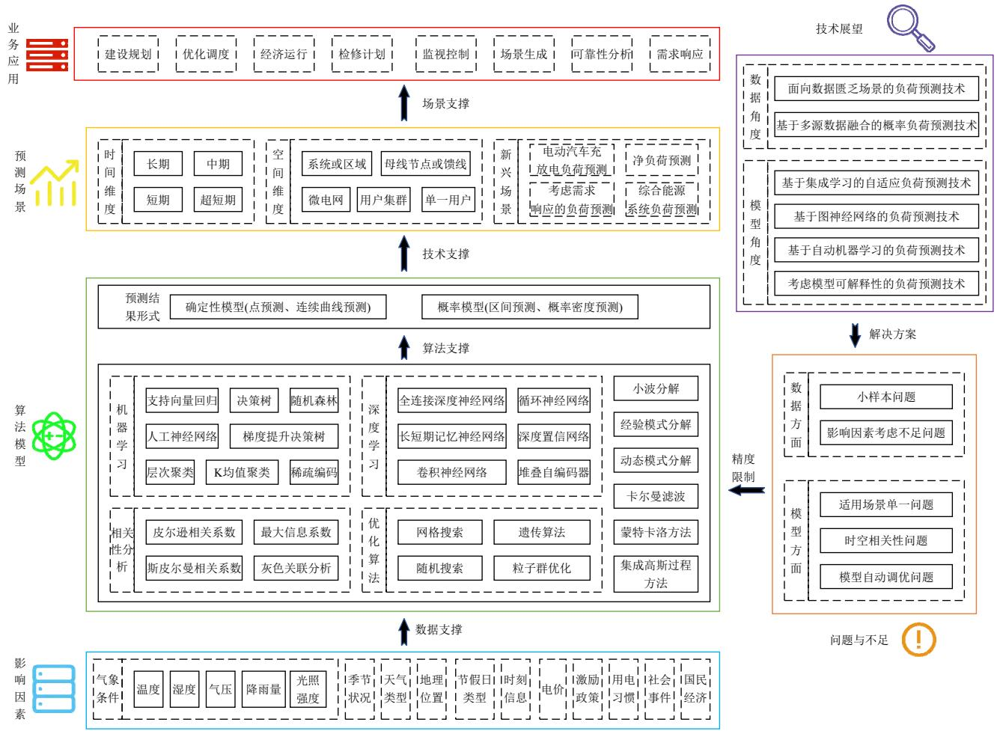  
图 1 基于人工智能技术的新型电力系统负荷预测研究框架  
Fig. 1 Framework of artificial intelligence based load forecasting research for the new-type power system

# 1 负荷预测概述

# 1.1 传统方法

现有负荷预测技术研究主要是从时间与空间 2个维度开展，并且根据时间与空间尺度的不同分别

具有相应的重要意义[7]。由于传统电力系统的负荷组成成分简单，并且预测场景往往针对于系统级或母线级负荷，因而传统负荷预测方法主要是基于统计学的分析方法[8]。然而，随着电力系统的快速发

展与不断演变，尤其是新型电力系统的构建在很大程度上将会引入大量的分布式新能源、电动汽车等新元素，电力系统负荷侧愈显灵活多变。加之，由于需求侧管理的逐渐普及，产消者、负荷聚合商等新角色随之涌现，从而用户与电网之间的互动也变得更加积极主动。因此，面对多种复杂的负荷影响因素，传统负荷预测方法难以精准构建新型电力系统背景下负荷模式。

# 1.2 人工智能方法

随着新一代人工智能技术的兴起，数据驱动的人工智能方法逐渐成为电力系统负荷预测的主要研究方法，特别是基于传统机器学习、深度学习的大数据分析方法，由于其具备提取复杂抽象特征的优越能力，因而在负荷预测领域表现出更好的预测精度。

一般而言，预测问题可以定义为：在给定预测信息空间 $\varOmega _ { t }$ 中选取特定信息作为预测输入 $x _ { t }$ ，应用一定的预测模型 $g ( \cdot )$ ，构建预测输入 $x _ { t }$ 到预测对象$\hat { y } _ { t + l }$ 的映射关系。具体数学表达如下所示：

$$
\hat {y} _ {t + l} = g \left(x _ {t}\right) \tag {1}
$$

式中 l 为预测提前时间。

针对基于人工智能方法的负荷预测而言， $g ( \cdot )$ 通常是指机器学习、深度学习等数据驱动模型； $\hat { y } _ { t + l }$ 一般是以确定性预测结果与概率预测结果2种形式表达； $\varOmega _ { t }$ 包括历史负荷信息和外部信息(如天气、地理位置、时间标签、电价、政策等信息)。

人工智能预测模型的训练是指寻找使损失函数 $L [ g ( x _ { t } )$ , $y _ { t + l } ]$ 最小化的参数及模型 $g _ { \mathrm { { o p t } } }$ 。在负荷预测场景下，损失函数 $L [ g ( x _ { t } ) , y _ { t + l } ]$ 一般为均方根误差、Pinball loss 等。通常，可以利用期望风险 $R _ { \mathrm { e x p } } ( g )$ 最小化作为模型训练依据， $R _ { \mathrm { e x p } } ( g )$ 表达为

$$
R _ {\exp} (g) = E \left\{L \left[ g \left(x _ {t}\right), y _ {t + l} \right] \right\} \tag {2}
$$

则所构建的人工智能预测模型应满足：

$$
g _ {\text {o p t}} = \arg \min  R _ {\exp} (g) \tag {3}
$$

然而，在实际应用中，仅利用已知样本难以计算期望风险。因此，通常利用已知样本集合 $S = \{ ( x _ { t }$ ,$y _ { t + l } ) \boldsymbol  \} _ { t = 1 } ^ { T }$ (T 为样本数量)计算经验风险 $R _ { \mathrm { e m p } } ( g )$ 用于近似期望风险，因为根据大数定律，当训练样本数量足够大时，经验风险将趋近于期望风险，即

$$
R _ {\exp} (g) = \lim  _ {T \rightarrow + \infty} R _ {\mathrm {e m p}} (g) \tag {4}
$$

$$
R _ {\text {e m p}} (g) = \frac {1}{T} \sum_ {t = 1} ^ {T} L \left[ g \left(x _ {t}\right), y _ {t + l} \right] \tag {5}
$$

在有限训练样本条件下， $R _ { \mathrm { e m p } } ( g )$ 无法完全逼近$R _ { \mathrm { e x p } } ( g )$ ，因而所得到的预测模型仅能够实现对现有样本的高度拟合。

为防止模型过拟合问题，更加有效实现对未来数据的精准估计，可以通过增加正则惩罚项，构建结构风险 $R _ { \mathrm { s t r } } ( g )$ 以折中平衡经验风险与期望风险，具体数学表达如下：

$$
R _ {\mathrm {s t r}} (g) = \frac {1}{T} \sum_ {t = 1} ^ {T} L \left[ g \left(x _ {t}\right), y _ {t + l} \right] + P (g) \tag {6}
$$

式中正则惩罚项 $P ( g )$ 一般指 L1 正则惩罚项、L2 正则惩罚项等。

所以，所构建的人工智能预测模型应满足：

$$
g _ {\text {o p t}} = \arg \min  R _ {\text {s t r}} (g) \tag {7}
$$

# 1.3 性能评价指标

通常，按照预测结果属性的不同，对负荷预测模型的性能进行评估，包括确定性预测结果和概率预测结果。具体地，确定性预测的性能评价指标主要包含平均绝对误差(mean absolute error，MAE)、均方根误差(root mean square error，RMSE)、以及平 均 绝 对 百 分 比 误 差 (mean absolute percentageerror，MAPE)，而概率预测的性能评价指标主要包含 Pinball loss、Winkler score 与连续等级概率分数(continuous ranked probability score，CRPS)[9]。各个性能评价指标的具体数学表达如下所示：

$$
M _ {\mathrm {A E}} = \frac {1}{N} \sum_ {i = 1} ^ {N} | \hat {y} _ {i} - y _ {i} | \tag {8}
$$

$$
R _ {\mathrm {M S E}} = \sqrt {\frac {1}{N} \sum_ {i = 1} ^ {N} \left(\hat {y} _ {i} - y _ {i}\right) ^ {2}} \tag {9}
$$

$$
M _ {\mathrm {APE}} = \frac {1}{N} \sum_ {i = 1} ^ {N} \left| \frac {\hat {y} _ {i} - y _ {i}}{y _ {i}} \right| \times 100 \% \tag{10}
$$

$$
\mu_ {\text {P i n b a l l - l o s s}} = \left\{ \begin{array}{l l} (1 - q) \left(\hat {y} _ {i, q} - y _ {i}\right), & \hat {y} _ {i, q} \geq y _ {i} \\ q \left(y _ {i} - \hat {y} _ {i, q}\right), & \hat {y} _ {i, q} <   y _ {i} \end{array} \right. \tag {11}
$$

$$
\mu_ {\text {W i n k l e r - s c o r e}} = \left\{ \begin{array}{l l} \beta , & U _ {i} \geq y _ {i} \geq L _ {i} \\ \beta + 2 \left(L _ {i} - y _ {i}\right) / \alpha , & L _ {i} > y _ {i} \\ \beta + 2 \left(y _ {i} - U _ {i}\right) / \alpha , & U _ {i} <   y _ {i} \end{array} \right. \tag {12}
$$

$$
\mu_ {\mathrm {C R P S}} = \frac {1}{N} \sum_ {i = 1} ^ {N} \left(E _ {F _ {i} (z)} \left| Y - y _ {i} \right| - \frac {1}{2} E _ {F _ {i} (z)} \left| Y - Y ^ {\prime} \right|\right) \tag {13}
$$

式中： $y _ { i }$ 为实际值； $\hat { y } _ { i }$ 为预测值； $N$ 为样本个数； $q$ 为概率值； $\hat { y } _ { i , q }$ 为 $q$ 分位点预测值； $\alpha$ 为置信度； $\beta$ 为置信区间宽度； $U _ { i }$ 为置信区间上限； $L _ { i }$ 为置信区间下限； $F _ { i } ( z )$ 为预测概率分布；Y 和 $Y ^ { \prime }$ 是从累积分

布函数为 $F _ { i } ( z )$ 的分布中采样得到的独立随机变量；$E _ { F _ { i } ( z ) }$ 为求期望函数。

尽管国内外学者已经开展了大量的负荷预测研究，但是由于预测场景和数据集的不同，预测精度往往区别较大，因而当前难以对于负荷预测模型进行公平的性能比较和评价[10-11]。

# 1.4 新型电力系统负荷预测的新特征与新挑战

由于新能源、电动汽车等新因素大量融入负荷侧，加之，电力市场改革促使多种新角色伴随而生，使得未来新型电力系统负荷将表现出更加复杂的新特性。因此，新型电力系统负荷预测也将面临着更加巨大的挑战，同时具有更加重要的研究意义。在不同典型场景下，新型电力系统负荷预测的新特征与新挑战分析总结如下。

1）对于系统或区域级负荷预测以及变电站(母线)或馈线级负荷预测，集中式或大容量新能源发电大规模并网与消纳在一定程度上会影响系统或母线负荷的内在特性，增加其波动程度，导致预测难度增大。  
2）与大电网相比，微电网负荷的随机性较强，历史负荷曲线相似度较低，且其负荷容量较小，各类负荷的特征之间相互平滑作用较弱。加之，在未来新型电力系统发展背景下，微电网内部负荷与高比例新能源发电、储能相互作用影响程度不断加深。所以，微电网负荷预测难度将会大幅提升。  
3）针对用户级负荷预测场景(包括用户集群负荷预测和单一用户负荷预测)，由于多元用户主体用电习惯具有高度的个性化和差异化，并且用户负荷模式往往呈现出很强的易变性和不确定性，因而造成预测建模面临巨大挑战。  
4）作为需求侧新型负荷，未来大规模电动汽车接入新型电力系统，其充、放电行为使得电动汽车兼具负荷与储能装置的双重属性，且它的可移动性使其充电负荷具有时间与空间的随机性和不确定性，从而加剧电动汽车充放电负荷预测的难度。  
5）由于分布式电源、储能等需求侧灵活可控资源不断接入未来新型电力系统，用户负荷将逐渐由刚性转变为柔性。加之，不同用户在电力市场各种激励政策影响下以不同方式进行需求响应，会在很大程度上改变其原有的用电模式与负荷特性。因此，以上 2方面原因成为新型电力系统背景下考虑需求响应的负荷预测建模的难点。  
6）在大量风电、光伏发电等新能源并入新型

电力系统的背景下，尤其是用户侧分布式光伏发电逐渐广泛普及，新能源发电与负荷的双重不确定性，将使得从供给侧看去的净负荷不确定特征愈发突出，因而给新型电力系统净负荷预测带来很大挑战。  
7）在综合能源负荷预测方面，由于能源互联网的快速发展，未来新型电力系统将与气、冷、热多种能源系统相互影响作用，使得电、气、冷、热多种负荷之间存在较强耦合性，从而提升综合能源系统多元负荷预测建模的难度。

# 2 基于人工智能技术的新型电力系统负荷预测研究现状

依据新型电力系统负荷预测场景的新特征与新挑战，本节重点针对未来新型电力系统背景下典型负荷预测场景的人工智能建模方法研究现状进行详细的叙述与分析。

# 2.1 系统或区域级负荷预测

系统或区域级负荷预测对于整个地区的电网规划、运行、以及调度具有至关重要的意义。目前，针对系统或区域级负荷预测，基于人工智能的方法主要可以分为传统机器学习方法和深度学习方法。

基于传统机器学习的预测方法常常包括人工神经网络、支持向量机、随机森林和集成学习等算法[12-17]。文献[12]构建基于广义回归神经网络的数据驱动模型，将其应用于某地中长期电力负荷预测，且该模型适用于单步和多步预测。为提升模型泛化能力，文献[13]通过灰色投影筛选出相似日样本集合，进而采用随机森林建立负荷预测模型。该模型具有泛化性强、收敛速度快及参数可调等优点。文献[14]提出 1 种基于支持向量机的中长期负荷预测方法，并针对支持向量机需要人为确定参数的不足问题，利用模拟退火算法自动优化模型参数。类似地，文献[16]提出 1 种基于串–并行集成学习的连续多日高峰负荷预测方法，并采用粒子群优化算法交叉验证模型最优超参数。该方法能够利用组合模型综合考虑预测模型的偏差与方差，从而提升模型的预测精度。

深度学习方法能够通过多层非线性映射从大量数据中逐层学习到隐藏的抽象特征，从而有效提升预测效果[18-22]。文献[18]提出 1 种基于深度信念网络的短期负荷预测方法，其通过预训练方式得到深度信念网络的初始参数，有效解决深度神经网络由于随机初始化参数导致泛化能力降低、易陷入局

部最优等问题。实验结果表明，该方法在训练样本较大且负荷影响因素较复杂的情况下具有较高的预测准确率。另外，针对负荷影响因素复杂多变且影响因素数据往往分布在不同时间尺度上的特点，文献[20]将不同时间尺度的数据融合作为堆叠长短期记忆神经网络模型的输入特征，充分考虑了不同时间尺度数据的依懒性，有效提高了中长期系统级负荷预测精度。文献[21]则利用卷积神经网络进行特征融合，并结合长短期记忆神经网络对区域负荷进行短期预测。

当前，针对系统或区域级负荷预测场景，国内外研究人员已经开展了广泛深入的学术研究，并且预测精度能够达到较高的水平。特别地，近年来越来越多的专家学者采用深度学习方法进行负荷预测建模，以提升预测精度，其主要原因在于相比传统机器学习算法，深度学习算法对于挖掘大数据量中存在的复杂非线性关系更具优势，能够大幅提升模型对样本分布规律的表达效果。

# 2.2 变电站(母线)或馈线级负荷预测

变电站(母线)或馈线级负荷预测通常是指预测由变电站的主变压器供给一个相对较小区域的终端负荷的总和，包含居民负荷、商业负荷、工业负荷和农业负荷，其预测准确性会直接影响电网公司对于调度计划、系统运行方式的优化决策。按照时间尺度，变电站(母线)或馈线级负荷预测可以分为中长期预测和短期/超短期预测。

变电站或馈线级中长期负荷预测涉及的影响因素众多，且需要长时间尺度的数据支撑模型构建，因此往往容易遭遇历史数据匮乏导致预测精度下降的问题[23-25]。例如，文献[23]不仅考虑人口、经济、温度、历史负荷等常见影响因素，同时考虑馈线负荷组成以及新能源与电动车渗透率，进而通过长短期记忆神经网络和门控循环单元神经网络预测配电馈线的长期负荷。文献[24]针对历史数据匮乏的问题，利用生成对抗网络学习负荷数据的空间分布规律，以达到数据增强的目的，其将循环神经网络、卷积神经网络分别作为生成器与判别器，并建立预测模型，对历史负荷数据和增强后的数据进行深度挖掘。

精确的变电站或馈线级短期/超短期负荷预测有助于更加合理地安排日前与日内电力调度计划，然而相比于中长期预测，短期/超短期预测的波动性和随机性更强，预测难度更大，并且变电站开关的

复杂切换造成负荷的急剧变化也是该场景下预测的主要难点之一[26-30]。文献[26]提出 1 种分层级的变电站与馈线级负荷预测方法。该方法对根节点使用小波神经网络进行预测，并对子节点采用基于距离的方法判断节点是否异常，其中，应用统计方法预测正常节点，应用小波神经网络预测异常节点。为增强非线性负荷序列的回归能力，文献[27]采用1 种新颖的组合预测方法，其有机结合 Bagging 和Boosting 策略来提升基于深度信念网络的变电站负荷预测模型的精度。另外，为避免相似日等特征选取问题，文献[28]利用深度信念网络强大的特征关系学习能力建立变电站负荷预测模型，并应用动量优化算法训练神经网络。其中，动量优化算法能够在梯度下降算法的基础上，起到加速梯度下降的作用。

与系统或区域级负荷相比，变电站(母线)或馈线级负荷的量级较小，同时受天气状况、供电区域用户行为习惯等多种因素的综合影响，其波动性更强，周期性、季节性等变化趋势较为不显著。针对变电站(母线)或馈线级负荷预测场景，现有研究大多集中在短期/超短期预测建模，并且往往使用组合预测思想以达到提高预测精度的目的。

# 2.3 微电网负荷预测

微电网负荷预测是微电网能量管理系统的基础组成部分，同时也是对微电网在孤网或并网运行模式下进行优化调度的重要基础。当前，基于人工智能技术的微电网负荷预测方法一般可分为从整体角度进行预测的方法和按照不同构成成分进行预测的方法。

从整体角度进行预测的方法是指将整个微电网视为一个单一负荷节点，从而构建负荷预测模型[31-36]。其中，文献[31-32]利用人工神经网络，构建微电网日前负荷预测模型，预测其次日全天负荷曲线。文献[33-35]则首先采用经验模态分解方法将微电网负荷分解为多个具有固定模态的负荷分量，然后分别利用扩展卡尔曼滤波、振幅压缩灰色模型、自适应神经模糊推理系统等不同数据驱动方法构建相应分量的预测模型，最终聚合各分量的预测结果，获得微电网负荷的未来预测结果。

而按照不同构成成分进行预测的方法是指针对微电网的不同组成成分(例如，分布式电源、各类用电负荷等)分别建立预测模型，进而将各个成分的预测结果进行聚合[37-39]。图 2 为微电网能源管理系

统示意图。文献[37]针对微电网内部光伏发电与用电负荷，基于历史发电数据、负荷数据以及天气数据，分别采用具有不同数量隐藏层的深度前馈神经网络构建二者的日前预测模型，并通过贝叶斯模型平均方法集成不同网络模型的预测结果，从而计算得到二者的未来预测值。类似地，文献[38]提出 1种面向微电网内部光伏发电与用电负荷的数据驱动预测框架，其通过特征筛选方法分别获取在不同季节下光伏发电与用电负荷预测的重要特征，并基于长短期记忆神经网络、门控循环单元神经网络等深度学习算法构建二者的短期预测模型，最终使用超参数调优策略获得最优网络模型结构。

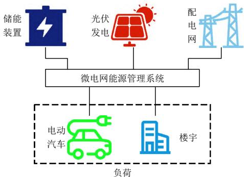  
图 2 微电网能源管理系统示意  
Fig. 2 Scematic diagram of the energy management system of the microgrid

综上而言，针对于微电网负荷预测，从整体角度进行预测的人工智能方法能够直接预测整个微电网的总用电负荷，从而有效支撑微电网的运行模式调整以及与外部电网的互动响应，往往适用于微电网内部缺少各个成分量测数据的应用场景。然而，按照不同构成成分进行预测的人工智能方法则能够分别挖掘不同组成成分的潜在模式并且获取其未来预测结果，因而有助于微电网内部的精细化能量管理与优化调度，并提升微电网内部各成分的透明性。

# 2.4 用户集群负荷预测

精准的用户集群负荷预测能够促进需求侧管理，辅助电网公司实现削峰填谷，并提高电网资产的利用率。在该场景下，常见的人工智能预测方法大致可分为自底向上预测和自顶向下预测。

自底向上的预测方法是指首先对用户集群中的各个单一负荷进行聚合，然后进行整体负荷的建模预测[40-44]。考虑到历史数据往往存在特征维度少、无效数据多、数据间特征关系不明确等问题，文献[40]提出 1 种基于双层 XGBoost 模型的用户集群超短期负荷预测方法。其中，通过第一层，即数

据处理层，建立多个弱学习器逐层训练，实现特征筛选，而通过第二层，即负荷预测层，则利用筛选出来的特征进行负荷预测。同样地，文献[41]利用广义神经网络较强的全局搜索和快速收敛能力对居民用户负荷进行整体预测，并通过互信息法实现特征筛选，使用主成分分析法实现特征降维。文献[43]提出 1 种融合集成学习和在线学习策略的居民集群负荷预测方法。该方法通过在线学习能够融合各训练模型的预测结果并确保模型的及时更新。

然而，自顶向下的预测方法是指首先对用户集群进行分组，然后分别预测每组用户的负荷，最后将每组用户的负荷预测结果进行融合。现有研究通常采用不同聚类策略对用户集群进行分组，而后再构建相应预测模型[45-50]。图 3 为自顶向下的用户集群负荷预测方法示意图。例如，文献[45]首先根据用电特征进行负荷分解，然后针对每个典型代表负荷模式分别进行预测，最后依据所有典型负荷模式的预测结果加权聚合获得建筑集群负荷预测结果。文献[46]使用 K 均值聚类算法对负荷曲线进行分组，并从人工神经网络、随机森林等七种回归模型中选择预测结果最优的模型作为居民建筑负荷预测模型。针对居民用户用电模式差异性，文献[47]分别采用了K均值聚类和模糊C均值聚类对用户负荷进行聚类，并探讨了不同聚类数量对预测结果的影响。此外，文献[48]通过层次聚类方法对用户负荷曲线进行分组，并将其和基于随机分组方法的预测结果进行对比分析。

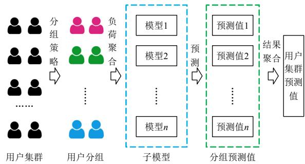  
图3 自顶向下的用户集群负荷预测方法示意  
Fig. 3 Top-down load forecasting method of the customer group

在用户集群负荷预测场景中，由于每个单一用户自身用电习惯不尽相同，用户群体内部常常存在多种不同用电模式，因此自底向上的整体预测方法难以精准地挖掘并建模不同负荷规律，使其预测精度的提升受到限制。相比而言，自顶向下的用户群体负荷预测方法通过聚类策略将具有相似用电行

为的用户进行聚合并分别建模预测，不仅能够使得聚合的负荷曲线更加稳定，从而优化预测效果，同时可以避免对每个单一用户进行建模预测而带来的精度低且效率低的问题。

# 2.5 单一用户负荷预测

开展单一用户负荷预测技术研究，是实现精益化需求侧管理、高效家庭能源管理、精准电力市场定价的重要前提条件。当前，基于人工智能的单一用户负荷预测方法大致可以分为确定性预测方法和概率预测方法。

确定性预测方法一般是指通过数据驱动模型，针对未来某一时刻或时间段，给出确定性的点预测值或者预测型线[51-60]。例如，文献[51]提出一种基于多变量线性回归与长短期记忆神经网络混合的短期单一用户负荷预测方法。首先，利用集成经验模态分解将负荷序列分解为不同频率的子序列。其次，分别使用多变量线性回归与长短期记忆神经网络对低频与高频子序列进行建模预测。最终，融合各个子序列的预测值获得单一用户负荷的未来预测值。同样地，文献[52]提出一种基于非侵入式负荷分解与图谱聚类相结合的单一居民负荷预测方法。而文献[54]提出一种融合多任务学习与贝叶斯时空高斯过程的短期家庭用电负荷预测方法，其能够有效学习不同居民社区之间的潜在相关性，从而提升预测精度。此外，为避免深度学习模型训练遭遇过拟合问题，文献[55-57]采用分群策略将居民用户聚类成若干群组，并通过深度学习算法对各个用户群组分别构建预测模型，进而预测每个单一用户的未来用电负荷，以实现单一居民用户负荷预测精度的提升。不同于单一居民负荷预测，文献[58]利用改进的深度卷积神经网络，基于历史负荷数据与温度数据，实现短期办公楼宇负荷预测。文献[59]通过灰色神经网络，有效融合卡尔曼滤波预测模型和最小二乘支持向量机预测模型，实现超短期工业用户负荷预测。类似地，文献[60]基于负荷、电流、时间信息等多源数据，应用长短期记忆神经网络，并结合多种集成学习算法，构建超短期工业用户负荷预测模型。

相比而言，概率预测方法通常是指基于数据驱动模型，以概率密度函数、概率分布、置信区间等概率表达形式，给出未来预测结果[61-65]。例如，文献[62]通过融合梯度提升方法与分位点回归，预测单一居民负荷的一组分位点，进而获得其未来用电

需求的概率分布。为充分刻画未来时刻负荷预测值的概率分布信息，文献[63]基于卷积神经网络、门控循环神经网络以及全连接神经网络，构建深度混合密度网络，并设计一种全新的损失函数，以直接预测居民负荷的概率密度函数。相似地，文献[65]提出一种基于用电场景的单一居民负荷概率预测方法。

在单一用户负荷预测技术研究方面，尽管国内外研究人员关于确定性预测建模方法已经开展大量工作，但是预测精度依然相对较低并且精度提升难度较大，主要原因在于用户用电模式受用电行为习惯、气象条件、市场电价与政策等多重复杂因素影响，其具有很强的不确定性和易变性。针对此问题，概率预测方法能够有效捕捉未来负荷的不确定性，反映确定性预测结果无法提供的更多信息。目前，面向单一用户负荷预测的概率建模方法研究仍然十分有限。

# 2.6 电动汽车充放电负荷预测

由于大规模电动汽车充、放电行为势必会对电网造成不可忽视的影响，因而为降低电动汽车接入未来新型电力系统引发的负面影响，开展电动汽车充放电负荷预测研究是分析车网双向互动、电网规划与运行等方面的重要基础。常见的电动汽车充放电负荷预测方法大致分为机理驱动的预测方法、基于人工智能的数据驱动预测方法、以及数据机理融合驱动的预测方法 3 种。其中，机理驱动的预测方法主要通过电动汽车的交通行为、充电动态物理过程、用户心理等方面建模，利用蒙特卡洛随机模拟、排队论、后悔理论等方法，进行电动汽车充放电负荷预测[66-69]。本文重点讨论基于人工智能的数据驱动预测方法与数据机理融合驱动的预测方法。

基于人工智能的数据驱动预测方法是指基于电动汽车的历史充电负荷数据，应用机器学习、深度学习等人工智能方法，预测电动汽车充电需求[70-75]。为减少分量数量并避免分量过多导致误差积累与计算烦琐，文献[71]首先通过经验模态分解和模糊熵将电动汽车充电负荷序列分解成不同频率的简单子序列，然后分别利用长短期记忆神经网络和支持向量机作为基学习器，构建各个子序列的预测模型，最后采用 Stacking 集成学习方法，并融合天气数据和分解前充电需求时间序列数据，获得最终预测结果。该方法能够在单步与多步的短期预

测中取得良好的预测效果。文献[72]提出 1 种基于多信道卷积神经网络和时域卷积网络的电动汽车充电负荷预测方法，以提升短期负荷预测精度。针对于电动汽车充电负荷时序随机性强、待预测日充电负荷受相关历史日充电行为影响大的特点，文献[74]首先应用斯皮尔曼秩相关系数挖掘待预测日的电动汽车充电负荷与其历史日的充电负荷之间的相关性，构建原始多相关日充电场景集，其次基于原始场景集利用β-变分自编码器生成海量多相关日充电场景，最后通过相关性分析在生成的多相关日充电场景集中筛选出待预测日的相关场景集，从而确定待预测日电动汽车充电负荷确定性预测结果和区间预测结果。

另外，数据机理融合驱动的预测方法是指通过有效结合机理驱动与数据驱动 2 种手段，进行电动汽车充放电负荷预测建模[76]。例如，文献[76]提出1 种基于车辆车网互动(vehicle-to-grid，V2G)行为辨识的电动汽车充放电容量预测方法。首先，通过分析车辆荷电状态特性、出行时间特性、以及用户对价格的敏感度构建相应输入特征，利用随机森林模型，识别车辆是否参与 V2G 调度。然后，基于车辆充放电行为参数，应用蒙特卡洛方法模拟车辆出行和充放电情况，进而预测电动汽车集群充电和放电容量。

综上所述，基于人工智能的数据驱动预测方法能够综合利用电动汽车历史充放电负荷、天气等相关多源数据，简化电动汽车充放电负荷预测模型，具有无需假设大量机理模型参数的优点。相比而言，数据机理融合驱动的预测方法则能够充分结合机理建模与数据建模的双重优势，有效预测电动汽车充放电负荷的时空分布，是未来潜在的重点研究方向。当前，关于数据机理融合驱动的电动汽车充放电负荷预测方法研究相对较少。

# 2.7 考虑需求响应的负荷预测

在电力市场逐步放开与用户侧灵活可控资源大量接入的背景下，精准构建计及需求响应的负荷预测模型能够有助于电网公司有效引导各类用户主动参与电力市场的运营与调控，充分挖掘并利用用户侧资源。目前，考虑需求响应的负荷预测方法主要分为引入价格信息的预测和考虑响应信号的预测。

引入价格信息的预测方法一般考虑电价与负荷之间的相关性，并直接将电价作为输入特征，构

建负荷预测模型[77-79]。为较少模型的数据输入量并提高输入的数据质量，文献[77]采用灰色关联分析法，根据气象信息选取相似日特征变量，并提取需求响应电价作为输入特征，构建基于长短期记忆神经网络和动态模式分解的组合预测模型，以分别预测负荷与误差序列，进而将二者线性叠加获得修正后的电力负荷预测值。由于电价对预测时刻负荷具有重要影响，文献[78]应用最大信息系数法分析电价与负荷之间的相关性，并进一步地构建基于注意力机制的长短期记忆神经网络，实现短期负荷预测。实验结果表明该方法具有较强的鲁棒性。相似地，文献[79]利用历史负荷序列、电价数据、预测日类型作为输入特征，建立基于长短期记忆神经网络的负荷预测模型，并使用自适应矩估计进行深度学习训练。

考虑响应信号的预测方法通常利用需求响应机理模型等手段，获取量化的响应信号，并将其作为输入特征，构建负荷预测模型[80-82]。文献[80]根据消费者心理学原理，分析用户模糊需求响应机理，并通过半梯形隶属度函数消除用户响应模糊属性，最终结合历史负荷序列、需求响应量化值、温度等综合影响因素，构建径向基函数神经网络短期负荷预测模型。该模型在传统和动态峰谷电价机制下均具有更加优良的预测性能。根据需求响应计划信号的可预知性与季节性基础负荷的独立性，文献[82]利用小波分解方法将主动配电网负荷分解为季节性基础负荷以及需求响应信号与各种气象因素共同作用的负荷 2 个部分，并分别利用时间序列模型和支持向量回归模型预测 2 个部分负荷，构成组合预测模型，叠加 2 个部分预测值获得主动配电网总负荷预测值。

总体而言，关于考虑需求响应的负荷预测场景，国内外学者开展的人工智能模型研究尚且较少。由于需求响应改变了电力用户的常规用电习惯，并且电价与激励政策的变化增加了用电负荷的复杂性，从而在很大程度上增加了预测建模的不确定性因素，提升了负荷预测的难度。因此，亟需进一步提高需求响应背景下负荷预测的精度，确保电网安全稳定运行与电力供需平衡。

# 2.8 净负荷预测

在大量新能源发电逐渐接入新型电力系统的背景下，提升净负荷预测精度，对保证电网安全可靠运行与优化调度具有十分重要的意义。目前，基

于人工智能技术的净负荷预测方法主要可以分为直接预测法和间接预测法。

直接预测法通常是指基于历史净负荷数据，构建数据驱动模型并挖掘净负荷模式，从而直接预测未来净负荷需求[83-87]。文献[83]基于历史净负荷数据和气象数据，采用改进的差分进化算法进行属性简约，将简约后的数据作为样本集，训练最小二乘支持向量机模型，实现母线净负荷预测。文献[84]基于居民用户历史净负荷序列，构建深度长短期记忆神经网络，分别预测单一居民用户净负荷与用户集群净负荷。此外，从原始净负荷数据处理角度，文献[86]提出 1 种融合完全集成经验模态分解和深度信念网络的用户侧短期净负荷预测方法。首先，采用自适应噪声的完全集成经验模态分解算法将原始净负荷序列分解为若干具有不同变化特征的子序列。然后，使用深度信念网络逐一对各个子序列进行建模与预测。最终，将多个子序列的预测结果累加获得用户侧净负荷预测结果。

间接预测法一般是指通过数据驱动模型分别挖掘实际用电负荷与新能源发电的潜在规律，预测二者的未来值并加以融合，进而获得净负荷预测值[88-89]。例如，针对高比例渗透的表后光伏发电情况，文献[88]提出 1 种数据驱动的净负荷概率预测方法。首先，通过最大信息系数与网格搜索估计表后光伏发电的容量。其次，基于光伏发电容量估计，将净负荷分解为光伏发电输出、实际负荷、冗余 3部分，并使用机器学习算法分别构建 3 部分的预测模型。最终，采用 Copula理论，分析并融合 3 者的预测结果，获得整体净负荷的概率预测结果。文献[89]使用图自编码器挖掘多个居民单元净负荷序列之间的时空关系，并基于挖掘的时空特征，利用图字典学习估计各个居民单元的历史表后光伏发电与实际负荷，进而采用深度门控循环神经网络分别预测二者的未来值，最后计算得到净负荷预测值。

针对净负荷预测技术研究，直接预测法主要基于历史净负荷数据，并融合气象、星期类型等外部数据，利用数据驱动模型，实现整体净负荷一次性精准预测，能够在一定程度上避免对新能源发电与实际负荷进行单独预测产生的误差累积，适用于缺乏新能源与负荷等成分量测数据的情况。相比而言，间接预测法能够深入挖掘新能源、负荷等各分量的潜在模式并加以预测，有效提升表后各测量分量的可见性，并且在各个分量潜在模式具有较强规律性的情况下，其预测精度往往表现较好。

# 2.9 综合能源系统负荷预测

综合能源系统作为新一代能源系统的重要组成部分，是以电力系统为核心，通过将其内部多种不同形式的能源、能量转换设备、以及储能装置在系统中统一化集成，从而实现各种能源系统之间的协调规划、优化运行、协同管理、交互响应与互补互济。所以，综合能源系统负荷预测是实现各种能源系统之间协调规划、优化运行、协同管理和能源相互转换的基本前提。目前，基于人工智能的综合能源系统负荷预测方法一般可以按照是否利用多任务学习建模进行分类。

多任务学习往往能够有效利用多个学习任务中所包含的有用信息，进而使得每个学习任务获得更好的学习效果。现有基于多任务学习的综合能源系统负荷预测方法通常以多任务学习为框架，通过共享层模拟多元负荷之间的耦合关系，以达到提高负荷预测精度的目的[90-94]。图 4 为基于多任务学习的综合能源系统负荷预测方法示意图。例如，考虑园区内热、电、气负荷之间的耦合性，文献[90]提出1种基于深度信念网络和多任务回归的综合能源系统负荷预测方法。其中，该方法利用底部的深度信念网络对抽象特征进行提取，而利用顶部的多任务回归层作为有监督学习模型对多元负荷进行预测。为克服传统单一负荷预测方法难以兼顾不同用能需求之间的差异性、随机性及耦合性的缺点，文献[91]首先将多个子任务的输入特征在融合层进行数据融合，然后送至由多个长短期记忆神经网络线性连接构成的共享层，进而实现综合能源系统负荷预测，最后应用神经网络可解释性技术证实所构建的模型能够充分利用耦合信息提高预测精度。相似地，文献[92]结合多任务学习和最小二乘支持向量

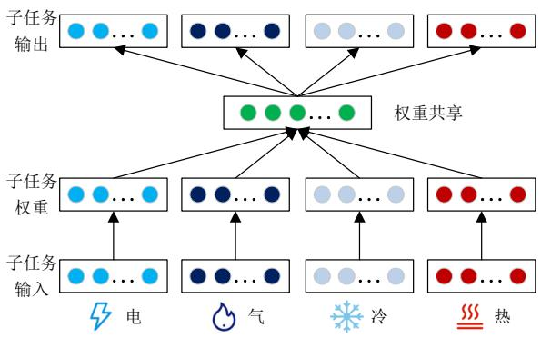  
图4 基于多任务学习的综合能源系统负荷预测方法  
Fig. 4 Multi-task learning based load forecasting method of the integrated energy system

机，构建园区综合能源系统负荷预测模型，并且与单任务学习模型相比，该模型能够有效提升预测精度。

除运用多任务学习框架之外，很多研究方法融合深度学习与相关性分析等手段实现综合能源系统负荷预测[95-98]。针对用户级综合能源系统规模小、负荷波动大、能量耦合复杂的特点，文献[95]通过利用深度神经网络将多类负荷的特征在高维空间上进行融合来学习不同负荷之间的复杂关联关系。首先，结合 $K$ 均值聚类与皮尔逊相关系数，对各类基本负荷单元进行重构，使其具有较强的时空相关性，然后，利用多通道卷积神经网络在高维空间进行特征提取和融合，最后，融入气象信息与节假日信息，通过长短期记忆神经网络，实现用户级综合能源系统超短期负荷预测。另外，综合能源系统多元负荷预测建模涉及的影响因素复杂繁多，往往需要进行特征筛选以进一步提高预测精度。文献[96]利用皮尔逊相关系数对各类负荷的影响因素进行特征筛选，并选择合适的特征作为输入量，然后采用卷积神经网络和支持向量回归分别构建各类负荷的预测模型。然而，文献[97]则通过基于互信息和误差最小的方法确定园区综合能源系统多元负荷需求的影响因素，接着利用改进的灰色关联分析法计算待预测日与样本集的综合相似度，选取其对应的相似日，最终采用深度信念网络分别预测园区未来冷热电负荷需求。

总体来讲，基于人工智能的综合能源系统负荷预测技术研究仍处于初步探索阶段。由于多种能源之间存在较强的物理性差异和耦合特性，因而使得综合能源系统多元负荷具有更加显著的易变性和不确定性。在该场景下，基于多任务学习机制的数据驱动预测模型的预测效果往往更为突出，其不仅能够有效学习不同能源之间的复杂关联关系，同时能够对多元负荷进行联合预测。此外，相比独立的预测模型，即运用单独的预测模型分别预测各类负荷，基于多任务学习的预测模型能够有效缩短训练和预测时间。

# 3 人工智能方法目前存在的问题与不足

当前，虽然基于人工智能技术的新型电力系统负荷预测研究已经取得诸多进展与成果，但在数据与模型 2 个方面仍然存在一定程度的问题与不足。

# 3.1 数据方面

# 3.1.1 小样本问题

数据质量是电力系统负荷预测建模的重要基础与预测性能的关键保证。在新型电力系统发展的背景下，向量测量单元(phase measurement unit，PMU) 、 数 据 采 集 与 监 视 控 制 系 统 (supervisorycontrol and data acquisition，SCADA)、智能电表(smart meter，SM)等测量装置，将会更加广泛地部署在智能电网的各个环节并不断完善。然而，由于量测装置数据采集问题以及通信装置的数据传输问题，往往导致电网数据出现噪音过高与样本缺失等异常情况，使得获取的大量电网数据难以用于模型构建，从而不可避免地给数据驱动的负荷预测模型训练带来了小样本问题。另外，在负荷预测建模中，作为重要的输入特征之一，气象信息常常面临着数据缺失与不足的情况，进而也加剧了建模过程中的小样本问题。因此，确保能够通过技术方法获取全面、可靠、及时的电网、气象等高质量多源数据是新型电力系统负荷预测研究领域的一大挑战。

# 3.1.2 影响因素考虑不足问题

影响因素的精准辨识是电力系统负荷预测的基本前提。具体地，电力系统负荷模式受多种因素影响，例如，气象条件、天气类型、地理位置、节假日类型、时刻信息、电价、政策、用户用电习惯以及突发事件或社会重大事件等。其中，气象条件包含温度、湿度、气压、降雨量、风速以及光照强度等。但是，目前大多数基于人工智能的负荷预测方法主要考虑利用历史负荷序列、气象条件、天气类型等 3 种相应数据进行建模，从而在一定程度上限制了预测精度的提升。所以，精准、全面、有效的影响因素辨识是确保人工智能负荷预测方法准确性和可靠性的一大挑战。

# 3.2 模型方面

# 3.2.1 适用场景单一问题

由于预测数据的选择不尽相同，许多负荷预测模型对于数据存在依赖性，因此一般仅针对特定情况下特定数据特征的预测问题表现出比较良好的预测性能。然而，在实际应用中，基于人工智能的负荷预测模型通常采用“离线训练，在线应用”的方式进行预测，但电力系统负荷模式往往处于动态变化的环境中，各种数据的潜在分布也会随着时间发生动态变化，从而导致训练良好的预测模型在线应用时出现预测精度偏低的现象。因此，基于人工

智能的负荷预测模型容易产生适用场景单一、泛化能力不强的问题。

# 3.2.2 时空相关性问题

目前，负荷预测研究一般仅专注于挖掘历史负荷序列的时间相关性，即不同时刻之间的时序关系，进而构建预测模型。然而，在一些情况下，由于同一区域内各个负荷节点(如变电站、园区、用户等)受到相同气象条件、电价等外部因素的影响，因而其负荷模式之间在一定程度上具有潜在的空间相关性。此时，在缺少相应影响因素数据的条件下，尽可能地从历史负荷序列中挖掘并利用更多隐藏的空间相关性信息，能够有助于进一步提升模型预测的准确度。因此，现有诸多负荷预测研究工作尚未能够针对时间与空间的相关性信息加以充分兼顾。

# 3.2.3 模型自动调优问题

人工智能负荷预测技术通常基于海量样本数据，利用机器学习、深度学习等人工智能方法进行模型训练。但是，由于模型超参数(如各类神经网络的层数、神经元个数、学习速率、训练周期等)与输入特征对于人工智能模型的性能具有重要影响，尤其是深度学习模型，因而模型超参数优化与特征筛选对于进一步提升负荷预测模型的精度起着关键作用。当前，基于人工智能的负荷预测研究基本上通过专家经验或者大量的重复实验(如网格搜索、随机搜索等)进行超参数调优，其效率较低且难以保证模型参数最优化，同时缺乏完善的理论指导，从而在一定程度上限制了模型的预测性能。

# 4 新型电力系统背景下未来负荷预测研究展望

# 4.1 技术方向

针对现阶段基于人工智能的新型电力系统负荷预测技术研究存在的诸多关键问题，亟需提出有效可行的新方法与新思路予以解决，以满足新型电力系统建设的需要。下文将分别从 6 个重点方向进行未来技术研究展望。

# 4.1.1 面向数据匮乏场景的负荷预测技术

针对负荷预测面临的数据质量问题，现有研究关于缺失值和异常值的处理方法主要有 3 种：1）直接删除法，该种方法往往会忽略数据中的重要信息，并且缺失率越高，对于后续数据分析的影响越大；2）简单插补法，通常指均值插补、中位数插

补以及其他数学插补方法[28]，该种方法仅关注数值之间的联系，以统计学方法实现插补；3）基于传统机器学习的插补方法[99-100]，一般包含基于最大似然期望最大化的插值、基于 $K$ 近邻的插值和基于矩阵分解的插值等，然而，该种方法主要关注数据本身的统计学特征，却忽视时间序列数据中的时序特征，因而插补精度较低。

生成对抗学习作为样本增强的重要手段之一，已经在电力系统量测数据的修复与重构方面有所应用，如 PMU 数据、SCADA 数据等[101-102]。具体来说，生成对抗学习利用生成器学习数据样本的分布规律而生成新的样本数据，利用判别器判断输入数据的真伪，并通过二者的博弈训练，最终使得生成器学习到数据样本的潜在规律。所以，未来负荷预测技术研究可以考虑采用生成对抗学习达到负荷预测样本增强与重构的目标。

此外，迁移学习是将 1个预训练的模型重新用在另一个任务中的机器学习方法，其能够有效避免训练样本不足的问题，进而提升模型泛化能力。因此，通过迁移学习方法将从源域中学习得到的负荷特征应用于目标域的负荷模式挖掘，是克服负荷预测数据匮乏问题的又一有效途径[103]。

作为 1 种特殊的分布式机器学习框架，联邦学习可以有效帮助多个参与方在满足隐私保护与数据安全的前提下，进行数据共享和机器学习建模，其在电力人工智能领域已经取得一定研究成果[104-105]。在负荷预测方面，基于多个不同参与方(如网省公司、用户等)的样本数据，通过安全加密方法与模型融合机制，应用联邦学习技术进行模型训练，不仅能够保护各个参与方的数据隐私，而且能够丰富各方的样本空间。图 5 为基于联邦学习的负荷预测方法示意图。

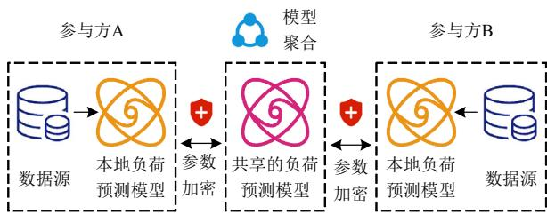  
图 5 基于联邦学习的负荷预测方法  
Fig. 5 Federated learning based load forecasting method

综上所述，为有效解决小样本问题，基于生成对抗学习、迁移学习与联邦学习等方法的负荷预测

技术是未来值得关注的技术研究方向。

# 4.1.2 基于多源数据融合的概率负荷预测技术

系统全面考虑各种负荷预测影响因素能够有效提高预测模型的准确性，而应用概率预测手段能够充分捕捉负荷变化的不确定性。

一方面，作为负荷预测模型的输入特征，不同影响因素大致可以归纳为数值型(如历史负荷、气象条件、电价等)和非数值型(如星期类型、时刻信息、天气类型等)2种类别，并且其影响程度不尽相同[40]。因此，有必要采用相关性分析、因果知识挖掘等方法研究并量化不同场景下各种复杂因素对于负荷模式的影响程度，同时过滤掉冗余特征并筛选出有效特征。

另一方面，相比于确定性预测，概率预测能够更加详尽地描绘预测对象的不确定性，其可以分为给定置信度的区间预测和完整的概率分布预测。由于供给侧新能源发电比重不断提高，需求侧灵活性负荷以及用户主动响应逐渐增加，多重不确定性将会成为新型电力系统背景下负荷的常态化特征，因而利用概率负荷预测技术可以实现对未来负荷不确定性的有效量化[106-107]。其中，获取概率预测结果的策略主要包括：1）生成多重输入场景；2）应用概率预测模型；3）增强点预测结果。图 6 为基于多源数据融合的概率负荷预测方法示意图。

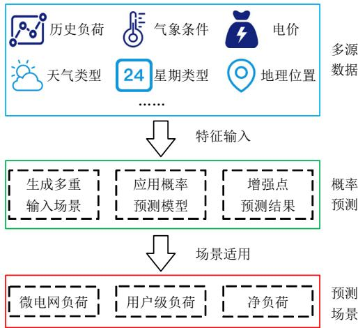  
图 6 基于多源数据融合的概率负荷预测方法  
Fig. 6 Probabilistic load forecasting method based on the fusion of multi-source data

所以，应当进一步研究基于多源异构数据融合的概率负荷预测技术，以应对不同场景下(尤其是微电网负荷预测、用户级负荷预测以及净负荷预测)电力负荷不确定性高、易变性强、影响因素考虑不充分的挑战。

# 4.1.3 基于集成学习的自适应负荷预测技术

集成学习是1种建立在统计学习理论基础之上的多算法融合的机器学习方法，其能够整合多种基本学习方法的差异性学习能力，得到泛化能力更强的模型，往往具有比单一机器学习模型更优的预测性能[108-109]。其中，典型的集成学习策略包括Bagging、Boosting、Stacking 等。合理恰当选择单一负荷预测模型算法和组合方式，利用集成学习整合多种单一模型，能够有效规避单一方法的缺陷与不足，充分发挥多种方法的各自优势，实现多场景灵活适用，提升预测性能[110]。

进一步地，由于基于人工智能的负荷预测技术往往基于已有的历史数据进行模型训练并在实际应用中将新数据输入模型以预测未来负荷，导致难以保证新数据与历史数据满足独立且同分布的前提假设，因而可以通过自适应策略自动调整预测模型以避免这一问题。具体而言，考虑采用在线学习方法，既保留模型先前学习得到的有效信息，同时又用新数据对模型进行更新。在实际应用中，当新数据积累到一定数量时或者当预测精度持续低于某一阈值时，对当前预测模型进行调整或重新训练，以达到确保模型及时适应当前负荷模式的目的。图 7 为基于集成学习的自适应负荷预测方法示意图。

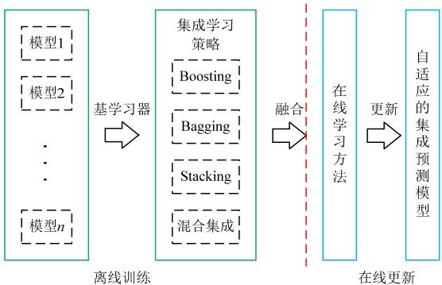  
图 7 基于集成学习的自适应负荷预测方法  
Fig. 7 Ensemble learning   
based adaptive load forecasting method

因此，在未来研究中，有必要开展融合集成学习与自适应策略的负荷预测技术研究，解决模型适用场景单一的问题，提升预测模型的鲁棒性和泛化能力。

# 4.1.4 基于图神经网络的负荷预测技术

近年来，图神经网络作为 1 种正在兴起的人工智能方法，其能够对图数据进行有效的学习，受到广泛的关注与研究[111]。具体地，它利用图的边与顶

点连接的结构信息以及附属于图结构的属性信息，对于隐含的图信息进行挖掘与抽取[112]。由于同一区域内不同负荷节点共享相同的外部影响因素(如气象条件、地理位置等)等而存在一定程度的潜在空间相关性，根据图数据的特点与图神经网络的优势，可以考虑将负荷序列等时序数据作为图的顶点信息以表示时间相关性，将负荷节点之间的关联关系作为图的边信息以反映空间相关性，从而构建面向负荷预测的图数据结构，最终通过图神经网络实现负荷预测建模[57,113]。图 8 为基于图神经网络的负荷预测方法示意图。因此，合理分析区域内各个负荷节点之间的时空相关性并构建相应图数据，建立基于图神经网络的负荷预测模型，能够充分挖掘负荷的时空相关性信息，并有效提升预测性能。

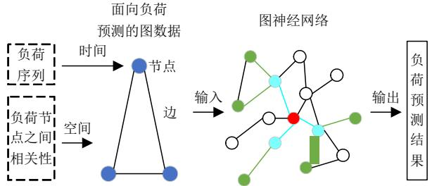  
图 8 基于图神经网络的负荷预测方法  
Fig. 8 Graph neural network based load forecasting method

# 4.1.5 基于自动机器学习的负荷预测技术

自动机器学习技术能够使机器学习建模过程自动化，减少、甚至完全规避专家在整个过程中的参与度，并实现机器学习模型构建和应用。图 9 为自动机器学习框架图。自动机器学习一般主要包含数据准备、特征工程、模型生成、模型评估等 4 个环节。在实际应用中，通过自动机器学习技术，科学合理地筛选负荷预测模型的相关输入特征并设置模型超参数，实现模型调优自动化，提高预测技

术的准确性与实用性。近年来，已有专家学者利用粒子群优化、遗传算法、模拟退火算法、蚁群优化等经验启发式算法对负荷预测模型进行超参数优化并取得了良好的预测效果[13]。然而，经验启发式算法的反复迭代优化使得模型训练次数骤增，因而造成了巨大的计算负担。贝叶斯优化作为 1 种新兴的超参数优化方法正逐渐被广泛应用，其能够基于先验信息高效推理后验信息，大幅提升超参数寻优的收敛速度。值得注意的是，考虑到超参数自动调优需要反复多次的模型训练而涉及巨大的运算量，利用 Hadoop、Spark 等分布式计算技术以及多线程并行计算技术，可以达到降低训练时间成本的目的。4.1.6 考虑模型可解释性的负荷预测技术

可解释性一般是指以可理解的术语向人类解释或呈现的能力，其本质是人类可以理解决策原因的程度。针对可解释对象的不同，机器学习可解释性技术大致可以按照模型的解释、预测结果的解释以及模仿者模型的解释 3 个方面进行分类[114]。目前，机器学习可解释性技术在计算机视觉、医疗等少数研究领域已经取得一定程度的进展，尤其深度学习的可解释性技术研究[115]。然而，在电力研究领域，机器学习可解释性技术的研究与应用仍然处于初步探索阶段。对于负荷预测场景，可以考虑通过敏感度分析计算相关性分数，量化评估输入特征对于预测输出结果的影响程度，准确挖掘高度影响预测输出结果的相关输入特征，以提升负荷预测模型结果的可解释性。同时，可以利用注意力机制，反映输入特征与预测输出结果之间的对齐关系或依赖关系，解释说明预测模型学习获得的关键重要信息，从而增强负荷预测模型内部的可解释性。图10为考虑模型可解释性的负荷预测方法示意图。

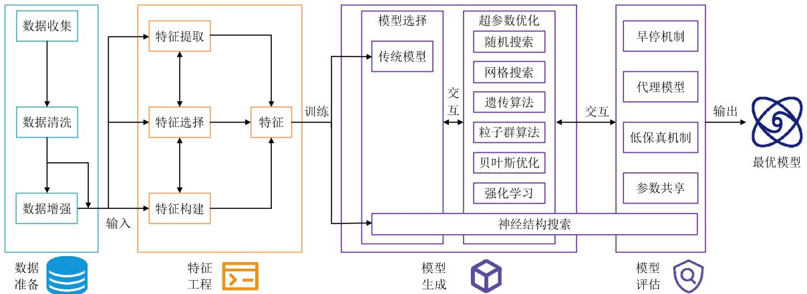  
图 9 自动机器学习框架  
Fig. 9 Framework of automatic machine learning

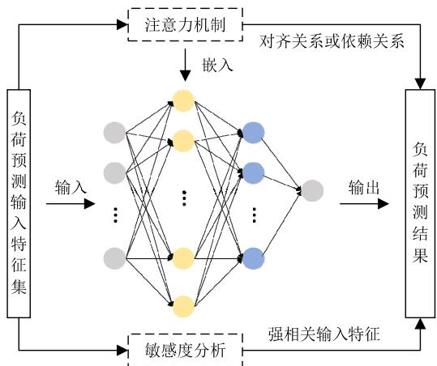  
图10 考虑模型可解释性的负荷预测方法  
Fig. 10 Load forecasting method considering model interpretability

因此，深入开展考虑模型可解释性的负荷预测技术研究，能够大幅提升负荷预测模型在实际应用中的可信性、可靠性以及安全性。

# 4.2 研究场景

在新型电力系统构建与发展的背景下，越来越多的产销者、聚合商、电动汽车、新能源、综合能源等新角色与新因素将不断被引入，进而不可避免地给新型电力系统负荷预测带来了新特征与新挑战。因此，进一步探索与研究新兴的负荷预测场景对于新型电力系统的规划、运行、控制与调度具有重大的实践意义，以下从 4 个方面概括未来负荷预测研究场景展望。

# 4.2.1 电动汽车充放电负荷预测

未来大规模电动汽车接入新型电力系统，一方面，其作为充电负荷影响着电网的稳定运行，另一方面，其作为分散的储能装置能够辅助电网平抑负荷波动。所以，建立准确的电动汽车充放电负荷预测模型以刻画充放电需求时空分布特征是分析电动汽车对电网影响的重要基础，也是开展车网互动的必要前提。然而，电动汽车兼具负荷与储能装置的双重属性，且它的可移动性使其充电负荷具有时间与空间的随机性和不确定性，同时，充电行为受道路结构、交通路况、充电设施分布、行驶路径、出行目的地、起始荷电状态、用户心理等多种综合因素影响，从而给电动汽车充电负荷预测带来了巨大挑战。另外，从方法建模角度，模型驱动的电动汽车充电负荷预测方法需要假定大量模型参数以表达复杂的充电行为，而数据驱动的预测方法需要大量多源异构数据支撑训练学习，二者均具有各自的局限性。因此，在未来研究中，基于路网、交通、

天气、电网、充放电信息等多源数据，考虑用户决策的非理性和随机性，结合行驶路径优化模型和后悔理论，以挖掘电动汽车充放电负荷空间分布规律，同时构建基于深度学习算法的时间序列预测模型以挖掘电动汽车充放电负荷时间分布规律，从而融合模型驱动与数据驱动建模的各自优势，分析电动汽车充放电的时空分布特性，精准构建电动汽车充放电负荷预测模型。图 11 为模型与数据驱动的电动汽车充放电负荷预测方法示意图。

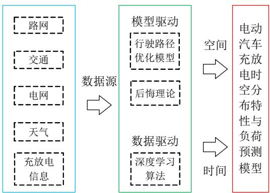  
图11 模型与数据驱动的电动汽车充放电负荷预测方法  
Fig. 11 Model and data driven load forecasting method for charging and discharging of electric vehicles

# 4.2.2 考虑需求响应的负荷预测

大量分布式光伏、储能装置等广义需求响应资源在用户侧广泛出现，其灵活多样的响应方式使负荷转移能力更强、可转移时间范围更广。同时，售电市场的逐步改革与开放，为用户侧各种广义需求响应资源主动参与电力市场的运营和调控提供了条件与环境。然而，不同用户需求响应行为却具有较强的差异性，且多种需求响应资源相互耦合，因而大幅提升了负荷预测的难度。目前，大量需求响应的研究工作主要集中于需求响应的机理分析或者模型构建，而对于计及需求响应的负荷预测场景研究甚少。所以，未来研究工作可以考虑使用优化解析模型分析用户侧不同需求响应灵活资源的特性与变化规律，评估相应资源的需求响应潜力，获取其量化的需求响应信号，同时，结合电价、天气、时间等多维特征，计及各种灵活资源参与需求响应的不确定性，利用数据驱动的人工智能模型，建立需求响应条件下数据机理融合的负荷预测方法，从而有效辅助新型电力系统安全经济运行、供需平衡以及削峰填谷。图 12 为考虑需求响应的数据与机理融合驱动的负荷预测方法示意图。

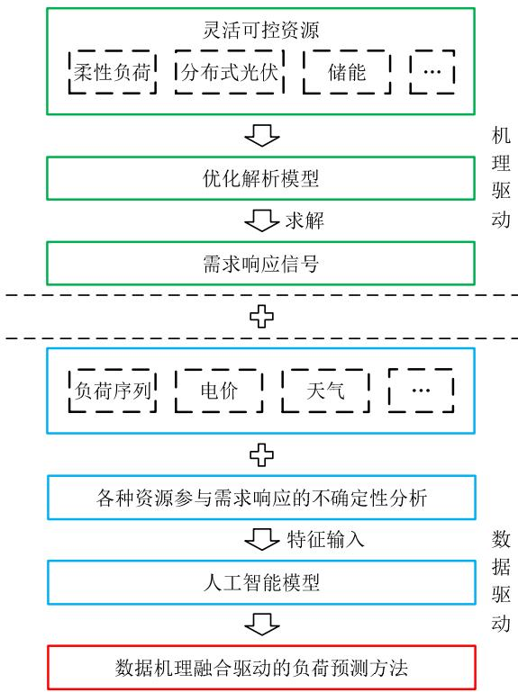  
图12 考虑需求响应的数据与机理融合驱动的负荷预测方法  
Fig. 12 Data and mechanism driven load forecasting method considering demand responses

# 4.2.3 净负荷预测

大规模风电、光伏等新能源接入各级电网使得电能流向会由传统的单向流动转变为双向流动。与此同时，市场参与者的种类随之变得丰富多样，例如产销者、负荷聚合商、虚拟电厂等。然而，针对新型电力系统净负荷预测场景，目前国内外鲜有研究人员开展相关深入研究，并且，净负荷预测在此背景下也面临着巨大的挑战与难点。图 13 为净负荷示意图。具体地，一方面，新能源与负荷的双重不确定性相互作用，使得净负荷的不确定性特征愈发突出，尤其是用户级净负荷。另一方面，当前的端口表记只能测量综合的净负荷需求，而难以直接获取实际负荷与新能源发电的各分量数据信息，造

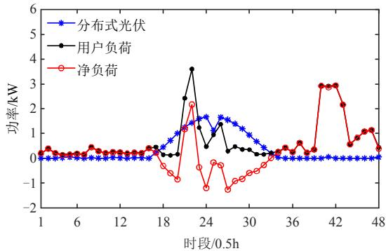  
图 13 净负荷  
Fig. 13 Net load

成净负荷预测建模缺乏充足的数据基础。综上所述，在未来研究中，可以考虑利用非侵入式负荷监测技术(如隐马尔可夫模型、迁移学习等)分解得到准确的新能源发电分量与实际负荷分量，以深入探索净负荷特性分析，并且，鉴于新能源发电与实际负荷往往存在一定程度的相互影响与作用，建立面向净负荷预测的图数据(例如，新能源发电与实际负荷的历史序列可以分别作为图数据的节点特征，而二者历史序列之间的相关性可以作为图数据的节点关系)，进而采用图机器学习方法挖掘 2 个分量之间的内在关联关系以及二者的潜在模式，构建数据驱动的净负荷预测模型，以支撑新型电力系统的场景生成、优化运行以及可靠性分析。图 14 为基于非侵入式负荷监测技术与图神经网络的净负荷预测方法示意图。

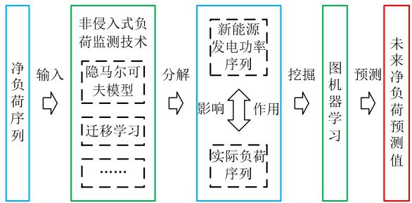  
图14 基于非侵入式负荷监测技术与图神经网络的净负荷预测方法示意图  
Fig. 14 Scematic diagram of the net load forecasting method based on non-intrusive load monitoring and graph neural networks

# 4.2.4 综合能源系统负荷预测

开展综合能源系统负荷预测技术研究，对于新型电力系统的优化调度、经济运行以及高比例新能源消纳具有十分重要的意义。根据地理因素、能源特性和能源转换难易程度，综合能源系统可以划分为广域级、区域级和用户级 3 个层级。图 15 为用户级综合能源系统示意图。以新能源为主体的新型电力系统必然会大幅提升综合能源系统的随机性和不确定性，因而构建实时、准确、可靠的电、气、冷、热等多元负荷预测模型面临着巨大的困难。除此之外，不同能源系统之间的耦合性增强以及能源消费日益市场化均对综合能源系统负荷预测提出了更高的要求。然而，传统的单一负荷预测方法仅独立预测某种负荷，其难以充分兼顾各种能源需求之间的特性区别与耦合关系，无法确保多元负荷的预测精度。由于综合能源系统中存在多种能源形式且不同能源之间具有一定程度的耦合性，因此，可

以通过因果知识挖掘与相关性分析方法，深入分析电、气、冷、热等多元负荷的相关影响因素及其影响程度，构建能够系统全面表征多元负荷内在模式的特征集合，并基于图机器学习技术，充分挖掘多种能源负荷之间的差异性与耦合性，从而实现综合能源系统多元负荷联合预测。此外，可以利用模型可解释性技术进一步探索图神经网络模型的可解释性含义，揭示基于图神经网络的综合能源系统负荷预测模型的内在机理与多元负荷之间的潜在关联关系。图 16 为融合图神经网络与模型可解释性技术的综合能源系统负荷预测方法示意图。

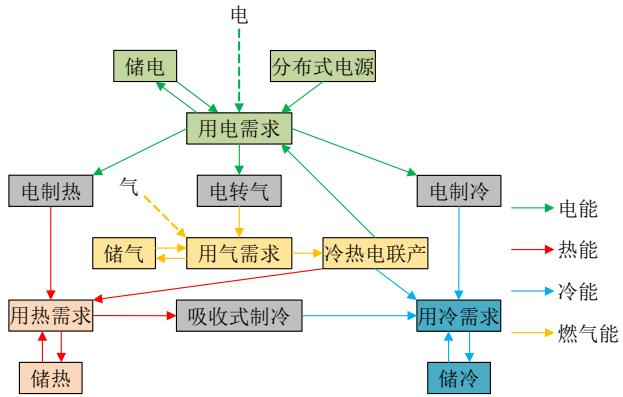  
图 15 用户级综合能源系统示意图

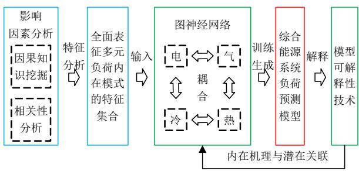  
Fig. 15 Scematic diagram of integrated energy systems at the customer level   
图16 融合图神经网络与模型可解释性技术的综合能源系统负荷预测方法示意图  
Fig. 16 Scematic diagram of the integrated energy system load forecasting method combining graph neural networks and model interpretability techniques

# 5 结语

作为电力系统规划、调度与运行优化等方面的重要基础，负荷预测是支撑新型电力系统安全、可靠、经济运行的关键技术。本文从多个方面系统地综述了基于人工智能技术的新型电力系统负荷预测研究，以期为能源绿色低碳转型目标下的新型电力系统发展研究提供参考。总体来讲，本文在简要阐述传统方法、人工智能方法理论、性能评价指标、新型电力系统负荷预测的新特征与新挑战等 4 个方

面的负荷预测相关概念的基础上，针对新型电力系统负荷预测存在的新特征与面临的新挑战，从9 个典型负荷预测场景对基于人工智能的新型电力系统负荷预测方法研究现状全面地进行了详细论述。继而，考虑到目前人工智能负荷预测技术仍然存在小样本、影响因素考虑不足、适用场景单一、时空相关性、模型自动调优等数据和模型 2 个方面的问题与不足，本文进一步地提出基于小样本学习、多源数据融合、集成学习、图神经网络、自动机器学习、机器学习可解释性等方法的若干潜在人工智能负荷预测技术研究方向，并展望分析了未来新型电力系统背景下具有重要研究意义的负荷预测场景。

# 参考文献

[1] 李响，牛赛．双碳目标下源–网–荷多层评价体系研究[J]．中国电机工程学报，2021，41(S1)：178-184  
LI Xiang，NIU Sai．Study on multi-layer evaluation system of source-grid-load under carbon-neutral goal [J]   
Proceedings of the CSEE，2021，41(S1)：178-184(inChinese)  
[2] 陈胜，卫志农，顾伟，等．碳中和目标下的能源系统转型与变革：多能流协同技术[J]．电力自动化设备，2021，41(9)：3-12  
CHEN Sheng，WEI Zhinong，GU Wei，et al．Carbon neutral oriented transition and revolution of energy systems：Multi-energy flow coordination technology [J]   
Electric Power Automation Equipment，2021，41(9)：3-12(in Chinese)  
[3] 邱伟强，王茂春，林振智，等．“双碳”目标下面向新能源消纳场景的共享储能综合评价[J]．电力自动化设备，2021，41(10)：244-255  
QIU Weiqiang，WANG Maochun，LIN Zhenzhi，et al Comprehensive evaluation of shared energy storage towards new energy accommodation scenario under targets of carbon emission peak and carbon neutrality [J] Electric Power Automation Equipment，2021，41(10)： 244-255(in Chinese)   
[4] 彭大健，裴玮，肖浩，等．数据驱动的用户需求响应行为建模与应用[J]．电网技术，2021，45(7)：2577-2585  
PENG Dajian，PEI Wei，XIAO Hao，et al．Data-driven consumer demand response behavior modelization and application[J]．Power System Technology，2021，45(7)： 2577-2585(in Chinese)   
[5] 蒲天骄，乔骥，韩笑，等．人工智能技术在电力设备运维检修中的研究及应用[J]．高电压技术，2020，46(2)：369-383

PU Tianjiao，QIAO Ji，HAN Xiao，et al．Research and application of artificial intelligence in operation and maintenance for power equipment[J] ． High Voltage Engineering，2020，46(2)：369-383(in Chinese)   
[6] 朱继忠，董瀚江，李盛林，等．数据驱动的综合能源系统负荷预测综述[J]．中国电机工程学报，2021，41(23)：7905-7923  
ZHU Jizhong，DONG Hanjiang，LI Shenglin，et al Review of data-driven load forecasting for integrated energy system[J]．Proceedings of the CSEE，2021， 41(23)：7905-7923(in Chinese)   
[7] 康重庆，夏清，张伯明．电力系统负荷预测研究综述与发展方向的探讨[J]．电力系统自动化，2004，28(17)：1-11．  
KANG Chongqing，XIA Qing，ZHANG Boming．Review of power system load forecasting and its development [J] Automation of Electric Power Systems，2004，28(17)： 1-11(in Chinese)   
[8] 康重庆，夏清，刘梅．电力系统负荷预测[M]．2 版北京：中国电力出版社，2017  
KANG Chongqing，XIA Qing，LIU Mei．Power system load forecasting[M]．2nd ed．Beijing：China Electric Power Press，2017(in Chinese)   
[9] AL MAMUN A，SOHEL M，MOHAMMAD N，et al A comprehensive review of the load forecasting techniques using single and hybrid predictive models[J] IEEE Access，2020，8：134911-134939   
[10] HONG Tao，PINSON P，WANG Yi，et al．Energy forecasting：A review and outlook[J]．IEEE Open Access Journal of Power and Energy，2020，7：376-388   
[11] WANG Yi，CHEN Qixin，HONG Tao，et al．Review ofsmart meter data analytics：Applications，methodologies，and challenges[J]．IEEE Transactions on Smart Grid，2019，10(3)：3125-3148  
[12] 姚李孝，刘学琴，伍利，等．基于广义回归神经网络的电力系统中长期负荷预测[J]．电力自动化设备，2007，27(8)：26-29  
YAO Lixiao，LIU Xueqin，WU Li，et al．Mid-& long-termload forecast based on GRNN[J] ． Electric PowerAutomation Equipment，2007，27(8)：26-29(in Chinese)  
[13] 吴潇雨，和敬涵，张沛，等．基于灰色投影改进随机森林算法的电力系统短期负荷预测[J]．电力系统自动化，2015，39(12)：50-55  
WU Xiaoyu，HE Jinghan，ZHANG Pei，et al．Power system short-term load forecasting based on improved random forest with grey relation projection [J] Automation of Electric Power Systems，2015，39(12)：

50-55(in Chinese)   
[14] 李瑾，刘金朋，王建军．采用支持向量机和模拟退火算法的中长期负荷预测方法[J]．中国电机工程学报，2011，31(16)：63-66  
LI Jin，LIU Jinpeng，WANG Jianjun．Mid-long term load forecasting based on simulated annealing and SVM algorithm[J]．Proceedings of the CSEE，2011，31(16)： 63-66(in Chinese)   
[15] ZHOU Mo，JIN Min．Holographic ensemble forecastingmethod for short-term power load[J]．IEEE Transactionson Smart Grid，2019，10(1)：425-434  
[16] 史佳琪，马丽雅，李晨晨，等．基于串行–并行集成学习的高峰负荷预测方法[J]．中国电机工程学报，2020，40(14)：4463-4472  
SHI Jiaqi，MA Liya，LI Chenchen，et al．Daily peak load forecasting based on sequential-parallel ensemble learning [J]．Proceedings of the CSEE，2020，40(14)：4463-4472(in Chinese)   
[17] ZHANG Wenjie，QUAN Hao，SRINIVASAN D．An improved quantile regression neural network for probabilistic load forecasting[J]．IEEE Transactions on Smart Grid，2019，10(4)：4425-4434   
[18] 孔祥玉，郑锋，鄂志君，等．基于深度信念网络的短期负荷预测方法[J]．电力系统自动化，2018，42(5)：133-139  
KONG Xiangyu，ZHENG Feng，E Zhijun，et al Short-term load forecasting based on deep belief network[J]．Automation of Electric Power Systems，2018， 42(5)：133-139(in Chinese)   
[19] LAI C S，YANG Yuxiang，PAN Keda，et al．Multi-view neural network ensemble for short and mid-term load forecasting[J]．IEEE Transactions on Power Systems， 2021，36(4)：2992-3003．   
[20] 罗澍忻，麻敏华，蒋林，等．考虑多时间尺度数据的中长期负荷预测方法[J]．中国电机工程学报，2020，40(S1)：11-19  
LUO Shuxin，MA Minhua，JIANG Lin，et al．Mediumand long-term load forecasting method consideringmulti-time scale data[J]．Proceedings of the CSEE，2020，40(S1)：11-19(in Chinese)  
[21] RAFI S H，NAHID-AL-MASOOD，DEEBA S R，et al A short-term load forecasting method using integrated CNN and LSTM network[J]．IEEE Access，2021，9： 32436-32448   
[22] 李滨，陆明珍．考虑实时气象耦合作用的地区电网短期负荷预测建模[J]．电力系统自动化，2020，44(17)：60-68LI Bin ， LU Mingzhen ． Short-term load forecasting

modeling of regional power grid considering real-time meteorological coupling effect[J]．Automation of Electric Power Systems，2020，44(17)：60-68(in Chinese)   
[23] DONG Ming，GRUMBACH L．A hybrid distribution feeder long-term load forecasting method based on sequence prediction[J]．IEEE Transactions on Smart Grid， 2020，11(1)：470-482   
[24] 肖白，黄钰茹，姜卓，等．数据匮乏场景下采用生成对抗网络的空间负荷预测方法[J]．中国电机工程学报，2020，40(24)：7990-8001  
XIAO Bai，HUANG Yuru，JIANG Zhuo，et al．The method of spatial load forecasting based on the generative adversarial network for data scarcity scenarios [J] Proceedings of the CSEE，2020，40(24)：7990-8001(in Chinese)   
[25] LI Yun，JONES B．The use of extreme value theory forforecasting long-term substation maximum electricitydemand[J]．IEEE Transactions on Power Systems，2020，35(1)：128-139．  
[26] SUN Xiaorong，LUH P B，CHEUNG K W，et al．An efficient approach to short-term load forecasting at the distribution level[J] ． IEEE Transactions on Power Systems，2016，31(4)：2526-2537   
[27] CAO Zhaojing，WAN Can，ZHANG Zijun，et al．Hybrid ensemble deep learning for deterministic and probabilistic low-voltage load forecasting[J]．IEEE Transactions on Power Systems，2020，35(3)：1881-1897．   
[28] 杨智宇，刘俊勇，刘友波，等．基于自适应深度信念网络的变电站负荷预测[J]．中国电机工程学报，2019，39(14)：4049-4060  
YANG Zhiyu ， LIU Junyong ， LIU Youbo ， et alTransformer load forecasting based on adaptive deepbelief network[J]．Proceedings of the CSEE，2019，39(14)：4049-4060(in Chinese)  
[29] 范士雄，刘幸蔚，於益军，等．基于多源数据和模型融合的超短期母线负荷预测方法[J]．电网技术，2021，45(1)：243-250  
FAN Shixiong，LIU Xingwei，YU Yijun，et al．Multisource data and hybrid neural network based ultra-shortterm bus load forecasting[J]．Power System Technology， 2021，45(1)：243-250(in Chinese)   
[30] 闫冬，赵建国．一种实用化的配电网超短期负荷预测方法[J]．电力系统自动化，2001，25(22)：45-48  
YAN Dong，ZHAO Jianguo．Practicable method for load forecasting of distribution network[J] ． Automation of Electric Power Systems，2001，25(22)：45-48(in Chinese)   
[31] HERNANDEZ L，BALADRÓN C，AGUIAR J M，et al

Short-term load forecasting for microgrids based on artificial neural networks[J]．Energies，2013，6(3)： 1385-1408   
[32] HERNÁNDEZ L，BALADRÓN C，AGUIAR J M，et al Improved short-term load forecasting based on two-stage predictions with artificial neural networks in a microgrid environment[J]．Energies，2013，6(9)：4489-4507   
[33] 汤庆峰，刘念，张建华，等．基于 EMD-KELM-EKF与参数优选的用户侧微电网短期负荷预测方法[J]．电网技术，2014，38(10)：2691-2699  
TANG Qingfeng，LIU Nian，ZHANG Jianhua，et al．Ashort-term load forecasting method for micro-grid basedon EMD-KELM-EKF and parameter optimization [J]Power System Technology，2014，38(10)：2691-2699 (inChinese)  
[34] 薛阳，张宁，吴海东，等．基于UTCI-MIC 与振幅压缩灰色模型的用户侧微电网短期负荷预测方法[J]．电网技术，2020，44(2)：556-563  
XUE Yang，ZHANG Ning，WU Haidong，et al．Short-term load forecasting method for user side microgrid based on UTCI-MIC and amplitude compression grey model [J] Power System Technology，2020，44(2)：556-563(in Chinese)   
[35] SEMERO Y K，ZHANG Jianhua，ZHENG Dehua．EMD-PSO-ANFIS-based hybrid approach for short-term loadforecasting in microgrids[J] ． IET Generation ，Transmission & Distribution，2020，14(3)：470-475  
[36] AMJADY N，KEYNIA F，ZAREIPOUR H．Short-termload forecast of microgrids by a new bilevel predictionstrategy[J]．IEEE Transactions on Smart Grid，2010，1(3)：286-294  
[37] TAYAB U B，LU Junwei，TAGHIZADEH S，et al Microgrid energy management system for residential microgrid using an ensemble forecasting strategy and grey wolf optimization[J]．Energies，2021，14(24)：8489   
[38] TRIVEDI R，PATRA S，KHADEM S．A data-driven short-term PV generation and load forecasting approach for microgrid applications[J]．IEEE Journal of Emerging and Selected Topics in Industrial Electronics，2022，3(4)： 911-919．   
[39] HERNÁNDEZ-HERNÁNDEZ C ， RODRÍGUEZ F ，MORENO J C，et al．The comparison study of short-termprediction methods to enhance the model predictivecontroller applied to microgrid energy management [J]Energies，2017，10(7)：884  
[40] 孙超，吕奇，朱思曈，等．基于双层 XGBoost 算法考虑多特征影响的超短期电力负荷预测[J]．高电压技术，

2021，47(8)：2885-2895  
SUN Chao，LÜ Qi，ZHU Sitong，et al．Ultra-short-term power load forecasting based on two-layer XGBoost algorithm considering the influence of multiple features [J]．High Voltage Engineering，2021，47(8)：2885-2895(in Chinese)   
[41] GE Leijiao，XIAN Yiming，WANG Zhongguan，et al Short-term load forecasting of regional distribution network based on generalized regression neural network optimized by grey wolf optimization algorithm[J]．CSEE Journal of Power and Energy Systems，2021，7(5)： 1093-1101   
[42] 吕海灿，王伟峰，赵兵，等．基于 Wide & Deep-LSTM模型的短期台区负荷预测[J]．电网技术，2020，44(2)：428-436LÜ Haican，WANG Weifeng，ZHAO Bing，et alShort-term substation load forecast based on wide &deep-LSTM model[J]．Power System Technology，2020，44(2)：428-436(in Chinese)  
[43] VON KRANNICHFELDT L，WANG Yi，HUG G．Online ensemble learning for load forecasting[J] ． IEEE Transactions on Power Systems，2020，36(1)：545-548   
[44] GONG Huangjie，RALLABANDI V，MCINTYRE M L， et al．Peak reduction and long term load forecasting for large residential communities including smart homes with energy storage[J]．IEEE Access，2021，9：19345-19355   
[45] PARK K，YOON S，HWANG E．Hybrid load forecasting for mixed-use complex based on the characteristic load decomposition by pilot signals[J]．IEEE Access，2019，7： 12297-12306   
[46] OPREA S V，BÂRA A．Machine learning algorithms for short-term load forecast in residential buildings using smart meters，sensors and big data solutions[J]．IEEE Access，2019，7：177874-177889   
[47] 杨德昌，赵肖余，何绍文，等．面向海量用户用电数据的集成负荷预测[J]．电网技术，2018，42(9)：2923-2929YANG Dechang，ZHAO Xiaoyu，HE Shaowen，et alAggregated load forecasting based on massive householdsmart meter data[J]．Power System Technology，2018，42(9)：2923-2929(in Chinese)  
[48] GOEHRY B ， GOUDE Y ， MASSART P ， et alAggregation of multi-scale experts for bottom-up loadforecasting[J]．IEEE Transactions on Smart Grid，2020，11(3)：1895-1904  
[49] WANG Yi，CHEN Qixin，SUN Mingyang，et al．An ensemble forecasting method for the aggregated load with subprofiles[J]．IEEE Transactions on Smart Grid，2018，

9(4)：3906-3908  
[50] KONG Weicong，DONG Zhaoyang，JIA Youwei，et al Short-term residential load forecasting based on LSTM recurrent neural network[J]．IEEE Transactions on Smart Grid，2019，10(1)：841-851   
[51] LI Jian，DENG Daiyu，ZHAO Junbo，et al．A novel hybrid short-term load forecasting method of smart grid using MLR and LSTM neural network[J]．IEEE Transactions on Industrial Informatics，2021，17(4)：2443-2452   
[52] DINESH C，MAKONIN S，BAJIĆ I V．Residential power forecasting using load identification and graph spectral clustering[J]．IEEE Transactions on Circuits and Systems II：Express Briefs，2019，66(11)：1900-1904   
[53] YU C N，MIROWSKI P，HO T K．A sparse coding approach to household electricity demand forecasting in smart grids[J]．IEEE Transactions on Smart Grid，2017， 8(2)：738-748   
[54] GILANIFAR M，WANG Hui，SRIRAM L M K，et al Multitask Bayesian spatiotemporal Gaussian processes for short-term load forecasting[J] ． IEEE Transactions on Industrial Electronics，2020，67(6)：5132-5143   
[55] SHI Heng，XU Minghao，LI Ran．Deep learning for household load forecasting — A novel pooling deep RNN[J]．IEEE Transactions on Smart Grid，2018，9(5)： 5271-5280   
[56] AURANGZEB K，ALHUSSEIN M，JAVAID K，et al A pyramid-CNN based deep learning model for power load forecasting of similar-profile energy customers based on clustering[J]．IEEE Access，2021，9：14992-15003   
[57] HAN Fujia，PU Tianjiao，LI Maozhen，et al．Short-term forecasting of individual residential load based on deep learning and K-means clustering[J]．CSEE Journal of Power and Energy Systems，2021，7(2)：261-269   
[58] WANG Jinsong，CHEN Xuhui，ZHANG Fan，et al Building load forecasting using deep neural network with efficient feature fusion[J] ． Journal of Modern Power Systems and Clean Energy，2021，9(1)：160-169．   
[59] JIANG Haoyu，WU Angjian，WANG Bo，et al．Industrial ultra-short-term load forecasting with data completion [J] IEEE Access，2020，8：158928-158940   
[60] TAN Mao，YUAN Siping，LI Shuaihu，et al．Ultra-shortterm industrial power demand forecasting using LSTM based hybrid ensemble learning[J]．IEEE Transactions on Power Systems，2020，35(4)：2937-2948   
[61] WANG Yi，ZHANG Ning，TAN Yushi，et al．Combiningprobabilistic load forecasts[J] ． IEEE Transactions onSmart Grid，2019，10(4)：3664-3674

[62] TAIEB S B，HUSER R，HYNDMAN R J，et al Forecasting uncertainty in electricity smart meter data by boosting additive quantile regression[J] ． IEEE Transactions on Smart Grid，2016，7(5)：2448-2455   
[63] AFRASIABI M，MOHAMMADI M，RASTEGAR M， et al．Deep-based conditional probability density function forecasting of residential loads[J]．IEEE Transactions on Smart Grid，2020，11(4)：3646-3657   
[64] LI Chaojie，DONG Zhaoyang，DING Lan，et al Interpretable memristive LSTM network design for probabilistic residential load forecasting[J] ． IEEE Transactions on Circuits and Systems I：Regular Papers， 2022，69(6)：2297-2310   
[65] XIA Zhong，MA Hui，SAHA T K，et al．Consumptionscenario-based probabilistic load forecasting of singlehousehold[J]．IEEE Transactions on Smart Grid，2022，13(2)：1075-1087  
[66] 邢强，陈中，黄学良，等．基于数据驱动方式的电动汽车充电需求预测模型[J]．中国电机工程学报，2020，40(12)：3796-3812XING Qiang，CHEN Zhong，HUANG Xueliang，et alElectric vehicle charging demand forecasting model basedon data-driven approach[J]．Proceedings of the CSEE，2020，40(12)：3796-3812(in Chinese)  
[67] 邢强，杨祺铭，范军太，等．基于数据驱动方式和行为决策的电动汽车快充需求预测模型[J]．电网技术，2020，44(7)：2439-2448XING Qiang，YANG Qiming，FAN Juntai，et al．Electricvehicle fast charging demand forecasting model based ondata-driven approach and human behavior decision-making[J]．Power System Technology，2020，44(7)：2439-2448(in Chinese)  
[68] 张美霞，孙铨杰，杨秀．考虑多源信息实时交互和用户后悔心理的电动汽车充电负荷预测[J]．电网技术，2022，46(2)：632-641ZHANG Meixia，SUN Quanjie，YANG Xiu．Electricvehicle charging load prediction considering multi-sourceinformation real-time interaction and user regretpsychology[J]．Power System Technology，2022，46(2)：632-641(in Chinese)  
[69] 龙雪梅，杨军，吴赋章，等．考虑路网-电网交互和用 户心理的电动汽车充电负荷预测[J]．电力系统自动化， 2020，44(14)：86-93 LONG Xuemei，YANG Jun，WU Fuzhang，et al Prediction of electric vehicle charging load considering interaction between road network and power grid and user’s psychology[J]．Automation of Electric Power

Systems，2020，44(14)：86-93(in Chinese)  
[70] 刘文霞，龙日尚，徐晓波，等．考虑数据新鲜度和交叉熵的电动汽车短期充电负荷预测模型[J]．电力系统自动化，2016，40(12)：45-52  
LIU Wenxia，LONG Rishang，XU Xiaobo，et al Forecasting model of short-term EV charging load based on data freshness and cross entropy[J]．Automation of Electric Power Systems，2016，40(12)：45-52(in Chinese)   
[71] 王毅，谷亿，丁壮，等．基于EMD-模糊熵和集成学习的电动汽车充电需求预测[J]．电力系统自动化，2020，44(3)：114-121  
WANG Yi，GU Yi，DING Zhuang，et al．Charging demand forecasting of electric vehicle based on empirical mode decomposition-fuzzy entropy and ensemble learning [J] Automation of Electric Power Systems，2020，44(3)： 114-121(in Chinese)   
[72] ZHANG Jiaan，LIU Chenyu，GE Leijiao．Short-term loadforecasting model of electric vehicle charging load basedon MCCNN-TCN[J]．Energies，2022，15(7)：2633  
[73] 赵厚翔，沈晓东，吕林，等．基于GAN的负荷数据修复及其在EV 短期负荷预测中的应用[J]．电力系统自动化，2021，45(16)：143-151  
ZHAO Houxiang，SHEN Xiaodong，LYU Lin，et al Load data restoration based on generative adversarial network and its application in short-term load forecasting of electric vehicle[J] ． Automation of Electric Power Systems，2021，45(16)：143-151(in Chinese)   
[74] 黄南天，刘德宝，蔡国伟，等．基于多相关日场景生成的电动汽车充电负荷区间预测[J]．中国电机工程学报，2021，41(23)：7980-7989  
HUANG Nantian，LIU Debao，CAI Guowei，et al．Interval prediction of electric vehicle charging load based on scene generation with multiple correlation days[J]．Proceedings of the CSEE，2021，41(23)：7980-7989(in Chinese)   
[75] LI Mengyu，LENZEN M，KECK F，et al．GIS-basedprobabilistic modeling of BEV charging load forAustralia[J]．IEEE Transactions on Smart Grid，2019，10(4)：3525-3534  
[76] 邓艺璇，黄玉萍，黄周春．基于随机森林算法的电动汽车充放电容量预测[J]．电力系统自动化，2021，45(21)：181-188  
DENG Yixuan，HUANG Yuping，HUANG Zhouchun Charging and discharging capacity forecasting of electric vehicles based on random forest algorithm [J] Automation of Electric Power Systems，2021，45(21)： 181-188(in Chinese)   
[77] 李闯，孔祥玉，朱石剑，等．能源互联环境下考虑需求

响应的区域电网短期负荷预测[J]．电力系统自动化，2021，45(1)：71-78  
LI Chuang，KONG Xiangyu，ZHU Shijian，et al Short-term load forecasting of regional power grid considering demand response in energy interconnection environment[J]．Automation of Electric Power Systems， 2021，45(1)：71-78(in Chinese)   
[78] 彭文，王金睿，尹山青．电力市场中基于 Attention-LSTM的短期负荷预测模型[J]．电网技术，2019，43(5)：1745-1751  
PENG Wen，WANG Jinrui，YIN Shanqing．Short-term load forecasting model based on attention-LSTM in electricity market[J]．Power System Technology，2019， 43(5)：1745-1751(in Chinese)   
[79] 李鹏，何帅，韩鹏飞，等．基于长短期记忆的实时电价条件下智能电网短期负荷预测[J]．电网技术，2018，42(12)：4045-4052  
LI Peng，HE Shuai，HAN Pengfei，et al．Short-term load forecasting of smart grid based on long-short-term memory recurrent neural networks in condition of real-time electricity price[J]．Power System Technology， 2018，42(12)：4045-4052(in Chinese)   
[80] 张智晟，于道林．考虑需求响应综合影响因素的RBF-NN 短期负荷预测模型[J]．中国电机工程学报，2018，38(6)：1631-1638  
ZHANG Zhisheng，YU Daolin．RBF-NN based short-term load forecasting model considering comprehensive factors affecting demand response[J]．Proceedings of the CSEE， 2018，38(6)：1631-1638(in Chinese)   
[81] 郭亦宗，冯斌，岳铂雄，等．负荷聚合商模式下考虑需求响应的超短期负荷预测[J]．电力系统自动化，2021，45(1)：79-87  
GUO Yizong，FENG Bin，YUE Boxiong，et al．Ultrashort-term load forecasting considering demand response in load aggregator mode[J]．Automation of Electric Power Systems，2021，45(1)：79-87(in Chinese)   
[82] 苏小林，刘孝杰，阎晓霞，等．计及需求响应的主动配电网短期负荷预测[J]．电力系统自动化，2018，42(10)：60-66，134  
SU Xiaolin，LIU Xiaojie，YAN Xiaoxia，et al．Short-term load forecasting of active distribution network based on demand response[J] ． Automation of Electric Power Systems，2018，42(10)：60-66，134(in Chinese)   
[83] 颜宏文，李欣然．基于差分进化的含分布式电源母线净负荷预测[J]．电网技术，2013，37(6)：1602-1606  
YAN Hongwen，LI Xinran．Uncertainty analysis on net load forecasting for busbar containing distributed energy

sources based on differential evolution and rough sets reduction[J]．Power System Technology，2013，37(6)： 1602-1606(in Chinese)   
[84] RAZAVI S E，AREFI A，LEDWICH G，et al．From loadto net energy forecasting ： Short-term residentialforecasting for the blend of load and PV behind themeter[J]．IEEE Access，2020，8：224343-224353  
[85] SUN Mingyang，ZHANG Tingqi，WANG Yi，et al．Using Bayesian deep learning to capture uncertainty for residential net load forecasting[J]．IEEE Transactions on Power Systems，2020，35(1)：188-201   
[86] 刘友波，吴浩，刘挺坚，等．集成经验模态分解与深度学习的用户侧净负荷预测算法[J]．电力系统自动化，2021，45(24)：57-64  
LIU Youbo，WU Hao，LIU Tingjian，et al．User-side net load forecasting method integrating empirical mode decomposition and deep learning[J] ． Automation of Electric Power Systems，2021，45(24)：57-64(in Chinese)   
[87] STRATIGAKOS A，BACHOUMIS A，VITA V，et al Short-term net load forecasting with singular spectrum analysis and LSTM neural networks[J]．Energies，2021， 14(14)：4107   
[88] WANG Yi，ZHANG NING，CHEN Qixin，et al Data-driven probabilistic net load forecasting with high penetration of behind-the-meter PV[J]．IEEE Transactions on Power Systems，2018，33(3)：3255-3264   
[89] KHODAYAR M，LIU Guangyi，WANG Jianhui，et al Spatiotemporal behind-the-meter load and PV power forecasting via deep graph dictionary learning[J]．IEEE Transactions on Neural Networks and Learning Systems， 2021，32(10)：4713-4727   
[90] 史佳琪，谭涛，郭经，等．基于深度结构多任务学习的园区型综合能源系统多元负荷预测[J]．电网技术，2018，42(3)：698-706  
SHI Jiaqi，TAN Tao，GUO Jing，et al．Multi-task learning based on deep architecture for various types of load forecasting in regional energy system integration [J] Power System Technology，2018，42(3)：698-706(in Chinese)   
[91] 孙庆凯，王小君，张义志，等．基于 LSTM 和多任务学习的综合能源系统多元负荷预测[J]．电力系统自动化，2021，45(5)：63-70  
SUN Qingkai，WANG Xiaojun，ZHANG Yizhi，et al Multiple load prediction of integrated energy system based on long short-term memory and multi-task learning[J]．Automation of Electric Power Systems，2021， 45(5)：63-70(in Chinese)

[92] TAN Zhongfu，DE Gejirifu，LI Menglu，et al．Combined electricity-heat-cooling-gas load forecasting model for integrated energy system based on multi-task learning and least square support vector machine[J]．Journal of Cleaner Production，2020，248：119252   
[93] WANG Bo，ZHANG Liming，MA Hengrui，et al．Parallel LSTM-based regional integrated energy system multienergy source-load information interactive energy prediction[J]．Complexity，2019，2019：7414318   
[94] WANG Xuan，WANG Shouxiang，ZHAO Qianyu，et al A multi-energy load prediction model based on deep multi-task learning and ensemble approach for regional integrated energy systems[J] ． International Journal of Electrical Power & Energy Systems，2021，126：106583   
[95] 栗然，孙帆，丁星，等．考虑多能时空耦合的用户级综合能源系统超短期负荷预测方法[J]．电网技术，2020，44(11)：4121-4134LI Ran，SUN Fan，DING Xing，et al．Ultra short-term loadforecasting for user-level integrated energy systemconsidering multi-energy spatio-temporal coupling [J]Power System Technology，2020，44(11)：4121-4134(inChinese)  
[96] 罗凤章，张旭，杨欣，等．基于深度学习的综合能源配电系统负荷分析预测[J]．高电压技术，2021，47(1)：23-32LUO Fengzhang，ZHANG Xu，YANG Xin，et al．Loadanalysis and prediction of integrated energy distributionsystem based on deep learning[J] ． High VoltageEngineering，2021，47(1)：23-32(in Chinese)  
[97] 吴伟杰，吴杰康，雷振，等．基于 CSO 优化深度信念网络的园区能源需求预测方法[J]．电网技术，2021，45(10)：3859-3868WU Weijie，WU Jiekang，LEI Zhen，et al．Park energydemand forecasting based on CSO optimized deep beliefnetwork[J]．Power System Technology，2021，45(10)：3859-3868(in Chinese)  
[98] CHEN Biyun，WANG Yifeng．Short-term electric load forecasting of integrated energy system considering nonlinear synergy between different loads[J] ． IEEE Access，2021，9：43562-43573   
[99] HASTIE T，MAZUMDER R，LEE J D，et al．Matrix completion and low-rank SVD via fast alternating least squares[J]．The Journal of Machine Learning Research， 2015，16(1)：3367-3402   
[100] MAZUMDER R，HASTIE T，TIBSHIRANI R．Spectral regularization algorithms for learning large incomplete matrices[J]．Journal of Machine Learning Research，

2010，11：2287-2322  
[101] 王守相，陈海文，潘志新，等．采用改进生成式对抗网络的电力系统量测缺失数据重建方法[J]．中国电机工程学报，2019，39(1)：56-64  
WANG Shouxiang，CHEN Haiwen，PAN Zhixin，et al A reconstruction method for missing data in power system measurement using an improved generative adversarial network[J]．Proceedings of the CSEE，2019， 39(1)：56-64(in Chinese)   
[102] 杨玉莲，齐林海，王红，等．基于生成对抗和双重语义感知的配电网量测数据缺失重构[J]．电力系统自动化，2020，44(18)：46-54  
YANG Yulian ， QI Linhai ， WANG Hong ， et alReconstruction of missing measurement data indistribution network based on generative adversarialnetwork and double semantic perception[J]．Automationof Electric Power Systems，2020，44(18)：46-54(inChinese)  
[103] CAI Long，GU Jie，JIN Zhijian．Two-layer transferlearning-based architecture for short-term load forecasting[J] ． IEEE Transactions on Industrial Informatics，2020，16(3)：1722-1732   
[104] LI Yang，LI Jiazheng，WANG Yi．Privacy-preserving spatiotemporal scenario generation of renewable energies：A federated deep generative learning approach [J]．IEEE Transactions on Industrial Informatics，2022， 18(4)：2310-2320   
[105] WANG Yi，BENNANI I L，LIU Xiufeng，et alElectricity consumer characteristics identification ： Afederated learning approach[J]．IEEE Transactions onSmart Grid，2021，12(4)：3637-3647  
[106] ÁLVAREZ V ， MAZUELAS S ， LOZANO J AProbabilistic load forecasting based on adaptive onlinelearning[J]．IEEE Transactions on Power Systems，2021，36(4)：3668-3680  
[107] ZHANG Wenjie，QUAN Hao，GANDHI O，et al Improving probabilistic load forecasting using quantile regression NN with skip connections[J] ． IEEE Transactions on Smart Grid，2020，11(6)：5442-5450   
[108] 万灿，崔文康，宋永华．新能源电力系统概率预测：基本概念与数学原理[J]．中国电机工程学报，2021，41(19)：6493-6508  
WAN Can，CUI Wenkang，SONG Yonghua．Probabilistic forecasting for power systems with renewable energy sources：Basic concepts and mathematical principles [J] Proceedings of the CSEE，2021，41(19)：6493-6508(in Chinese)

[109] 万灿，宋永华．新能源电力系统概率预测理论与方法及其应用[J]．电力系统自动化，2021，45(1)：2-16WAN Can，SONG Yonghua．Theories，methodologiesand applications of probabilistic forecasting for powersystems with renewable energy sources[J]．Automationof Electric Power Systems ， 2021 ， 45(1) ： 2-16(inChinese)．  
[110] 史佳琪，张建华．基于多模型融合 Stacking 集成学习方式的负荷预测方法[J]．中国电机工程学报，2019，39(14)：4032-4041  
SHI Jiaqi，ZHANG Jianhua．Load forecasting based on multi-model by stacking ensemble learning [J] Proceedings of the CSEE，2019，39(14)：4032-4041(in Chinese)   
[111] 王铮澄，周艳真，郭庆来，等．考虑电力系统拓扑变化的消息传递图神经网络暂态稳定评估[J]．中国电机工程学报，2021，41(7)：2341-2349  
WANG Zhengcheng，ZHOU Yanzhen，GUO Qinglai， et al．Transient stability assessment of power system considering topological change：a message passing neural network-based approach[J]．Proceedings of the CSEE， 2021，41(7)：2341-2349(in Chinese)   
[112] 韩升科，胡飞虎，陈之腾，等．基于 GCN-LSTM 的日前市场边际电价预测[J]．中国电机工程学报，2022，42(9)：3276-3285  
HAN Shengke，HU Feihu，CHEN Zhiteng，et al．Day ahead market marginal price forecasting based on GCN-LSTM[J]．Proceedings of the CSEE，2022，42(9)： 3276-3285(in Chinese)   
[113] YU Qun，LI Zhiyi．Correlated load forecasting in active distribution networks using spatial-temporal synchronous graph convolutional networks[J]．IET Energy Systems Integration，2021，3(3)：355-366   
[114] 陈珂锐，孟小峰．机器学习的可解释性[J]．计算机研究与发展，2020，57(9)：1971-1986  
CHEN Kerui ， MENG Xiaofeng ． Interpretation and

understanding in machine learning[J] ． Journal ofComputer Research and Development，2020，57(9)：1971-1986(in Chinese)  
[115] 成科扬，王宁，师文喜，等．深度学习可解释性研究进展[J]．计算机研究与发展，2020，57(6)：1208-1217  
CHENG Keyang，WANG Ning，SHI Wenxi，et al   
Research advances in the interpretability of deep learning[J] ． Journal of Computer Research and Development，2020，57(6)：1208-1217(in Chinese)

  
韩富佳

在线出版日期：2023-02-23。

收稿日期：2022-06-09。

作者简介：

韩富佳(1989)，男，博士，工程师，主要从事智能配用电分析应用、人工智能技术等研究工作，hanfujia@epri.sgcc.com.cn；

王晓辉(1985)，男，博士，高级工程师，主要从事人工智能平台、电力大数据应用等研究工作，wangxiaohui@epri.sgcc.com.cn；

乔骥(1991)，男，博士，高级工程师，主要从事能源互联网运行与优化控制、人工智能应用等研究工作，qiaoji@epri.sgcc.com.cn；

史梦洁(1989)，女，工学硕士，高级工程师，主要从事用户用能分析、人工智能应用等研 究工作，shimengjie@epri.sgcc.com.cn；

蒲天骄(1970)，男，工学硕士，教授级高级工程师，主要从事电力系统自动控制、电力大数据应用、人工智能技术等研究工作，tjpu@epri.sgcc.com.cn。

(责任编辑 乔宝榆)

# Review on Artificial Intelligence Based Load Forecasting Research for the New-type Power System

HAN Fujia, WANG Xiaohui, QIAO Ji, SHI Mengjie, PU Tianjiao

(China Electric Power Research Institute)

KEY WORDS: double carbon; new energy; new-type power system; load forecasting; artificial intelligence (AI)

Driven by the goal of ‘double carbon’, constructing the new-type power system with new energy as the main part is the important premise and inevitable trend to promote the low carbon transformation and development of the modern power system. As the complex and variable multi-load is an important part of the new-type power system, load forecasting is of great significance for the planning, operation, control, and dispatching of the new-type power system. In this context, this paper firstly gives a brief overview of power system load forecasting. Secondly, in view of the new characteristics and challenges of load forecasting for the new-type power system, the status quo of applications of data driven artificial intelligence technologies in various load

forecasting scenarios is described in detail. Then, from the perspectives of data and models, the problems and shortcomings of current artificial intelligence based load forecasting methods are deeply analyzed. Finally, in view of the challenges of artificial intelligence based load forecasting technologies for the new-type power system, the key technology research directions in the future are prospected, and the relevant key research scenarios are summarized, in order to provide the constructive reference for the development of the new-type power system under the goal of ‘double carbon’. The framework of artificial intelligence based load forecasting research for the new-type power system is shown in Fig. 1.

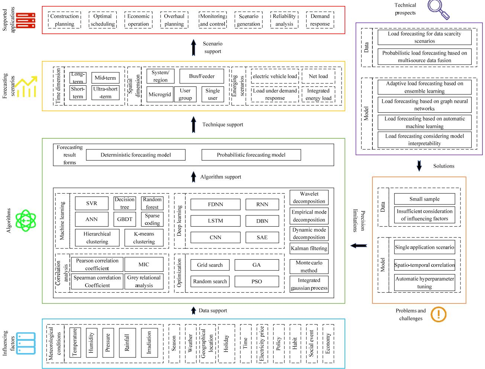  
Fig. 1 Framework of artificial intelligence based load forecasting research for the new-type power system