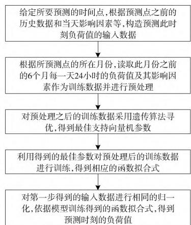
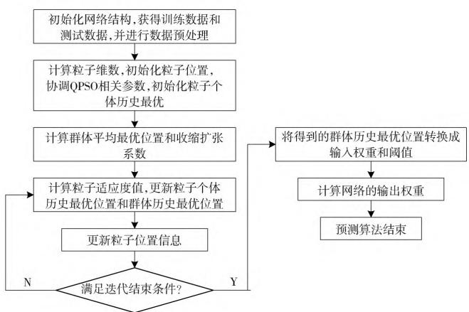
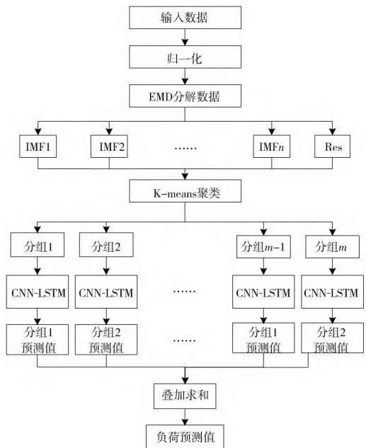

# 基于人工智能算法的电力系统负荷预测研究综述

杨 雷1 ， 罗雪红1 ， 韩 鹍1 ， 张启立2 ， 郭 鹏2 ， 李晓飞2

（1．国网渭南供电公司， 陕西 渭南 714000； 2．北京国电通网络技术有限公司 ， 北京 100070）

摘 要 ： 在能源互联网大环境下 风光等新能源发电的大量并网带来的间歇性问题影响了电力系统的稳定运行 传统的电力负荷预测方法对于该情况下的动态负荷精度已无法保证 而基于人工智能算法的预测方法得到了广泛的应用 对此 ， 首先介绍了电力系统负荷预测方法的分类和必要性 ， 并将基于人工智能算法的电力系统负荷预测分为基于传统机器学习 基于深度学习 基于组合模型3种方法展开综述 ， 最后对电力负荷预测领域的未来发展进行了展望和总 结 。

关键词 ： 电力系统负荷预测 ； 传统机器学习 ； 深度学习 ； 组合模型

中图分类号 ： TP18 DOI： 10．19768／j．cnki．dgjs．2024．12．018

# AReviewofPowerSystemLoadForecastingBasedonArtificialIntelligenceAlgorithms

YANGLei1， LUOXuehong1， HAN $\mathrm { K u n } ^ { 1 }$ ， ZHANGQili2， GUOPeng2， LIXiaofei2

（1．StateGridWeinanElectricPowerSupplyCompany， Weinan714000， China；  
2．BeijingGuodiantongNetworkTechnologyCo．， Ltd．， Beijing100070， China）

Abstract： Undertheenvironmentofenergyinternet，theintermittencyproblembroughtbylarge－scaleintegrationofnew energysourcessuchaswindandphotovoltaicgenerationsimpactsstableoperationofthepowersystem．Theconventional loadforecastingmethodscannolongerguaranteetheiraccuracyforthissituation， andtheforecastingmethodsbasedon artificialintelligencealgorithmshavefoundwideapplication．Thispaperencompassesfirstanoutlineonclassificationand necessityofpowersystemloadforecastingmethods， andthenasummaryoftheAIalgorithm－basedmethodsfromthe perspectivesofdifferentalgorithmclasses，i．e．， conventionalmachinelearning， deeplearning， andcombinedmodels．The paperendswithafutureoutlookofthisfastadvancingfield

Keywords： powersystemloadforecasting； conventionalmachinelearning； deeplearning； combinatorialmodel

# 0 引言

随着社会经济的快速发展以及社会对电力需求的快速增长 ， 电力系统的规模不断扩大 ， 电网的运行环境也日渐复杂［1－2］ 。 近10年来我国对电力系统的建设不断投入 ， 国内电力资源正稳定增长 ， 2021年1月7日 ， 国家电网经营区的最高负荷达到了9．60亿 $\mathrm { k W }$ ， 日发电量达到了201．91亿kWh， 均创造了历史最高［3］ 我国当前的电气化进程已经进入飞速发展期 电能是能源领域最重要的清洁能源之一 ， 它与我国社会能源利用的方方面面都有关系 ， 大到国家综合实力体现上 ， 如航空航天技术、 军用核反应堆技术等 ， 小到与人民息息相关的生活上 ， 如电子设备等 电力产业在国民经济建设和国家能源发展中占据着十分关键的地位 ， 是我国各行各业持续发展的基础性产业［4］ 。 电能具有瞬时性和不可存储性的特征 其生产和使用都是同时的 ， 因此需要保证电力系统的稳定 ， 才能提供持续可靠的电能 由于电力系统在运行过程中会受到各种因素的影响 ， 因此要保证电力系统的稳定运行 ， 就必须对电力系统

收稿日期 ：2023－10－14

进行实时监控和调整 准确预测电力系统负荷 ， 制定合适的调度方案和发电计划 ， 便是保证电力系统稳定运行的有效 途 径 ［5］ 。

随着社会的发展更新 ， 电力系统趋于复杂化、 大规模化 ， 因此在进行电力负荷预测时所需考虑的因素也趋于复杂化和多样化 ， 气候条件、 社会条件、 政治条件和经济条件都成为电力负荷预测所需综合考虑的 基于人工智能算法的电力系统负荷预测方法 ， 不仅能够克服传统人工预测的各种弊端 ， 而且还具有一定的自动化和智能化特点 ， 能够减少电力负荷预测系统技术人员的负担 本文将简要分析基于人工智能算法的电力系统负荷预测方法的应用现状 并对其进行展望 旨在为人工智能算法在电力负荷预测领域应用提供一定参考

# 1 电力系统负荷预测的分类

电力系统负荷预测根据不同目的和时间长度 ， 一般可以分为超短期负荷预测 $\mathrm { ~ 1 ~ } \operatorname* { m i n } \sim 1 \mathrm { ~ h ~ } )$ 短期负荷预测$( 1 \ \mathrm { h } { \sim } 7 \ \mathrm { d } )$ 、 中期负荷预测 $\left( 1 4 \mathrm { ~ d } \sim 3 \right.$ a） 、 长期负荷预测（3～5a） ［6－7］ 四类 ， 见表1。

表1 电力系统负荷预测分类  

<table><tr><td colspan="2">负荷预测分类</td><td>时间精度</td><td>预测基准</td><td>目的</td></tr><tr><td colspan="2">超短期时分)负荷预测</td><td>1 min~1 h</td><td>前几日同一时间段的变化规律</td><td>预测后续1h或数小时的负荷变化情况</td></tr><tr><td colspan="2">短期日度)负荷预测</td><td>1 h~7 d</td><td>一个正常日的天气变化、节日类型、社会活动等</td><td>预测1周内每天的负荷曲线或对特殊日期周末、节假日、春节)作特殊预测</td></tr><tr><td colspan="2">中期月度)负荷预测</td><td>14 d~3 a</td><td>每月的气温、降水等天气情况、特殊情况</td><td>月典型日负荷特性预测</td></tr><tr><td colspan="2">长期年度)负荷预测</td><td>3~5 a</td><td>国民经济发展情况、人口、产能单耗、产业结构调整、电价的政策</td><td>预测多年内的电力系统负荷特性</td></tr></table>

# 2 电力系统负荷预测的必要性

随着社会经济的飞速发展 ， 随处可见的充电设备以及移动支付已经覆盖了人民生活的方方面面 电能作为支撑这些电子设备的核心能源 ， 更是发挥着不可或缺的作用 ，因此电力系统的稳定性和安全性是十分重要的。 而在电力系统中 ， 每个分支机构都承担着不同的责任和作用 ， 电力系统负荷预测或大或小地发挥着它的作用。 超短期负荷预测也称时分预测 适用于实时分析和全面了解电力系统的运行状况 使运行人员对于电力系统的实时运行状态可以建立一个基本的感知 ， 同时也有助于对电网进行在线控制 ， 对配电网、 发电厂等系统进行实时调度指令下达的配合［8］ ； 短期负荷预测也称日度预测 ， 是针对下一天的发电计划进行的预测 ， 能够按照人们日常生活生产的规律 ， 精准预测电力系统供电负荷曲线 ， 保证社会的稳定发展 ； 中期负荷预测也称月度预测 ， 主要针对电力系统检修计划制定指导 ， 能够根据季节调整电力系统的调度计划或者根据月度预测的结果制定系统供电方案 ； 长期负荷预测也称年度预测 ， 对于电力系统整体的发展规划具有重要的指导意义 ， 能够根据年度预测的结果制定电力系统年度检修计划和运行方式等 ， 也可以借助国家经济的发展情况来预测电力系统未来的装机容量等 ， 达到节能环保、 高效经济运行的目的 。

# 3 基于人工智能算法的电力系统负荷预测

电力系统负荷预测的核心思想是借助系统产生的现有的历史负荷数据 ， 建立合适的负荷预测模型来预测未来一段时间或周期内的负荷值 ， 因此影响负荷预测精度的两大主要因素是历史数据和预测模型

在能源互联网和综合智慧能源系统布局飞速发展的今天 ， 电力系统的负荷预测对于电力系统的安全稳定发展具有十分重要的作用。 传统的负荷预测方法由于其简单的计算模型对于大数据背景下高随机性和波动性的动态负荷预测精度已经无法保证 ， 且近年来电动汽车 需求侧响应以及大规模新能源发电系统等新型负荷的接入所带来的高度随机性和动态变化特性 ， 导致传统的负荷预测方法已无法

满足新型电力系统下的负荷预测需求。

近些年在计算工具不断迭代更新和负荷训练数据量大规模提升的背景下 ， 基于人工智能算法的电力系统负荷预测方法在电力系统预测领域逐渐成为负荷预测研究中的热点之一。 下面将对基于人工智能算法的电力系统负荷预测分为基于传统机器学习、 基于深度学习以及基于组合模型3种方法展开叙述。

# 3．1 基于传统机器学习的电力系统负荷预测

基于传统机器学习的电力系统负荷预测方法已经在电力系统负荷预测领域取得了许多行之有效的成果。 在电力系统负荷预测领域 ， 传统的机器学习方法主要分为人工神经网络法 支持向量机法 随机森林法以及模糊预测法等［9］ 。 文献［10］ 利用主分量分析法 （PrincipleComponentAnalysis，PCA）和独立分量分析法（IndependentComponentAnalysis，ICA）处理电力系统负荷数据 ， 对负荷数据进行重构处理 ， 在有效去除数据噪音的前提下保留了原始数据中的特征信息 然后基于BP神经网络模型建立了电力系统负荷预测模型 结果证明了该方法能有效预测电力系统负荷 文献［11］通过信赖域法对现有的BP神经网络模型加以改进并建立了电力系统负荷预测模型 ， 实现了电力系统短期负荷预测 提前对机组出力进行调整 减小了电网频率波动 进一步缩短了电力系统调节时间 文献［12］首先利用 C均值模糊聚类算法对历史负荷数据样本进行聚类 ， 将聚类后的同一类数据作为随机森林预测模型的训练集样本构建决策树 得到的预测结果再采用粗糙集理论生成的补偿规则进行修正 ， 结果证明该预测方法能准确预测电力系统的负荷且与实际负荷的平均绝对误差百分比为$2 . 0 9 \%$ 文献［13］提出采用遗传算法优化的支持向量机来建立电力系统的短期负荷预测模型 ， 如图1所示 ， 实验表明该模型具有良好的有效性和可行性 文献［14］提出采用基于布尔核函数的支持向量机预测方法建立电力系统短期负荷预测模型 实际算例表明该方法具有结构简单 泛化性能好 不易过拟合以及预测精度较高等特点

  
图1 基于遗传算法－支持向量机的电力系统短期负荷预测模型

基于传统机器学习的电力系统负荷预测方法尽管取得

了诸多成效 ， 但电力系统的负荷预测受到多方面因素的影响 ， 例如天气、 特殊日期、 电价变化等 ， 且传统机器学习的浅层学习具有局限性 ， 无法充分学习和利用负荷数据中隐含的特 征 信 息 ， 近些年来面对越发复杂的电力系统结构 ， 其预测精度已无法满足需求。

# 3．2 基于深度学习的电力系统负荷预测

深度学习 作 为 近10年来机器学习领域的重大突破 ，它凭借着处理复杂数据的强大能力以及对复杂数据中隐含的信息特征的高效学习能力 ， 已经在图像处理、 故 障 预警、 语音识别等领域实现了广泛的应用 ， 目前在负荷预测领域也逐渐发挥其作用。 基于深度学习的电力系统负荷预测的主要方法有深度神经网络、 卷积神经网络、 极限学习机、 深度信念网络等。

文献［15］采用引入注意力机制的长短期记忆神经网络建立了电力系统短期负荷预测模型 ， 研究结果表明该模型的单日与单周短期负荷预测准确率可以分别达到 $9 7 . \ 2 8 \%$ 与 $9 7 . 7 6 \%$ 文献［16］利用长短期记忆神经网络建立了负荷预测模型 ， 从时间维度辨识学习负荷数据本身的规律特性 ， 从影响因素上识别不同因素对负荷的非线性影响 ， 并借助实际负荷数据对模型进行了验证 结果证明该方法可以有效实现电力系统负荷的预测。 文献［17］提出一种基于改进深度信念网络算法的负荷预测方法 通过将负荷数据的特征向量输入自编码神经网络进行特征融合后输入建立的电力系统负荷预测模型 ， 成功实现了短期负荷预测 文献［18］将高效通道注意力模块与时间卷积神经网络相结合 ， 通过在时间卷积神经网络中嵌入高效通道注意力模块改进了基本时间卷积神经网络的残差块下取样位置 构建了电力系统短期负荷预测模型 ， 经过实际电网负荷数据测试 ， 结果证明该方法能够有效实现电力系统的短期负荷预测 文献［19］提出一种基于量子粒子群优化极限学习机与卡尔曼滤波相结合的负荷预测模型（如图2所示） ， 该模型首先通过量子粒子群对极限学习机的输入层和隐藏层结构进行寻优 ， 以此预测各时间点的负荷值 ， 然后将得到的结果借助卡尔曼滤波算法进行进一步的更新和优化 最终得到各个时间点的最优电力负荷预测值 ， 实验表明该模型具

  
图2 基于量子粒子群－极限学习机－卡尔曼滤波的负荷预测模型

有较高的负荷预测精度和较高的稳定性。

# 3．3 基于组合模型的电力系统负荷预测

单一的电力负荷预测方法往往会因其固有的缺陷 ， 并不能考虑到各种影响因素而难以准确预测电力负荷趋势 ，但基于组合模型的电力系统负荷预测模型能够做到优势互补 ， 综合考虑到各个影响因素 ， 达到较高的负荷预测精度［20－21］ 。 文献［22］提出了一种卷积神经网络和长短期记忆神经网络相结合的组合模型用于实现电力系统的中长期负荷预测 如图3所示 首先借助聚类模态经验分解将负荷数据进行分解处理 ， 然后引入 K－means算法 ， 对分解后的分量进行聚类处理 ， 得到的最优特征数据作为卷积神经网络－长短期记忆神经网络组合模型的输入。 该模型最终成功实现了电力系统中长期负荷预测 ， 且具有较高的预测精 度 。

  
图3 基于卷积神经网络－长短期神经网络负荷预测组合模型

文献［23］首先利用经验模态分解将负荷数据分解为高频分量和低频分量 ， 然后利用时序卷积网络预测负荷数据中的高频分量 ， 利用极限学习机预测负荷数据中的低频分量 ， 实现了电力负荷的短期预测 ， 最后通过实验将该模型与单一模型预测进行对比 ， 结果证明该模型具有最高的预测精度且训练时间最短 文献［24］提出了一种基于完全自适应噪声集合经验模态分解与卷积神经网络以及门控循环单元组合模型的电力短期负荷预测方法 ， 利用完全自适应噪声集合经验模态分解将负荷数据分解为多个子序列 ， 然后利用卷积神经网络和门控循环单元的组合模型完成各分量预测 最终将各分量的预测结果汇总得到整体负荷预测结 果 。

# 4 基于人工智能算法负荷预测展望

电力系统负荷预测已逐渐成为保证电力系统安全稳定运行的重要研究方向 从传统的机器学习算法到深度学习

算法再到组合模型方法 ， 对电力系统负荷的预测精度越来越高 ， 正不断地趋近于实际负荷情况 ， 然而目前基于人工智能算法的电力系统负荷预测仍存在一些问题 ， 今后的研究重点和发展趋势可以聚焦于以下几点。

（1）建立完善 的 负 荷 数 据 库。 基于人工智能算法的预测方法在训练时需要大量的负荷数据作为基础 ， 然而目前公开的负荷数据不足以支撑完成人工智能算法模型的迭代训练 ， 因此构建完善的公开的负荷数据库应是今后研究重 点 。  
（2）建立合适的电力系统负荷预测模型。 目 前 的 大 多数模型虽然可以成功实现电力系统的负荷预测 ， 但其预测精度可能不能满足实际工业要求或者只是针对某些特定条件下的负荷预测 ， 因此可考虑进一步研究基于组合模型的负荷预测方法。  
（3）建立更低训练代价的负荷预测模型。 目 前 的 大 多数模型只考虑不断提高自身的负荷预测精度 ， 却忽略了随之增加的大量的训练时间和计算资源 ， 所以建立更为精确且训练代价更低的负荷预测模型应成为发展趋势。

# 5 结语

电力系统负荷预测一直是电力系统中最热门的研究领域之一 ， 且随着新型电力系统的构建 ， 电力系统的负荷预测精度要求也将不断提高 本文对基于人工智能算法的电力系统负荷预测方法进行了详细介绍 ， 首先介绍了电力负荷预测的方法分类以及电力负荷预测的必要性 ， 然后将基于人工智能算法的电力负荷预测方法分为基于传统机器学习、 基于深 度 学 习、 基 于 组 合 模 型 3种 方 法 展 开 详 细 叙述 ， 介绍了各个方法的研究成果和特点 ， 最后对基于人工智能算法的电力系统负荷预测研究进行了展望和总结 ， 如何建立完善的负荷数据库、 合适的负荷预测模型同时降低预测模型的训练代价仍是需要深思的问题

# 参考文献

［1］肖立业．智能电网的关键技术及发展方向［J］．电气时代 2016（1） ：52－55  
［2］宋璇坤 韩柳 鞠黄培 等．中国智能电网技术发展实践综述［J］．电力建设 ，2016，37（7） ：1－11  
［3］国家电网编辑组．国家电网用电负荷创历史新高多措并举全力保障电力可靠供应 ［EB／OL］．http： ／／www．sgcc．com．cn／html／sgcc＿main／col2017021449／2021－01／09／202101091020－54203766395＿1．shtml2021－1－20  
［4］朱彤．能源转型中我国电力能源的结构 问题与趋势［J］．经济导刊 2020（6） ：48－53  
［5］黄彦璐 张震 张喆 等．基于非侵入式负荷辨识和关联规则挖掘的用户柔性负荷区间预测［J］．南方电网技术 201913

（4） ：60－66  
［6］KawaiM，YanoK．Anisomorphicconstantfatiguelifediagramsof constantprobabilityoffailureandpredictionofP－S－Ncurvesforu－ nidirectionalcarbon／epoxylaminates［J］．InternationalJournalof Fatigue，2016，83：323－334   
［7］ZorK TimurO TekeA．Astate－of－the－artreviewofartificialintelligencetechniquesforshort－termelectricloadforecasting［C］．20176thInternationalYouth Conferenceon Energy（IYCE） ，IEEE，2017：1－7  
［8］李昭昱 艾芊 张宇帆 等．基于attention机制的LSTM 神经网络超短期负荷预测方法［J］．供用电 ，2019，36（1） ：17－22  
［9］秦勉．基于机器学习组合模型的短期负荷预测研究 ［D］．恩施 湖北民族大学 2022  
［10］何川，舒勤，贺含峰．ICA特征提取与BP神经网络在负荷预测中的应用［J］．电力系统及其自动化学报，2014，26（8） ：40－46  
［11］张凤林 陈峦 姚亮 等．基于信赖域法改进的BP网络在新能源并网方面的研究［J］．可再生能源 ，2018，36（1） ：43－50  
［12］李焱 ，贾雅君 ，李磊 ，等．基于随机森林算法的短期电力负荷预测［J］．电力系统保护与控制 202048（21） 117－124  
［13］孟凡喜 屈鸿 侯孟书．基于 GA和SVM 的电力负荷预测方法研究［J］．计算机科学 ，2014，41（S1） ：91－93，117  
［14］杜影双 寒枫 崔克彬 等．基于BKF－SVM 电力短期负荷预测［J］．微计算机信息 ，2009，25（27） ：48－49，47  
［15］何宏宇 龚泽玮 李诗颖 等．基于 AM－LSTM 模型的电力系统短期负荷预测［J］．自动化与仪器仪表 2023（2） ：61－65  
［16］庞传军 张波 余建明．基于 LSTM 循环神经网络的短期电力负荷预测［J］．电力工程技术 ，2021，40（1） ：175－180，194  
［17］王剑锋 ，郑剑 ，王旭东 ，等．基于改进深度信念网络的短期电力负荷预测方法 ［J］．电力系统及其自动化学报 202133（10） ：125－130  
［18］梁露 刘远龙 刘韶华 等．基于ECA－TCN的电力系统短期负荷预测研究［J］．电力系统及其自动化学报 ，2022，34（11） ：52－57  
［19］杨晋岭 靳云龙．基于 QPSO－ELM－KF的电力系统短期负荷预测［J］．太原科技大学学报 202344（1） 27－33  
［20］李晨 ，尹常永 ，李奇洁．电力系统负荷预测研究综述［J］．电子世界 ，2021（16） ：81－82  
［21］夏博 杨超 李冲．电力系统短期负荷预测方法研究综述［J］电力大数据 201821（7） 22－28  
［22］敬尔森 ，关焕 新．基 于 CEMD－CNN－LSTM 的中长期电力负荷预测［J］．沈阳工程学院学报（自 然 科 学 版） ，2023，19（3） ：45－51  
［23］李飞宏 肖迎群．基于 EMD－TCN－ELM 的短期电力负荷预测［J］．计算机系统应用 202231（11） 223－229  
［24］万磊 ， 余飞 ， 鲁统伟 ， 等．基于 CEEMDAN－CNN－GRU 组合模型的短期负荷预测方法［J］．河北科技大学学报 ，2022，43（2） 154－161